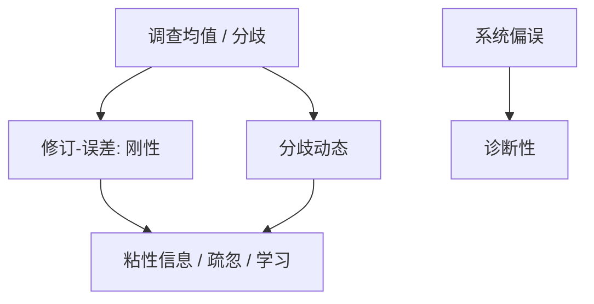

# 调查预期数据

结构预期最终要面对人报出来的数字：均值偏差、反应不足或过度、截面分歧，都是模型的矩，不是装饰。

<footer>—— Coibion and Gorodnichenko, Information Rigidity and the Expectations Formation Process, AER 2015；Michigan、SPF、Consensus</footer>

[上一课](/econ/uncertainty-shocks)给了方差对象。信念的可测对应是调查。本课缺口是把学习、粘性信息、疏忽、诊断性、新闻**对着数据**。不重推各模型公式。

## 问题

RE 加完全信息：预测误差对信息集不可预测，预测修订的回归有精确约束。Coibion–Gorodnichenko：用 SPF 修订对未来误差回归，发现反应不足（信息刚性）。另一端：有的序列过冲。分歧（截面方差）随冲击升，粘性信息与疏忽都能造分歧，诊断性主要造均值偏误。缺口是：本单元前几课的装置现在有可拒绝的矩，而不是并存的故事。

Coibion and Gorodnichenko, *AER* 2015；*JPE* 2012。Mankiw, Reis and Wolfers 的分歧。Andrade–Le Bihan、Dovern 等。Michigan 消费者、ECB SPF、专业预测商。

## 方法

矩：（i）误差对滞后误差、对修订的回归；（ii）分歧与波动的共动；（iii）家庭 vs 专家的差距；（iv）对政策公告的即时修订（接高频）。估计：用这些矩校准 $\lambda$、$\kappa$、$\theta$、学习增益，而不是只用宏观 IRF。注意：调查不是激励相容的市场预测，噪声与选择性回答存在；市场隐含（通胀掉期）是另一套，含风险价格。

HANK：家庭调查的收入与通胀预期直接进高 MPC 行为，比专家 SPF 更相关，数据也更吵。

## 机制

机制是把不可见的 $\mathbb{E}_t$ 换成可观测的预报。拒绝完全信息 RE 并不自动选出唯一替代：粘性信息、疏忽、有限层级、诊断性都能匹配部分矩，需联合看修订、分歧与过冲。政策：若家庭预期不更新，泰勒规则的预期通道弱，收入通道（HANK）相对更重要——与沟通课接头。

预测市场与调查的差别：风险中性概率 vs 平均信念。本课以调查为主，不把期权隐含密度当同一对象。

## 边界

本课不清洗每一项调查微观数据。不把选举民调当宏观预期。资产分析师盈利预测的行为金融文献点到为止。下一课才把央行如何移动这些数字写成政策。

后课默认：预期模型必须报告调查矩（修订、分歧、家庭–专家差）。下一课：沟通作为移动信念的工具。

## 小结

- 调查提供误差可预测性、修订与分歧等可拒绝矩。
- 信息刚性是常见结果，但不唯一对应某一模型。
- 家庭调查对 HANK 更相关，噪声更大。
- 出处：Coibion and Gorodnichenko, *AER* 2015。
