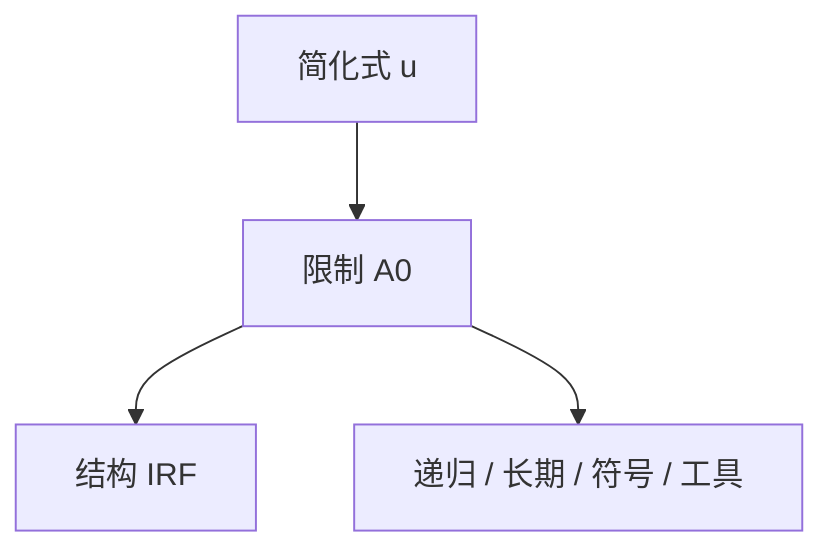

# SVAR 识别

简化式残差是一锅冲击的线性组合；没有额外限制，谈不上「货币政策冲击的脉冲」。

<footer>—— Sims, Macroeconomics and Reality, Econometrica 1980；Christiano, Eichenbaum and Evans 对货币冲击的递归识别；Uhlig 符号限制</footer>

[上一课](/econ/business-cycle-facts)给出共动，并声明共动不命名冲击。本课缺口是**识别**：从 VAR 的 $\Sigma$ 走到有标签的结构冲击。不重列事实表，不把 DSGE 先验当成唯一识别。

## 问题

Sims：宏观是联立的，OLS 的「谁回归谁」不可当成因果。VAR $Y_t=B(L)Y_{t-1}+u_t$，$u_t=A_0^{-1}\varepsilon_t$。识别 $A_0$ 需要与自由参数同样多的限制：短期递归（Cholesky）、长期（Blanchard–Quah）、符号、外部工具。Christiano–Eichenbaum–Evans：把政策利率放在某顺序上，假设某些变量对货币冲击的同期反应为零。缺口是：IRF 的形状来自限制，不是来自数据单独承认。

Sims, *Econometrica* 48(1), 1980。Ramey 的手册章节把货币、财政识别的文献收成一张地图。本课不进高频期货，那是再后课。

## 方法

估计简化式，施加 $A_0$ 限制，画 $\partial Y_{t+h}/\partial\varepsilon$。递归顺序是零限制的特例，对排序敏感。符号限制给出集合识别：许多 IRF 兼容「紧缩后物价不升」等不等式。外部工具（Stock–Watson、Mertens–Ravn）用代理变量与 $\varepsilon$ 相关、与其它冲击无关，把识别从 $A_0$ 的零改成矩。DSGE 的 IRF 是另一套：全部限制来自模型。两套对得上才互相撑腰，对不上先查趋势、信息集与冲击定义。

与 BK：SVAR 不要求 DSGE 的鞍点，但要求冲击正交与足够的滞后。滞后截断会把真实动态推进残差，看起来像「冲击」。

## 机制

机制是把正交化当命名。数据只给 $uu'$；命名来自「谁在同期不反应」或「长期中性」。错误的零限制把真实传导塞进错误的标签——财政乘数、货币传导的符号之争，多半是识别之争。信息：若私人看到而计量经济学家没放进 VAR 的变量，冲击会提前泄露（Ramey 的财政新闻）。后课局部投影用另一套估计 IRF，识别问题不会消失。

Blanchard and Quah, *AER* 1989：长期中性识别供需。Uhlig, *JME* 2005：符号限制下的货币冲击。Christiano, Eichenbaum and Evans, *Handbook* 与 *JPE* 2005。

## 边界

本课不把局部投影当 SVAR 的替代哲学（下一课才比估计方法）。不把叙事日期写进 Cholesky。也不估计因子模型的全部因子 VAR。限价簿、Kyle 冲击不是宏观 SVAR 的 $\varepsilon$，本栏不写微观结构识别。

后课默认：结构 IRF 必须声明识别方案；简化式共动不是脉冲。下一课：Jordà 的局部投影如何在识别给定后直接回归地平线。

## 小结

- SVAR：简化式残差加限制才成为有标签的冲击。
- 递归、长期、符号、外部工具是不同许可证。
- IRF 之争首先是识别之争。
- 出处：Sims, *Econometrica* 1980；CEE；Uhlig *JME* 2005。
