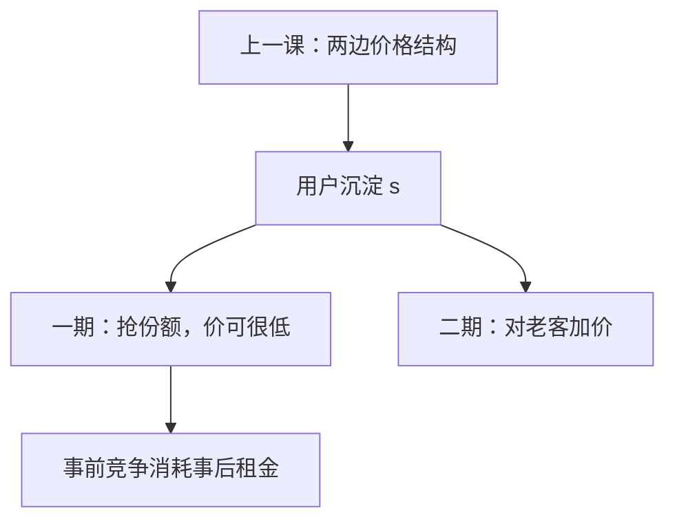

# 转换成本

买过之后再换一家要付一笔沉淀；事前为抢客户可以很凶，事后对锁定客户可以加价——竞争从「场内」挪到「入场」。

<footer>—— 据 Klemperer, Markets with Consumer Switching Costs, Quarterly Journal of Economics, 1987 整理</footer>

[上一课](/econ/two-sided-platform)（双边市场）。平台用价格结构养两边的交叉网络。本课不重写总价与分摊，也不把多归属再分类一遍。缺口是用户侧的沉淀：学过界面、迁过数据、毁过兼容，换一家有成本 $s$。这不必有网络规模进入效用——一个人换手机也疼。Klemperer 把「先争夺、后收租」写成两期价格。

## 问题

两期。一期无锁定，需求对价格很敏感，厂商用低价（甚至低于成本）买份额。二期老客户面对 $s$，剩余需求变陡，加价上升。理性消费者预见到二期被「敲」，一期愿意付的保留价格下降，于是一期竞争把二期租金提前打掉——在完全信息、无折现摩擦下，利润未必高于无转换成本的伯川德。缺口不是再写网络的 $n^e$，而是：**$s$ 怎样把弹性在时期之间挪动，以及「看起来很竞争」的入门价为什么仍可与事后势力共存。**

与网络对照：网络是别人也在才值钱；$s$ 是我自己的沉淀，即使对手的网更大，搬家费仍在。二者常一起出现（数据、联系人），但比较静态不同：纯 $s$ 不需要多重实现预期。

### 入门补贴不是掠夺自动成立

一期低于成本可以是「买客户」，二期对同一批人回收，不必赶走对手。Ordover–Willig 的反事实仍可用：若对手一直在场，这笔入门价是否仍最优？转换成本模型里往往是的。不要把 Klemperer 的促销写成[掠夺](/econ/predatory-pricing)。

Klemperer 1987：两期价格，老客户与新客户可被识别时，可以对新客折扣、对老客加价。不能识别时，统一价权衡「抢新」与「收老」。份额高的在位者更不愿降价抢新——这是惰性，不是共谋。

## 方法

两期、逆向归纳。二期给定锁定存量，每家在老客市场上有 $s$ 这么高的有效差异——有点像[霍特林](/econ/hotelling)的 $t$，但 $t$ 是横差异，$s$ 是历史买过谁。一期厂商为二期存量竞争。折现因子、新客流入、能否识别新老，决定入门价有多低。

福利：二期加价造成无谓损失；一期过度促销可能浪费（广告、送机）。社会最优的 $s$ 往往不是零——有些沉淀是学习真成本——但厂商有激励把 $s$ 做大（不兼容、积分到期）。进入者必须从新客或买下 $s$ 打起，在位者的存量本身就是壁垒。

本课仍是产品市场。不要把 $s$ 写成换做市商的队列位置；没有簿。

## 机制

弹性跨期挪动的机制是状态变量：买过之后，相对价格要相差超过 $s$ 才换。二期交叉弹性下降，勒纳上升。一期把二期利润资本化进份额的边际收益，于是一期自己的勒纳下降，甚至为负。

不能识别新老时，降价会漏给老客，抢新的激励被卡住——在位者「温和」，进入者更凶。这与合谋的低价惩罚方向相反：这里的高价是锁定，不是卡特尔。

重叠的新客流把两期教具拉成稳态：每一期都有一批未锁定的人与一批老客。统一价是两群弹性的加权。市场份额高则老客权重大，降价更贵，于是大厂商更「安静」——观测上像合谋，一阶条件仍是锁定，不是惩罚路径。合约预告二期价，等于把 $s$ 的敲竹杠提前写进一期，竞争回到可竞争式的打包。

Klemperer 1995 的综述把福利、进入、合谋（转换成本可帮助默契）收在一起。主干用 1987 的两期价格；合谋只作边界：锁定使惩罚偏离更疼，也可能使默契更容易。

## 边界

新客识别若被禁止，统一价下在位者更温和，进入者份额可以涨得更快。

合同里写清二期价，可以把敲竹杠提前抵消。消费者短视则一期竞争无法耗尽二期租金，利润上升、福利更差。厂商还有激励内生地做大 $s$：不兼容接口、积分过期、数据不可携。社会最优的学习成本不是零，但厂商选择的 $s$ 通常偏高。下一课把 $s$ 特化成耐用品加配套消耗品：打印机已经买了，墨盒是后市场。

后课默认：转换成本把竞争从二期挪到一期；事后加价与事前促销是同一租金的两面，不是自动掠夺。

本课不把入门低价自动写成掠夺。

## 小结

- $s$ 是个人沉淀，不必有网络规模。
- 二期弹性下降、加价；一期为份额把租金提前打掉。
- 入门低于成本可以是买客户，要用反事实与掠夺分开。
- 下一课：耐用品把锁定写进配套后市场。
- 出处：Klemperer, *QJE*, 1987。
