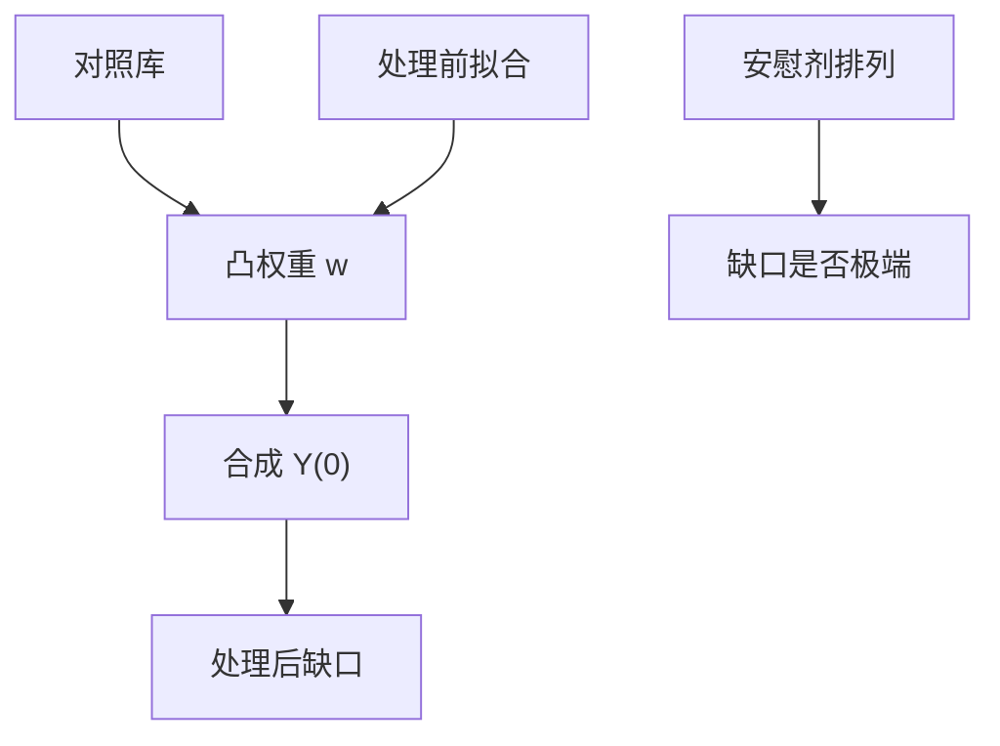
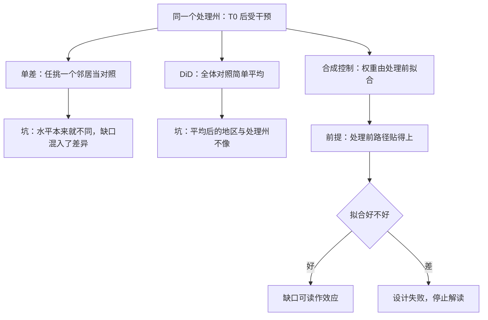

# 合成控制

只有一个（或几个）处理单位时，不要任意挑一个邻居当对照；用处理前轨迹把对照库权合成一个「合成的自己」。

<footer>—— Abadie and Gardeazabal, The Economic Costs of Conflict: A Case Study of the Basque Country, AER 2003；Abadie, Diamond and Hainmueller, JASA 2010</footer>

[上一课](/econ/rdd)靠门槛两侧的局部随机。本课缺口是：加州烟税、巴斯克冲突、德国统一这类**一个处理、没有门槛**的案例。匹配下一课把同一思想推广到许多处理单位。本课钉 Abadie 的合成控制。

## 问题

处理区 $i=1$ 在 $T_0$ 后受干预，候选对照 $j=2,\ldots,J$ 不受。单差用某一个 $j$ 任意。DiD 用所有 $j$ 的简单平均，但处理区可能在水平上就与平均不同。合成控制选权重 $w_j\ge 0$，$\sum w_j=1$，使处理前

$$
\sum_{t\le T_0} \Bigl(Y_{1t}-\sum_j w_j Y_{jt}\Bigr)^2
$$

（可加协变量）尽量小。处理后 $\hat Y_{1t}(0)=\sum_j w_j Y_{jt}$，效应是 $Y_{1t}-\hat Y_{1t}(0)$。缺口是：权重是设计，不是又一次 TWFE；推断不能靠常规聚类 $t$。

「凸组合」用数字说就是：合成加州 = 0.35 × 州 A + 0.3 × 州 B + 0.2 × 州 C + 0.15 × 州 D——每个权重都不小于零，加起来恰好等于 1。不许负权重的意思是：不许说「加州 = 1.2 × 州 A − 0.2 × 州 B」这种拿一个地区倒贴去凑数的做法，那等于外推到没有数据支撑的组合上。

Abadie–Diamond–Hainmueller 对加州 1988 年烟税：合成加州由若干州的凸组合构成，处理前吸烟路径贴合，处理后分叉。安慰剂把假处理派给每个对照州，看加州的缺口是否极端。

## 方法

约束为凸组合，禁止外推到对照库凸包之外——这是与回归对照的关键差别：OLS 可以给负权重、系数和不必为 1。拟合过好（处理前期太短、预测变量太多）会过拟合噪声，处理后缺口不可信。推断：排列检验（安慰剂时点或安慰剂单位）；近年有共形推断、渐近理论（Abadie 后续工作），本课以安慰剂为最小装置。

若处理前拟合已经差，不要报告处理后缺口——设计失败，不是「效应为零」。

安慰剂的直觉类比：就像考试防作弊——光看一个学生分数高不算什么，得让全班都「多拿一分」做一遍假试卷，看他的相对名次是否还很突出。安慰剂检验就是给每个没受干预的对照单位也假装受一次干预，算出它们的假缺口；真正的处理效应必须比这片「假缺口」的背景噪音极端得多才算数。

## 机制

机制是用对照库张成处理单位的反事实路径。平行趋势是「对照组平均与处理组同走」；合成控制是「加权后同走」，权重由处理前数据选。这仍是对 $Y(0)$ 可预测性的假设：没有同时冲击只打中处理单位。SUTVA：对照州不能被溢出污染（邻州走私香烟）。

与 DiD：合成控制可以看成数据驱动的对照组；DiD 是 $w_j=1/(J-1)$。交错多处理单位时，合成控制要逐个做或改用面板方法，不要把 TWFE 负权重问题假装已经消失。

常见误区：初学者容易以为「处理后缺口大 = 政策效果大」。实际上缺口要先过两关：处理前拟合必须贴得上，否则缺口可能只是「合成人不像真人」；缺口还要在安慰剂分布里足够极端，否则可能只是正常的年度波动。两关都过了，大缺口才轮到政策来解释。

外推禁令：若处理单位在处理前就在所有对照的凸包之外，不存在合格合成。应报告，而不是改用负权重回归硬造。

## 边界

本课不把巴斯克或加州的点估计外推成冲突与税收的普遍弹性。一个处理单位的外部有效天然薄。下一课匹配与倾向得分：许多处理、许多对照，回到截面或面板的条件独立，而不是一条合成路径。量化栏的事件研究对照的是证券，不是州，不混写。

后课默认：单（少）处理单位优先考虑凸合成加安慰剂；处理前拟合差则停止。匹配下一课处理「多个 $i$ 被处理」。

## 小结

- 合成控制 = 对照库上的凸组合，贴处理前路径。
- 禁止负权重外推；拟合差则设计失败。
- 推断以安慰剂排列为最小标准。
- 与 DiD：把简单平均换成数据驱动权重。
- 出处：Abadie and Gardeazabal, *AER* 2003；Abadie, Diamond and Hainmueller, *JASA* 2010。
