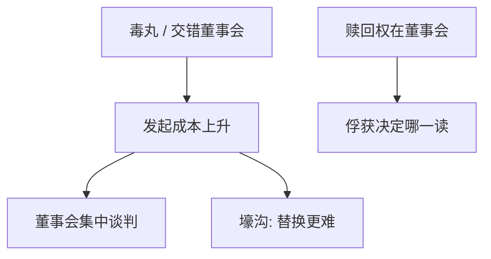

# 反收购防御

    
毒丸、交错董事会与超级多数把 Grossman–Hart 的发起激励再削一刀：可以保护谈判以抬高溢价，也可以保护现任的私人收益。

    <footer>—— 据 Comment and Schwert, Journal of Financial Economics 1995；Ryngaert, Journal of Financial Economics 1988；对照 Grossman and Hart 1980</footer>

[上一课](/econ/takeover-free-rider)说明分散股东使有效接管过少。本课缺口是现任故意加的摩擦：毒丸（股东权利计划）使未经董事会同意的收购稀释收购者，交错任期使控制董事会要等多年。不重推免费搭车代数，不把并购协同计算提前。

## 问题

防御的两读。股东利益：董事会作集中谈判代理人，避免股东各自接受低价，抬高 $p$，分享更多 $v-q$。经理壕沟：降低替换概率，私人收益与 FCF 浪费持续。Comment–Schwert：许多「防御」宣布时价格反应弱，像是已预期或无约束；真正的约束力随法律与药丸是否可赎回而变。缺口是：防御改变的是发起人的成本，从而移动控制权市场的供给，与 Grossman–Hart 的稀释补丁方向相反。

毒丸：现有股东（除收购者）廉价买新股，稀释收购者。董事会可赎回，于是权力在董事会——回到监督课的俘获问题：谁控制赎回，谁控制防御。

## 方法

装置：毒丸、交错董事会、黄金降落伞、双重股权（后课专写）、重审并购的超级多数。效果：提高成功所需时间与资金，筛选掉部分低 $v$ 的收购者，也筛选掉部分高 $v$ 但资金约束的收购者。黄金降落伞可以是买通现任、降低抵抗，与壕沟相反——合同可以是离职补偿换合作。

与激进主义：不能全面收购时，改为代理权争夺换董事、再赎回药丸。防御把全面要约改成治理战争。

资本结构：杠杆本身是防御（少有现金被收购者用来借债）又是 Jensen 纪律。防御与杠杆互动。双层股权把防御写进股票，不需要药丸。

## 机制

机制是把控制权交易的否决权交给董事会。若董事会与股东利益对齐，防御是对付免费搭车的集中化——用谈判代替分散接受。若被俘获，防御是提高 $q$ 下现任的续存概率。同一法律工具，目标函数决定福利。Hermalin–Weisbach 内生性再次出现：弱监督的企业更可能保有不可赎回的防御。

与空壳债权人对照：这边是股权投票与经济敞口的制度楔子（防御让投票无法在市场上被收购迅速集中）。

### 不是「去掉所有防御就有效」

无防御时 Grossman–Hart 仍在，股东可能以过低 $p$ 零散卖出，或根本没有发起。最优不是角点。黄金降落伞显示：给现任钱有时比给现任否决权更便宜。

Ryngaert 等研究毒丸采用的价格效应，符号与样本争议大。机制课不靠某一事件研究定案，只保留两读。

## 边界

不要把本课写成公司法条款汇编。下一课：假设收购发生，协同从哪来、用现金还是股票付，决定溢价是改善还是过度支付。防御只决定交易是否发生与谁谈判。

后课默认：防御提高发起成本，兼有议价与壕沟。赎回权归属决定哪一种。免费搭车未消失，只是换了代理人。

## 小结

- 毒丸与交错董事会提高接管成本，可抬溢价也可保护现任。
- 关键是董事会能否被股东替换以赎回防御。
- 与 Grossman–Hart 的稀释补丁方向相反：一个帮发起人，一个挡发起人。
- 出处：Comment and Schwert, *JFE* 1995；Ryngaert, *JFE* 1988；Grossman and Hart 1980。
