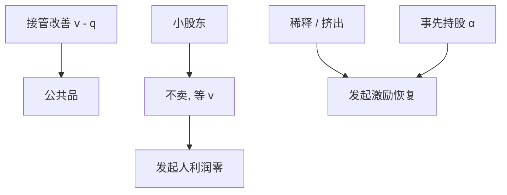

# 接管与免费搭车 Grossman–Hart

    
分散股东在要约收购里不愿交出股份：每人希望别人卖、自己留下分享改善后的价值；于是收购者付不出溢价，有效接管失败。

    <footer>—— Grossman and Hart, Takeover Bids, the Free-Rider Problem, and the Theory of the Corporation, Bell Journal of Economics 1980</footer>

[上一课](/econ/shareholder-activism)的激进主义不必买下整家公司。全面接管要把控制权买齐。本课缺口是 Grossman–Hart（1980）免费搭车：改善是公共品，小股东不接受低于事后价值的价格，收购者零利润，于是不愿付监测与溢价。不重写 13D 菜单，不把反收购条款提前。

## 问题

接管本应是董事会失灵时的最后监督：替换经理、释放 FCF。若目标股东分散，每人把股份当成可忽略，理性是拒绝任何低于接管后价值 $v$ 的要约，等待搭便车。收购者若必须付 $v$，改善全归目标股东，收购者净利为零，不愿发起。缺口是公司金融的经典公共品：控制权改善无法被发起人内部化。解决候选：稀释（两段要约、挤出）、大股东初始份额（Shleifer–Vishny）、法律允许挤出合并。

Grossman–Hart 允许公司章程把部分改善奖给收购者（稀释少数），以恢复发起激励。这与「保护少数股东」的直觉冲突：保护过度则没有人来改善。

## 方法

设现任下价值 $q$，接管后 $v\gt q$。要约价 $p$。小股东接受若 $p$ 至少不差于成功后留下的价值。若成功确定，留下得 $v$，故须 $p\ge v$，发起人无利。若成功不确定，仍接近。对策：让拒绝者在成功后得不到 $v$（挤出、冻结、双层要约前低后高）。或发起人已持有 $\alpha$，改善的 $\alpha$ 部分归己，可付 $p\in(q,v)$。激进主义是小 $\alpha$ 的语音版；全面要约是大 $\alpha$ 或法律挤出。

与 Jensen：LBO 用债务把 FCF 押给债权人，发起人（PE）持有大量股权，内部化改善——后课。本课先钉免费搭车逻辑。

## 机制

机制与债权持出同构：每个人要全额改善。股权侧没有自动中止，要靠要约规则与章程。信息：若 $v$ 不确定，股东怕卖亏，也怕不卖更亏，出现赢家诅咒式的接受策略。本课主线仍是确定 $v$ 下的免费搭车，信息版不是主干。

与 MM：接管不改变资产技术时，只是改谁经营；价值来自代理成本下降，不是切片魔术。切片（杠杆）可以是实施工具。

### 不要把溢价当成「市场无效」

溢价可以是把改善付给目标股东的那一块，加上发起人必须留下的那一块（若法律允许）。高溢价也可以是过度支付（后课支付方式）。Grossman–Hart 解释的是为何**没有**溢价时交易更难发生，不是溢价的精确数字。

Manne（1965）早已把控制权市场当作治理。Grossman–Hart 给出为何这个市场会失灵。下一课防御进一步移动发起激励。

## 边界

不要把本课写成各国要约法规比较。下一课毒丸、交错董事会如何故意加强免费搭车或提高 $p$，保护现任。再下一课协同与现金/股票支付。

后课默认：分散股权下，改善的公共品性质使有效接管供给不足。挤出、事先持股、杠杆收购是补丁。保护少数有事前激励代价。

## 小结

- 小股东免费搭车，要约须付到事后价值，发起人无利可图。
- 稀释/挤出与事先持股把改善内部化，恢复监督市场。
- 与债权持出同构；法律与章程决定谁能发起。
- 出处：Grossman and Hart, *Bell* 1980；对照 Shleifer and Vishny, *JPE* 1986。
