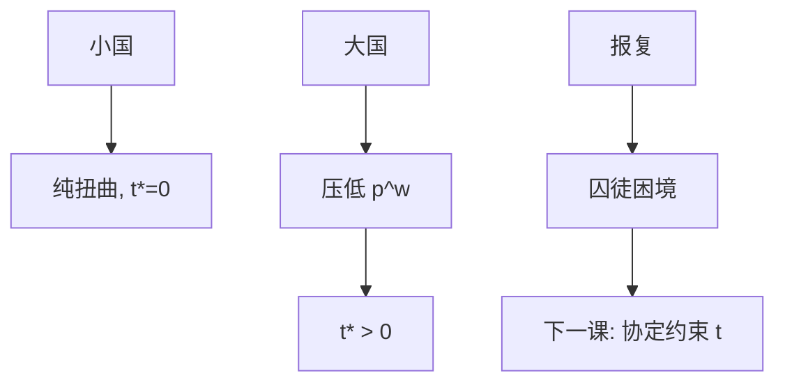

# 关税与最优关税

小国关税把楔子打进国内价格与世界价格，无条款改善，净损失；大国能压低进口世界价格，最优关税为正——直到报复把双方锁进囚徒困境。

<footer>—— 据 Johnson 最优关税传统；Broda, Limão and Weinstein, AER 2008 对进口弹性与市场势力</footer>

[上一课](/econ/eaton-kortum)把贸易成本 $\tau$ 写进份额。本课把 $\tau$ 的政策部分拆成关税。贸易协定下一课解释为何国家愿意捆住自己的最优关税。本课钉小国损失、大国条款、报复。

## 问题

从价关税 $t$ 使国内进口价 $=p^w(1+t)$。小国：$p^w$ 给定，关税收入是国内转移，消费与生产扭曲造成无谓损失，与[无谓损失](/econ/deadweight-loss)同构。大国：进口下降压低 $p^w$，条款改善部分抵消扭曲，存在最优 $t^*\approx 1/\varepsilon^*$（外国出口供给弹性）。缺口不是再画供给需求，而是：单边最优关税是以邻为壑；对方同样做，双方条款改善对消，扭曲留下。这是协定课的动机。

配额在完全竞争下可关税等价，租金归谁（许可证持有人 vs 政府）改分配。不完全竞争下等价破裂（Krugman / Brander–Spencer 另账）。本课完全竞争为最小。

## 方法

局部：进口需求弹性、出口供给弹性。一般均衡：EK / CES 里关税改变 $\pi_{ij}$ 与工资，福利分解为效率与条款（Costinot–Rodríguez-Clare 一类）。计量：用进口需求弹性估市场势力（Broda–Limão–Weinstein），看实际关税是否向最优靠。这是结构弹性，不是 China shock 的 ATT。

与李嘉图：关税把分工从机会成本推开，浪费比较利益。与 SS：保护提高进口竞争行业密集要素的报酬，这是分配，不是小国效率最优。

## 机制

机制是楔子加条款。小国没有条款通道，关税是向自己征税再补贴生产者。大国有买方势力，关税是抽取外国租金。抽取能成功是因为外国供给向上倾斜。世界作为整体，关税仍是负和（扭曲），再分配从外国生产者到本国国库与生产者。

运输成本、非关税壁垒（标准、红头）可以有类似楔子，但福利核算更脏（有的标准含共同收益）。本课关税是干净楔子。

 Lerner 对称：进口税与出口税在某些条件下等价。政策语言里「只保护进口」仍会伤出口部门——一般均衡的相对价格。

## 边界

本课不把某一国的关税表写成已经最优。战略性贸易（补贴本国寡头）是不完全竞争另课，不并入最优关税公式。下一课 GATT/WTO：互惠与最惠国把 $t^*$ 换成可执行的约束。全球价值链让名义关税与有效保护率分叉，后课再写。不要用最优关税为所有保护背书——那是单边、给定对方不报复的公式。

后课默认：小国自由贸易效率最优；大国单边 $t^*\gt 0$ 是条款抽取；报复使双方变差。协定用互惠解开困境。SS 解释谁支持保护，不解释小国效率。

## 小结

- 小国关税：扭曲，无条款，最优为零。
- 大国：买方势力给出 $t^*\approx 1/\varepsilon^*$。
- 报复把条款对消，留下无谓损失。
- 保护的分配（SS）与效率（本课）要分开写。
- 出处：Johnson 最优关税；Broda, Limão and Weinstein, *AER* 2008；Lerner 对称。
