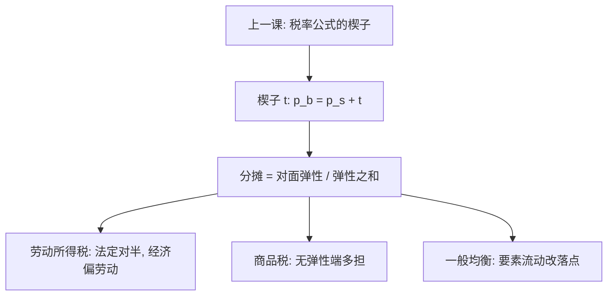
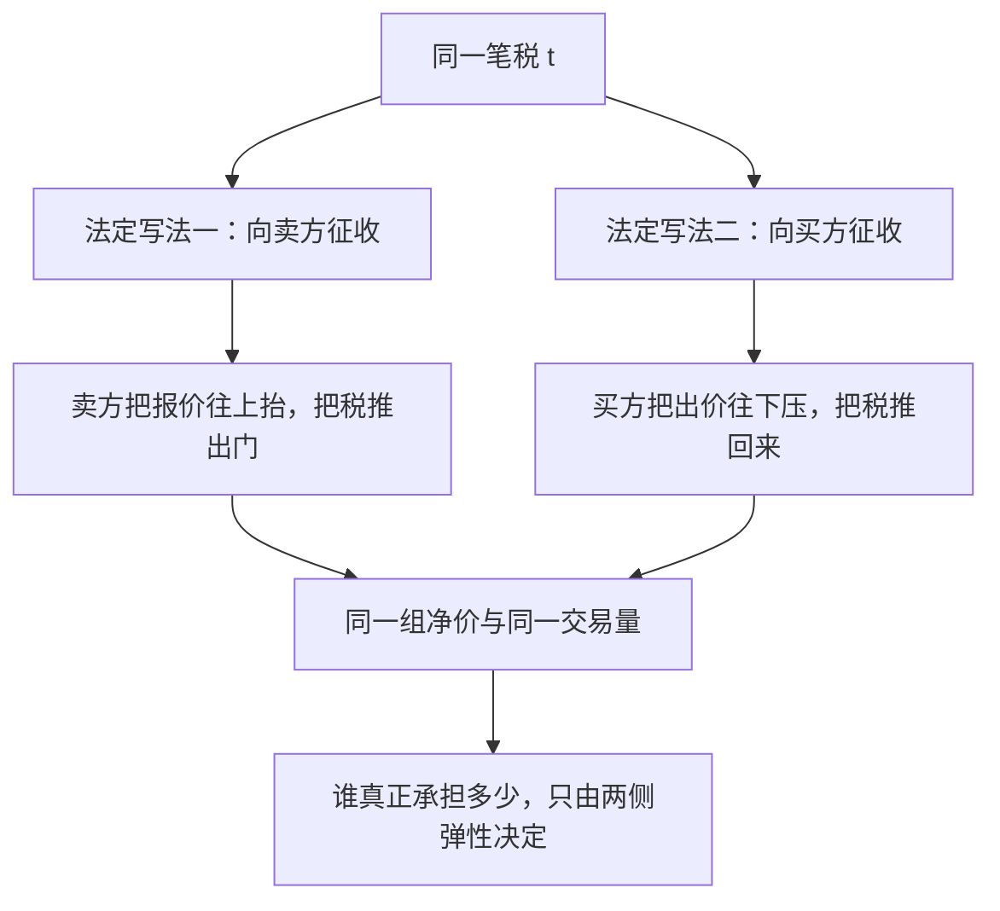

# 税收归宿：法定与经济

税票开给谁只是记账；谁的实际收入被压低，由两条曲线的斜率决定——把法定义务从一方挪到另一方，均衡的净价格一步也不动。

<footer>—— 据 Harberger, Taxation, Resource Allocation and Welfare, 1964；Musgrave, The Theory of Public Finance, 1959 整理</footer>

[上一课](/econ/mirrlees-optimal-tax)把最优税率写成弹性、密度与福利权重的一阶条件；但公式里的楔子是经济对象，先要问它落在谁身上，福利权重才有的放矢。主干[税收归宿](/econ/tax-incidence)已立「法定不等于经济」与弹性分摊公式。本课把公式算成两个例子——劳动所得税与商品税——并把归宿塞回最优税的设计缺口：你以为在向谁征税，与谁真的付钱，为什么是两道题。

## 问题

从量税楔在买方价与卖方价之间：$p_b=p_s+t$，出清要求 $D(p_b)=S(p_s)$。对 $t$ 微分得

$$
\frac{\mathrm{d}p_b}{\mathrm{d}t}=\frac{\varepsilon_S}{\varepsilon_S+\varepsilon_D},
\qquad
\frac{\mathrm{d}p_s}{\mathrm{d}t}=-\frac{\varepsilon_D}{\varepsilon_S+\varepsilon_D},
$$

（$\varepsilon$ 取绝对值）。法定归宿只指定谁把钱交给国库；经济归宿问净价动了多少。缺口不是再背一遍公式，而是把「向雇主征、向雇员征」的两种法定写法算成同一组净价变化，并回答弹性从哪里来、归宿如何接回上一课的税率公式。

### 劳动所得税：法定对半，经济偏一边

雇主与雇员各缴一半是法定分割；净工资 $w_n$ 与毛工资 $w_g$ 之间 $w_g=w_n+t$。设劳动供给弹性 $\varepsilon_S=0.2$、劳动需求弹性 $\varepsilon_D=1$，雇员承担 $\varepsilon_D/(\varepsilon_S+\varepsilon_D)=1/1.2\approx 83\%$。把全部法定义务挪给雇主，均衡净工资照样下降同样幅度：法定再分配现金流，弹性分配负担。

弹性的直觉类比：弹性就是「退出权」的大小。谈价格像拔河——越离不开这笔交易的一方，越只能接受更差的净价。雇主可以少雇人、上机器（退出渠道多），劳动者却要交房租吃饭（退出渠道少），所以劳动税的大头顺着弹性差滑向雇员一侧。

## 方法

商品税同法。从价 VAT 开给卖方，需求弹性 $0.5$、供给弹性 $2$，消费者承担 $2/2.5=80\%$；必需品需求更无弹性、承担更多——[Ramsey 商品税](/econ/ramsey-optimal-commodity-tax)警告过逆弹性不是公平命令，归宿把这句警告变成数字。局部之外是 Harberger 1964 的一般均衡：资本可跨部门流动时，对公司部门征税使资本外流、压低所有部门的资本回报，负担可以落到劳动与土地上；「向资本征税」不等于「资本承担」。税基固定时归宿走进资产价格：对土地征税，地价一次性下跌，后来者按税后价买入，不再「承担」。

## 机制

机制是退出权：税迫使交易量收缩，谁更离不开市场，谁就接受更差的净价；完全弹性的一端把税全部推走。接回上一课：Mirrlees 公式敢把 $T(y)$ 直接写在收入者身上，是因为劳动供给相对无弹性、归宿几乎不外溢，而不是因为他恰好在税票上；一旦税基会流动（资本、利润、跨国申报），设计者就必须先算要素价格通道再谈福利权重。法定写法改变的只有汇缴与合规的落点。

资本化的数字实例：一块地每年要交 1 万元税，市场按 5% 折现，地价立刻跌到只剩约 20 万元（1 万 ÷ 5%）。征税那一刻的地主一次性承担全部未来税负；后来者按便宜了的地价买入，等于再也没「缴过」这笔税——负担被提前锁进资产价格里。

把社保缴费中雇主份额降为零，法定负担消失，经济负担不消失：净工资合同会立刻吸收它。看见「企业缴费」就当成企业承担，是归宿课最常犯的错。

## 边界

局部公式忽略收入效应与多市场反馈；垄断下开票对象可以改边际，法定无关性减弱，主干课已画，不重写。归宿不是公平判断：无弹性一端可能是必需品的穷人，规范另要社会福利函数。本课只分矩形；矩形旁边被挤掉的三角形是下一课的度量对象。后课默认：讨论任何税，先写经济归宿再谈负担与权重，法定档次只是入口。

常见误区：初学者容易把「必需品穷人担得多」读成公平依据——实际上这只是弹性的算术结果：必需品退不出去，所以多担。它恰恰是警告而不是理由：若再叠加公平考量，就落回上一课的社会福利权重，弹性公式本身给不出「该不该」的答案。

## 小结

- 法定纳税人是会计身份，经济归宿是比较静态。
- 分摊比例 = 对面弹性除以弹性之和；劳动税大头落在相对无弹性的劳动者。
- 要素可流动时，向资本征税的负担可搬到劳动与土地；固定税基则资本化进资产价格。
- 最优税公式里的弹性是经济楔子的弹性，不是税表的法定档次。
- 出处：Harberger, 1964；Musgrave, 1959；主干税收归宿课。
