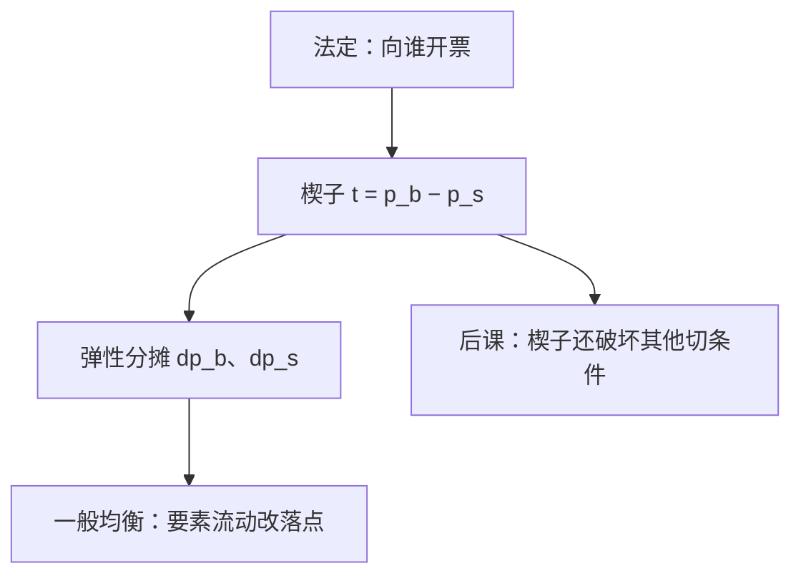

# 税收归宿

税的负担不落在法定纳税人身上，而落在相对更无弹性的那一端。

<footer>—— 据 Musgrave, The Theory of Public Finance, 1959；Harberger, The Incidence of the Corporation Income Tax, JPE, 1962 整理</footer>

[上一课](/econ/public-goods)要用税去融资公共品，[庇古税](/econ/externality-pigou)也已经把税当成纠正工具。缺口是会计：法令写「向买方征收」还是「向卖方征收」，并不决定谁的净价格动了多少。本课钉法定归宿与经济归宿的分离，以及弹性如何分摊 $t$，不重写萨缪尔森条件，也不把扭曲的福利成本展开成次优。

## 问题

从量税 $t$ 插在买方支付价 $p_b$ 与卖方实收价 $p_s$ 之间，$p_b=p_s+t$。市场出清要求 $D(p_b)=S(p_s)$。法定归宿只指定谁把钱交给国库；经济归宿问 $p_b$ 相对税前价格升了多少、$p_s$ 降了多少。两者之和等于 $t$（局部、无收入效应的基准里）。

若需求完全无弹性，买方承担全部；供给完全无弹性，卖方承担全部。弹性有限时，负担按

$$
\frac{\mathrm{d}p_b}{\mathrm{d}t}=\frac{\varepsilon_S}{\varepsilon_S+\varepsilon_D},\qquad
\frac{\mathrm{d}p_s}{\mathrm{d}t}=-\frac{\varepsilon_D}{\varepsilon_S+\varepsilon_D}
$$

分摊（符号约定：$\varepsilon_D$ 取正的需求弹性绝对值）。法令把税票开给谁，只要楔子是 $t$，均衡净价与开票对象无关——这是局部市场的无关性。

### 无关性不是无负担

无关性说的是法定侧，不是「税没有人承担」。楔子仍在，剩余仍被切走一块。归宿分配的是这一块落在哪一侧，以及——一般均衡里——落在哪个要素、哪一代人。

图形：供给上移 $t$ 与需求下移 $t$ 给出同一对 $(p_b,p_s)$。这就是法定无关。无弹性的那条曲线承担价格变动的大部分，因为它「无处可逃」。

## 方法

局部均衡：一种商品、收入效应忽略或收入用总额税补齐。工具是上述弹性公式。适用范围是税基小、与其他市场反馈弱。

一般均衡：Harberger 把公司税放进两部门、两要素模型。税使公司部门收缩，资本流向非公司部门，两部门资本回报一齐变，负担可以落到劳动或土地上，取决于替代弹性与要素密集。局部的「向资本征税、资本承担」在要素可流动时不成立。

总额税（lump-sum）没有楔子，归宿就是谁的预算被拿走，效率不动——那是[第二定理](/econ/welfare-theorems)用过的转移。商品税、要素税才有归宿与超额负担两套账。本课主钉归宿；超额负担与「只纠正一个扭曲」留给下一课。

## 机制

为什么弹性决定负担：税迫使交易量下降。谁更不能离开这个市场，谁就必须接受更差的净价。买方若有替代品，就逼卖方降 $p_s$；卖方若有其他用途，就逼买方抬 $p_b$。完全弹性的一端把税全部推走。

一般均衡多了要素价格这条通道。对资本征税像对「公司部门使用资本」征税；资本逃到另一部门，压低那边的边际产出，未征税部门的要素也受伤。归宿是一般均衡的比较静态，不是税表上的一行字。

## 边界

局部公式忽略收入效应与交叉价格。所得税、增值税的归宿要进多市场。垄断下法定无关性减弱：开票对象可以改边际，因为卖方不是价格接受者。寡头更甚，那是后课博弈，不是本课的弹性除法。

归宿也不等于公平判断。无弹性的买方承担税，可能是穷人，也可能是必需品的短视需求；规范另要社会福利函数。下一课问：既然总额税不可用，留下的楔子应不应该按第一定理的切条件逐个对齐。

后课默认：讨论税时先分清法定与经济归宿；局部由弹性，全局由要素流动。

## 小结

- 法定纳税人不是负担者；楔子由相对弹性分摊。
- 向买方或卖方开票，局部均衡下净价相同。
- Harberger：要素流动让税落到未征税市场。
- 总额税无楔子；商品税同时制造超额负担。
- 出处：Musgrave, 1959；Harberger, *JPE* 1962。
