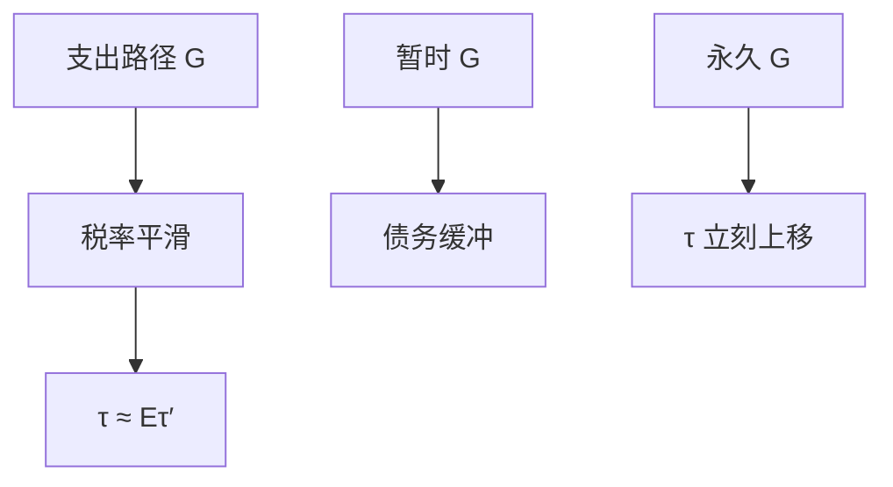

# Barro 税收平滑

扭曲税的边际成本应像永久收入那样平滑；暂时的支出用发债摊开，税率跟着永久支出走，而不是每年把预算轧平。

<footer>—— Barro, On the Determination of the Public Debt, JPE 1979</footer>

[上一课](/econ/fiscal-multiplier)在李嘉图与名义刚性下给出 $G$ 与减税的乘数，并声明一次总付税债互换可以不改 $C$。本课的缺口是换税种：若税是扭曲的（劳动、消费税），时间路径本身有成本，最优不是每期平衡预算，而是平滑税率。Barro（1979）把公共债务写成税收平滑的缓冲。物价水平的财政理论下一课才问名义锚是否由盈余现值定；本课先在实际量上写债务。

## 问题

乘数课的李嘉图用一次总付税：税的**时机**不扭曲，只有现值进财富。劳动税、销售税使边际决策变形，凸的超额负担意味着税率波动本身有成本——与消费的永久收入同构。缺口是：给定支出路径 $\{G_t\}$（含战争等暂时高峰），如何选 $\{ \tau_t\}$ 与债务。Barro：近似随机游走的税率，$\tau_t\approx\mathbb{E}_t\tau_{t+1}$，暂时 $G$ 用赤字，永久 $G$ 用永久更高的 $\tau$。这与「每年平衡预算」或「金规则只为资本项目发债」都不同。

平滑的是税率（边际扭曲），不是税收收入。税基随 $Y$ 变时，收入可以波动，税率仍平。自动稳定器下一课才把税基弹性当宏观缓冲。

## 方法

计划者最小化扭曲的现值，约束是政府跨期预算（不含一次总付）。一阶条件使相邻期边际扭曲的贴现值对齐，故 $\tau$ 近随机游走。债务是状态：吸收 $G$ 与税基的暂时冲击。预期到的永久战争：$\tau$ 立刻跳到新的永久水平，以免未来再跳。这与家庭 PIH 同构，对象是税。Ramsey 商品税（Ramsey 课）给出税种结构；本课只谈**同一税种的时间平滑**。

李嘉图在扭曲税下部分破裂：税的时机改变劳动供给与消费的跨期价格，乘数与平滑同时存在。下限上若要用 $G$ 刺激，平滑仍要求事后用债务摊还，而不是立刻用扭曲税轧平把刺激抵消掉——与乘数课的规则依赖一致。

### 不是为发债而发债

平滑给出债务的**规范**用途：保险税基与摊平暂时支出。它不给债务水平一个与 $\pi$ 无关的上限故事，也不等于 FTPL。不可持续的债务路径会在下一课变成价格水平跳跃或违约。本课假设政府仍满足现值约束。

### 平滑不是周期乘数菜单

暂时 $G$ 用债，是为了不让 $\tau$ 的平方超额负担集中爆发。它不回答 $G$ 本身该不该在下限上加大——那是乘数课的规则依赖。

两句话要一起读：刺激可以暂时抬 $G$，融资应平滑 $\tau$，而不是当年加扭曲税把刺激对冲掉。

## 机制

战争或灾难使 $G$ 暂时升高：若立刻用高 $\tau$ 融资，超额负担以税率的平方上升。发债把 $\tau$ 的升幅摊到未来多期，每期扭曲更小，现值更低。和平后盈余还债，$\tau$ 不必低于平滑路径去「还清」得过快。资本税的时间不一致（承诺课）会破坏这条平滑：将来的自己想抽资本存量的一次性税。Barro 的随机游走默认承诺能维持。

乘数课的一次总付减税不改变扭曲路径；本课的减税若降低 $\tau$，必须用未来 $\tau$ 或支出补上现值，否则不是平滑而是改永久税率。把刺激性减税写成税收平滑，会把周期政策与 Ramsey 时间路径焊成一句。平滑允许周期中税基波动造成的赤字，不允许把永久支出当成暂时来发债。

开放经济下，债务可以卖给外国人，$S-I$ 与 FH 相关再进来；平滑仍是税率逻辑。CIP 不决定 $\tau$ 路径，实证见 `/quant/irp`。

通胀税是另一种扭曲税。未预期通胀可以降低实际债，像一次性资本税，破坏平滑与承诺。本课的 $\tau$ 先指明文税率。

## 边界

本课不估计最优债务/GDP，不把平滑写成「可以无限赤字」。FTPL 下一课：若盈余现值钉不住， $P$ 会跳。自动稳定器把 $\tau$ 规则写成周期函数，与平滑的「税率不随暂时 $Y$ 动」在字面上紧张——稳定器平滑的是私人收入，税率表可以累进；Barro 平滑的是边际税率的随机游走。声明对象，不要焊死。

战争之外，衰退中的暂时 $G$ 或暂时低税基，平滑同样指向赤字，而不是立刻加税把乘数课的刺激抵消。永久的老龄化支出必须进永久 $\tau$，不能靠滚动债务假装暂时。这是会计上的永久/暂时分解，不是政治上的「以后再调」。李嘉图一次总付下时机无成本；本课一旦引入扭曲，时机就是福利对象。

后课默认：扭曲税下债务是平滑缓冲，税率近随机游走；一次总付李嘉图不再是唯一基准。下一课：名义债务与物价水平是否由财政现值决定。

## 小结

- 乘数课用一次总付；本课用扭曲税的时间路径。
- Barro：$\tau$ 近随机游走，暂时 $G$ 用债，永久 $G$ 用永久 $\tau$。
- 平滑的是边际扭曲，不是每期预算平衡。
- 现值约束仍要满足；FTPL 是下一课的名义接头。
- 出处：Barro, *JPE* 1979。
