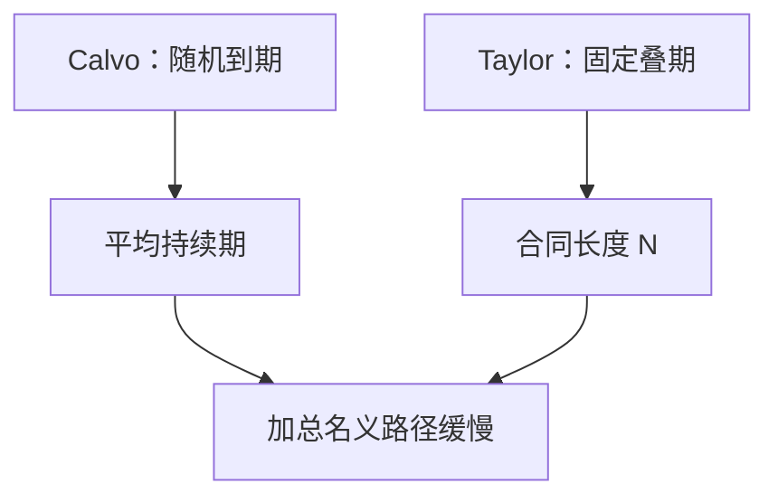

# Taylor 交错合同

合同不是每期抽签谁能改，而是固定期限叠在一起；今天能改的人必须把整段锁住的名义路径写进这一跳。

<footer>—— Taylor, Aggregate Dynamics and Staggered Contracts, JPE 1980</footer>

[上一课](/econ/sticky-wages)承认工资可以与价格一样粘，并把 EHL 的工资菲利普斯并上。粘性的日历仍可以是 Calvo 抽签。本课的缺口是 Taylor（1980）的交错合同：合同长度固定、重叠到期，加总价格或工资是若干尚未到期合同的平均。NKPC 下一课才从 Calvo 重置价格收成 $\kappa$；本课只把「交错」从概率改成叠期。

## 问题

Calvo：每期每人独立以 $1-\theta$ 改价，期望持续期 $1/(1-\theta)$，没有确定的到期日。Taylor：一半（或 $1/N$）的合同每期到期，期限 $N$ 固定。能改的人知道自己要锁 $N$ 期，于是把未来 $N$ 期的预期需求与成本写进今天的合同。缺口不是再论证工资粘不粘，而是：固定叠期如何产生惯性与前瞻并存的加总动力学。Fischer 的错开预置合同是近亲，但预置的是路径而非每期可再优化的水平——本课取 Taylor 的水平合同。

交错本身制造相对价格/工资离散：同一时刻市场上并存不同日期签下的名义条款。这与 Rotemberg 人人同步调价不同。

## 方法

以两期合同为例：当期新签合同 $x_t$ 取决于 $\mathbb{E}_t$ 未来两期的目标价格（或工资），加总 $p_t$ 是 $x_t$ 与 $x_{t-1}$ 的平均。解出的通胀既含 $\mathbb{E}\pi_{t+1}$ 一类前瞻，也含过去合同留下的滞后。$N$ 越大，惯性越强，货币政策传到 $P$ 越慢。Calvo 用一个 $\theta$ 概括平均持续期；Taylor 用 $N$ 与重叠份额，分布更「矩形」。线性近似后，二者都可以接到前瞻 Phillips，系数映射不同。

工资与价格都可以套这套叠期。上一课的 EHL 常用工资 Calvo；换成 Taylor 合同，工资通胀的滞后结构更干净地来自尚未到期的合同，而不是外贴指数化。

### 不是把菜单成本写成合同

菜单成本是状态依赖：偏得远才改。Taylor 合同是时间依赖：到期就改，不到期基本不改（除非重谈，本课抽象掉）。高通胀时合同会缩短，固定 $N$ 与固定 $\theta$ 犯同一错误。本课承认方便，不把 $N$ 当制度事实。

### 与 Fischer 预置路径的差别

Fischer 合同预置的是一整段名义路径，期中不再优化水平。Taylor 每期到期的批次重新选一个水平，锁住未来 $N$ 期。加总惯性两者都有，前瞻结构不同。

本课取 Taylor，因为更接近后来 Calvo 重置价格的「选一个价格锁一段时间」。预置路径是并列历史，不在主干默认。

## 机制

货币或利率冲击到来时，只有到期的那一批能把新信息写进名义条款，其余批次仍执行旧合同。加总 $P$ 或部分工资缓慢动，真实余额或真实工资暂时变，产出与就业有真实效应。预期到的冲击：新签合同会提前写入，效应小于意外冲击——与卢卡斯信息不完全不同，这里是合同叠期。长期所有批次都重签，中性恢复。

这与动态 IS 的接头在更后：名义刚性无论来自 Calvo 还是 Taylor，只要加总 $P$ 不跳，$i$ 就能暂时移动实际利率。本课不把三方程重写一遍。

$N=1$ 即每期全员重签，刚性消失，回到灵活价格。$N$ 很大则加总几乎不动，货币短期非中性变强，但新签合同仍把长期锚写进去——若 $\pi^*$ 可信，锁住的是相对 $\pi^*$ 的路径，不是任意水平。把交错合同读成「价格永远不反应政策」，是忽略了到期批次的前瞻。

交错合同的惯性常被读成「后视」。优化的新签合同仍前瞻；滞后项来自还没到期的旧合同，不是适应性预期。

## 边界

本课不估计 $N$，不把工会合同抽样当微观数据课。量化栏的订单存续不是宏观叠期。混合 NKPC 会把滞后通胀写进方程，那是经验修补与指数化；Taylor 叠期是其中一种结构来源，不是 Galí–Gertler 的规则拇指本身。

合同若允许重谈，固定 $N$ 被状态依赖打破，更像菜单成本。本课抽象掉重谈，是为了干净的时间依赖。高通胀时合同缩短，等于 $N$ 下降、刚性减弱——与菜单成本频率上升同一经验。线性 NK 把 $N$ 当参数，已经碰到卢卡斯批判：规则一变，合同长度可以变。

后课默认：交错可以是 Calvo 抽签或 Taylor 叠期；加总都缓慢，新签都前瞻。下一课把价格侧收成可嵌入三方程的 NKPC。

## 小结

- 工资粘性课给出对象；本课给出固定期限的交错日历。
- Taylor：到期批次改写，加总是未到期合同的平均。
- 新签前瞻，滞后项来自旧合同，不是适应性 $\pi^e$。
- 与 Calvo 宏观同族，持续期分布不同。
- 出处：Taylor, *JPE* 1980。
