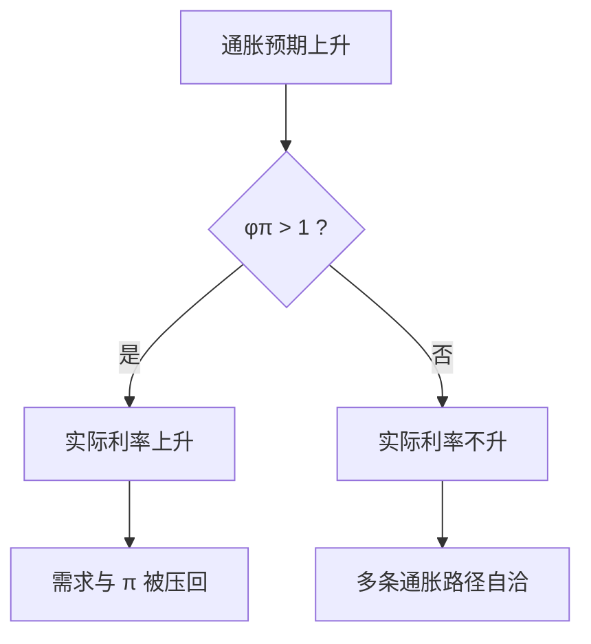

# 泰勒原理

名义利率对通胀的长期反应必须大于一对一，实际利率才能在通胀上升时上升；这是确定性条件，不是某十年的拟合优度。

<footer>—— Woodford 对利率规则确定性的讨论；Clarida, Galí and Gertler 对反应系数的估计对照</footer>

[上一课](/econ/taylor-rule)已经写出 $i_t=r^*+\pi^*+\phi_\pi(\pi_t-\pi^*)+\phi_y\tilde{y}_t$，并把 $\phi_\pi\gt 1$ 叫做泰勒原则。本课的缺口不是再抄一遍规则，而是：为什么小于一对一的反应会让通胀自我实现，以及 Clarida–Galí–Gertler 如何把这条不等式读成制度分界。时间不一致是下一课：即使系数写对了，将来的自己是否还肯遵守。

## 问题

新凯恩斯系统是前瞻 IS + NKPC + 利率规则。若 $\phi_\pi\le 1$，通胀预期上升时实际利率不升甚至下降，欧拉要求当前需求更旺，NKPC 上 $\pi$ 进一步升——存在许多条都自洽的通胀路径，价格水平不确定。Woodford 的缺口是局部确定性：规则必须对名义变量有足够反应，理性预期均衡才唯一（在稳态附近）。Taylor 原文的 1.5 是经验描述；原理是不等式，不是那个点估计。

上一课已经写出规则并点过 $\phi_\pi\gt 1$。本课只证明为什么小于一对一会让通胀自我实现，并把 Clarida–Galí–Gertler 的分样本当作制度对照，而不是再拟合一条泰勒规则。时间不一致下一课才问：写对的系数将来还肯不肯遵守。

$\phi_\pi\gt 1$ 是对**通胀**的反应。对产出缺口的 $\phi_y$ 帮助区分需求与成本冲击，但单独把 $\phi_y$ 加大并不能替代对 $\pi$ 的激进反应。

## 方法

把三方程对数线性系统写成对 $\mathbb{E}\pi$、$\tilde{y}$ 的差分方程，检查特征根是否落在确定性区域。简单情形下，长期反应系数 $\phi_\pi\gt 1$ 即泰勒原理；有惯性、有前瞻、有 $\phi_y$ 时，边界会平移，但精神不变：通胀升，实际利率必须升。Clarida、Galí 与 Gertler（QJE 2000）用前瞻规则估美国：Volcker 之前 $\phi_\pi$ 往往小于一，之后大于一——把「大稳健」读成确定性区域的切换，而不是偏好突然变好。

操作上，走廊或地板系统让 $M$ 内生，数量方程不再是工具。原理约束的是 $i$ 对 $\pi$ 的映射，不是准备金数量。

### 惯性不是放弃原理

规则含 $i_{t-1}$ 时，短期可以「少动」，但长期乘数仍须 $\phi_\pi\gt 1$。惯性来自承诺下的历史依赖，不是把反应改成适应性微调。卢卡斯批判：用 Volcker 之前的简化式去模拟「若当时就激进加息」，系数本身不可搬运。

## 机制

公众若相信 $\phi_\pi\gt 1$，则不敢把 $\mathbb{E}\pi$ 任意抬高：那样会换来更高的实际利率与更低的缺口。锚住的是预期，不只是当期 $i$。$\phi_\pi\le 1$ 时，预言高通胀可以自实现，铸币税与价格水平一起漂。这与长期中性兼容：原理选的是哪一条中性路径（哪一个 $\pi^*$），不是否认 $y$ 回自然率。

成本推动下，激进加息压 $\pi$ 会暂时加大缺口——那是权衡，不是对原理的否证。原理管确定性；最优系数还要看损失函数，下一课的承诺问题在此接头。$r^*$ 作为截距：原理约束的是对 $\pi$ 的斜率，截距跟错自然利率会带来平均缺口，那是测量问题，不取消 $\phi_\pi\gt 1$。

财政若主动（FTPL 课），货币再怎么满足泰勒原理也可能与盈余规则冲突。本课先在被动财政、正利率区把不等式钉死。开放经济的 UIP 会把外国 $i^*$ 与 $\mathbb{E}\Delta e$ 写进确定性边界，蒙代尔再碰，这里封闭。

有效下限上 $\phi_\pi\gt 1$ 无法执行，确定性要靠对未来路径的承诺。那是零下限课，本课先在正利率区把不等式钉死。

## 边界

本课不重估 CGG 的样本，不把原理写成每个国家的法定公式。汇率与 UIP 会改变开放经济的确定性边界，蒙代尔再碰。量化栏的微观报价不是 $\phi_\pi$。也不要把「规则含资产价格」偷运进来：那是另一条反应函数。

Woodford 的确定性是局部的、线性化的。全局上还可能有流动性陷阱式的第二稳态，那是下限课的对象，不在本课把 $\phi_\pi\gt 1$ 说成全球唯一。简单规则的惯性、前瞻、对缺口的反应都会平移边界，精神仍是：通胀升，实际利率必须升。财政主动时原理可能与盈余规则冲突，FTPL 课再写，这里假定财政被动。

后课默认：利率规则先满足 $\phi_\pi\gt 1$，均衡才按局部唯一来读。下一课问：宣布这条规则的央行，将来有没有再偷一次意外通胀的激励。

## 小结

- 泰勒原理：$\phi_\pi\gt 1$，通胀升则实际利率升。
- 它是 NK 系统的确定性条件，不是 Taylor 1993 的点估计。
- CGG：反应系数跨 Volcker 的切换，是制度对照。
- 惯性改变短期动态，不取消长期大于一对一。
- 下限上原理无法执行，确定性改靠路径承诺。
- 出处：Woodford, *Interest and Prices*；Clarida, Galí and Gertler, *QJE* 2000。
