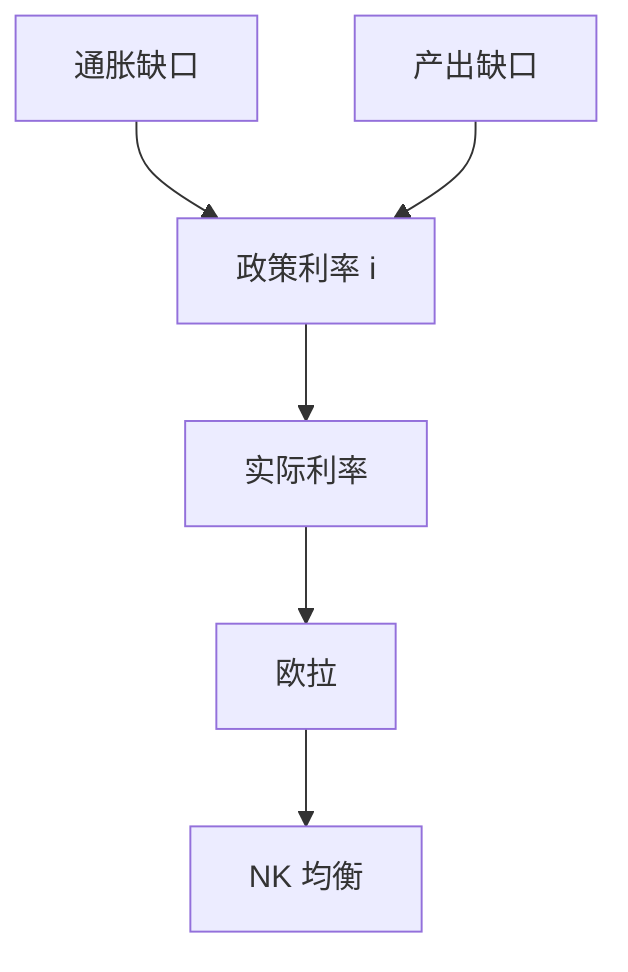

# 泰勒规则

政策利率对通胀缺口的反应必须大于一对一，实际利率才能在通胀上升时上升；系数是规则，不是又一次相机微调。

<footer>—— Taylor, Discretion versus Policy Rules in Practice, Carnegie–Rochester 1993；对照 Woodford 对利率规则确定性的讨论</footer>

[上一课](/econ/lucas-critique)禁止用旧简化式模拟新政。央行若仍说「看情况调 $i$」，公众无法形成与规则一致的预期。本课的缺口是给出一条可被写进新凯恩斯系统的利率规则。Taylor（1993）用通胀与产出缺口的线性反馈描述联邦基金利率；Woodford 问的是这条规则能否唯一决定均衡。时间不一致是下一课：即使有规则，将来的自己是否还愿意遵守。

## 问题

新凯恩斯把工具从 $M$ 换成 $i$。若 $i$ 外生钉死，名义值常常不确定（利率为零的路径可以有许多通胀）。若 $i$ 纯相机，卢卡斯批判直接适用。Taylor 的缺口是：用可观测的宏观状态反馈

$$
i_t = r^*+\pi^*+\phi_\pi(\pi_t-\pi^*)+\phi_y\tilde{y}_t,
$$

$\phi_\pi>1$ 时称为泰勒原则：通胀升则实际利率升，需求被欧拉抑制，预期被锚住。$\phi_\pi\le 1$ 时通胀可以自我实现。这是规则的稳定性条件，不是对某十年拟合优度的炫耀。

$r^*$ 是与 $y^*$ 相容的实际中性利率，可慢变。把它当常数是教学；估计 $r^*$ 本身会随规则与趋势增长而变——批判再次适用。

## 方法

把上式嵌进欧拉 + 前瞻 Phillips。确定性：在合理前瞻下，偏离目标的通胀预期会被实际利率推回去。Woodford 强调：规则必须对名义变量有足够反应，均衡才唯一。操作上，央行可以在走廊或地板系统里让准备金内生，数量方程决定 $M$ 的结果而不是工具。

Taylor 原文的系数（通胀约 1.5、缺口约 0.5）是描述 1980–90 年代的经验规则，不是最优控制的一阶条件。最优规则仍是对目标函数的承诺，系数可以含惯性 $i_{t-1}$。本课钉原则：$\phi_\pi>1$，工具是 $i$，评估必须在结构里做。

### 规则不是机械按钮

数据修订、自然产出不可观测、金融状况，都会让简单规则偏离。那是执行摩擦，不把我们退回「无规则的最优控制」。Friedman 的 $k\%$ 是数量规则；泰勒是利率规则。两者都是对批判的回应：先承诺反应函数。

## 机制

通胀高于目标时，$i$ 多升一截，欧拉要求当前需求下降，Phillips 上 $\tilde{y}$ 缩小，$\pi$ 回到目标。公众若相信这条反应，则 $\mathbb{E}\pi$ 不会任意飘。这与数量论的长期中性兼容：规则锚住的是 $\pi^*$，$y$ 仍回自然路径。铸币税在正的 $\pi^*$ 上仍可有一小块，但是规则的目标选择，不是用失业去换税。

产出缺口项处理真实冲击与需求冲击的权衡：完全不反应缺口，可能让利率对技术冲击「过紧」。RBC 对照提醒：若缺口测的是自然产出变动，反应 $\tilde{y}$ 会扭曲。规则的自变量必须与理论对象一致。

Taylor 原式的 0.5 是描述 1987–1992 一类时期的简单拟合，不是深结构。$r^*$ 与 $y^*$ 不可直接观测，自然率课已经警告。实时缺口修订是执行误差，不把规则退回无约束最优控制。

工具从 $M$ 换成 $i$ 后，货币量内生适应规则。数量论仍描述长期 $P$，周度操作不再拧 $M$。这是对数量方程课的制度补差。

## 边界

本课不把泰勒规则写成每个国家的法定公式，也不在这里展开有效下限——下一课的下一课才把 $i\ge 0$ 加上。汇率与开放的利率平价不是本课；蒙代尔会把 $i$ 接到资本流动。量化栏的微观报价不是宏观政策利率。规则不含资产价格目标；那是另一条反应函数。

后课默认：利率政策先写成对 $\pi$ 与缺口的反应，且 $\phi_\pi>1$。下一课问：宣布这条规则的央行，将来有没有再偷一次意外通胀的激励。

## 小结

- 工具是利率规则，不是无约束的相机 $i$。
- 泰勒原则 $\phi_\pi>1$ 用来锚住通胀预期、帮助均衡确定。
- 系数描述承诺，评估要在 NK 结构里做。
- $r^*$、缺口测量误差会污染简单规则，但不取消规则本身。
- 长期 $\pi^*$ 仍与货币趋势相容；$M$ 内生。
- 出处：Taylor, Carnegie–Rochester 1993；Woodford, *Interest and Prices*。
