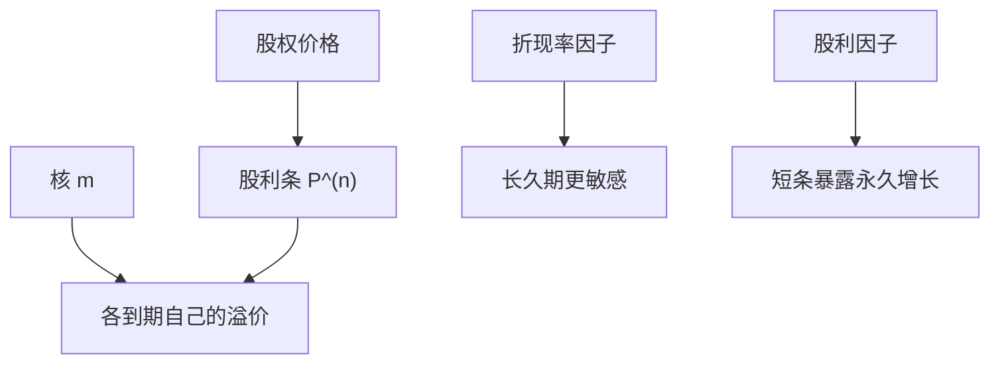

# 风险的期限结构

同一资产的短现金流与长现金流可以带着不同的风险价格；股权溢价不必在期限上平坦。

<footer>—— 据 Lettau and Wachter, Why Is Long-Horizon Equity Less Risky? Journal of Finance, 2007；van Binsbergen, Brandt and Koijen, Journal of Finance, 2012</footer>

[上一课](/econ/dp-ratio-predictability)把 $D/P$ 当成折现率状态的一个总量坐标。本课缺口是**沿期限切开**：价格是许多到期现金流之和，每一条「股利条」可以有自己的风险溢价。不重做预测回归，不把国债的仿射期限结构整课搬进来——那是主干 EH / 仿射课的对象；这里是**股权风险**的期限结构。

## 问题

恒定折现时，长股利只是多折几期，风险若只来自股利水平，长久期更险。时变折现翻转直觉：长现金流对折现率冲击更敏感，若折现率冲击可对冲或与 $m$ 的协方差符号相反，长股权条的溢价可以更低。Lettau–Wachter 给出一种模型：折现率均值回复，股利增长的永久冲击才是「坏」，于是短股利条（尚未被折现率平均掉）可以更险。van Binsbergen 等把股权拆成股利期货式的要求权，是测量；本课只要理论许可：风险价格可以随到期变。

缺口不是再校准 $\gamma$，而是：总量股权溢价是各条期限溢价的加权，Shiller 波动与 $D/P$ 预测主要抓住折现率因子，短现金流可能另有一块股利风险。

股利条（dividend strip）：只领取某一年股利的要求权。完全市场里可用期权或期货合成；不完全则是理论对象。本课不写合成的执行。

## 方法

把 $P_t=\sum_{n=1}^\infty P_t^{(n)}$，其中 $P^{(n)}$ 为 $n$ 期后股利的现值。对每一条写 $1=\mathrm{E}_t[m_{t,t+n} D_{t+n}/P_t^{(n)}]$，溢价 $\mathrm{E}[R^{(n)}]-r_f^{(n)}$ 由 $m_{t,t+n}$ 与 $D_{t+n}$ 的协方差决定。$m$ 的单因子结构会让期限结构由该因子的久期决定；多因子（习惯的慢状态、长期风险的持续增长）给出更富的形状。

与债券：名义无违约债券的期限结构是 $m$ 对一单位计价物的价格；股权条是 $m$ 对随机股利的价格。两者共享 $m$，不共享支付。不要把股权溢价的期限结构写成国债 EH 的否证。

Lucas 树单状态 Markov 已经给出一条期限结构，只是通常被加总藏掉。本课把加总拆开。

## 机制

机制是不同到期对状态冲击的暴露。均值回复的折现率：长期看被平均，短中期条承担「现在 $m$ 很抖」。持久的增长冲击：所有条都暴露，但短条折现少、相对权重更大。于是「股权很险」不必均匀洒在整条期限上。过度波动若主要来自折现率消息，应更多地表现在长条价格上；可预测性同理。

信息：短条更接近即将实现的 $y$，揭示深度随到期变——Admati 的跨资产学习在期限维上有类比。本课点到为止，不重做 REE。

长期风险（Bansal–Yaron）让增长的小持续成分进入 $m$，长条可以更险。与 Lettau–Wachter 的短条更险相反，取决于哪一个因子主导。形状是模型选择，不是数据终审——终审换栏。

## 边界

本课不报告股利期货的平均回报表。那是对这条理论的测量，样本短、合成摩擦大，属于量化。下一课离开交换经济：生产技术让投资的边际成为另一套定价核，股利不再等于果实。

后课默认：股权溢价有期限结构；折现率因子与股利因子在不同到期上权重不同。总量 $D/P$ 是加总坐标，不是每一条的充分统计。

## 小结

- 股利条各自对 $m$ 暴露，风险价格可以随到期变。
- 折现率均值回复 vs 持久增长冲击，给出相反的倾斜。
- 国债期限结构共享 $m$，不共享支付；不在此重写 EH。
- 出处：Lettau and Wachter, *JF* 2007；van Binsbergen, Brandt and Koijen, *JF* 2012。
