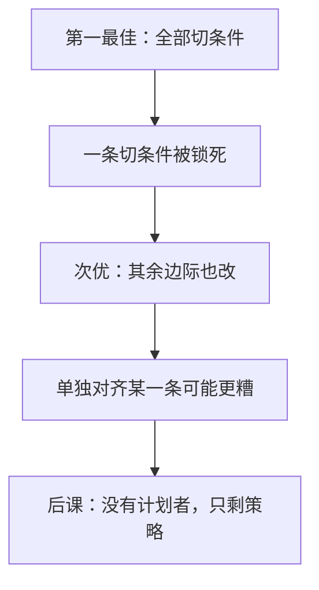

# 次优理论

若帕累托最优的某一条件因故无法满足，则其余条件一般也不再可欲；逐条对齐「还剩下的」一阶条件，不必改进福利。

<footer>—— Lipsey and Lancaster, The General Theory of Second Best, Review of Economic Studies, 1956</footer>

[上一课](/econ/tax-incidence)留下楔子：商品税、要素税改净价，负担按弹性落。 [第二福利定理](/econ/welfare-theorems)要用总额转移才能分权实现任意有效点，总额税在激励与信息上往往不可用。缺口是：已经有一块扭曲钉死，计划者还应不应该把其余市场都拉回「MRS = MRT」？Lipsey–Lancaster 说：不必。本课钉次优，然后市场失灵课序结束，博弈课序接手。

## 问题

帕累托最优是一组切条件同时成立。设其中一条因垄断、关税或无法取消的税而永久违背。直觉是：其余市场尽量竞争、尽量不征税，至少靠近最优。次优定理切断这直觉。约束下的最优（次优）一般要求其余边际也偏离它们的第一最佳值；单独消除某一个可消除的扭曲，福利可能下降。

缺口不是再算归宿，而是规范：在不能回到完整市场加总额税的制度里，「纠正看起来最像第一最佳的那一项」没有福利定理保证。

### 次优不是「第二好的政策清单」

名字容易读成一份具体药方。Lipsey–Lancaster 是一般命题：附加约束进入拉格朗日之后，一阶条件全部改写，交叉项把扭曲传到所有市场。没有更多结构，推不出「只对外部性征税、其余放任」一定对——尽管[庇古](/econ/externality-pigou)在第一最佳里是对的。

典型反例：一个部门垄断，价格高于边际成本。另一部门若仍按边际成本定价，资源会过度流入竞争部门。次优可能要在竞争部门也加税，把相对价格扳回来。

## 方法

把第一最佳写成 $\max W(x)$ s.t. 资源与技术。次优再加约束 $g(x)=0$，该约束正是那条无法满足的切条件。拉格朗日对未约束变量的导数里出现 $\mu\nabla g$，于是其余切条件都带 $\mu$ 的修正项。除非 $g$ 与这些变量可分，修正项不为零。

政策含义是比较静态，不是口号。要判断「取消一项关税」好不好，必须看它与留下的扭曲是互补还是替代。公共品融资只能用扭曲税时，萨缪尔森条件也要改写（Ramsey 加总、修正的 MRS 之和），不能直接套第一最佳的 $\sum\mathrm{MRS}=\mathrm{MRT}$。

本课不展开最优商品税的 Ramsey 公式细节；只要记住：楔子的最优模式由需求的替代矩阵决定，不是由「每个市场自己的弹性」单独决定——尽管 Ramsey 的简化情形看起来像逆弹性。

## 机制

扭曲通过相对价格传播。锁死的那条条件规定了某两种商品的错误比率；其他商品是否「按自己的 MRT 定价」，问的是它们相对这一错误比率是否又偏了一次。次优要的是相对价格结构，不是每一对都回到第一最佳。

这与归宿同一条一般均衡通道：税落在谁身上，取决于替代；次优的修正项，也取决于替代。归宿是实证的负担；次优是规范的「还该不该加下一根楔子」。公共品若只能用扭曲税融资，萨缪尔森加总也要乘上公共资金的边际成本，不能直接把[上一课](/econ/tax-incidence)的楔子当零。

本课仍假定有人在解约束最优。若连这个计划者都没有，只剩厂商或消费者互为环境，解概念必须换成相互最优反应——那是下一课纳什，不是再写一条拉格朗日。

## 边界

若经济可分——扭曲被关在一个与其余商品无替代、无互补的孤岛——第一最佳条件在其余处仍成立。可分是刀刃。信息不完全、数量配额、政治约束，都会制造各自的 $g(x)$，没有统一的「次优税率表」。

次优也不等于「什么都不要改」。它禁止的是无结构的逐条对齐，不是禁止计算。有了需求系统，仍可解约束最优。

后课离开计划者。市场失灵课序默认：第一最佳的切条件不能当清单用。策略互动里，连「谁是计划者」都不存在，解概念换成纳什。

## 小结

- 一条切条件锁死，其余第一最佳条件一般不再是约束最优。
- 单独消除一个扭曲，福利可能下降。
- 庇古、萨缪尔森在第一最佳里对；次优里要重写。
- 可分经济是例外，不是通例。
- 出处：Lipsey and Lancaster, *RES* 1956。
