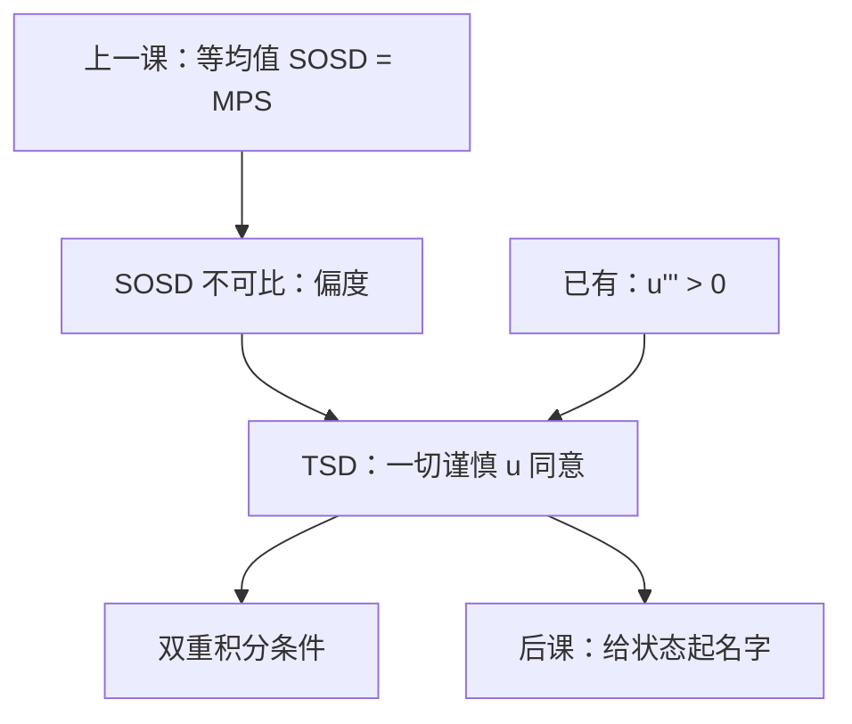

# 三阶占优

均值与展形都不足以让所有谨慎的人同意时，还要看质量是堆在左尾还是右尾——那是三阶占优，不是把方差再估一次。

<footer>—— 据 Whitmore, Third-Degree Stochastic Dominance, American Economic Review, 1970 整理</footer>

[上一课](/econ/sosd-mps)把等均值的 SOSD 与均值保持展开收成三条等价，并声明方差不是定义。本课不重写 MPS 的噪声表示，也不把积分条件 $\int F$ 再推一遍。缺口是：许多分布对均值相同、SOSD 不可比——一边更散在左尾，一边偏右。一切凹 $u$ 会分裂；但一切**谨慎**的 $u$（$u'''\gt 0$）仍可能同意。Whitmore 的三阶占优（TSD）就是这条偏序。谨慎课已经给出 $u'''$；本课把它接到分布上。

## 问题

SOSD 要求对一切递增凹 $u$ 都有 $\mathbb{E}u(X)\ge\mathbb{E}u(Y)$。偏度不同、二阶积分交叉时，这条偏序沉默。缺口不是再指定一条 $r_A$，而是收窄函数类：递增、凹、且 $u'''\ge 0$。Whitmore 给出积分刻画：记 $H_F(z)=\int_{-\infty}^z F$，$K_F(x)=\int_{-\infty}^x H_F$，则 $X$ 三阶占优 $Y$ 当

$$
K_F(x)\le K_G(x)\quad\forall x,\qquad H_F(\infty)\le H_G(\infty),
$$

并通常要求均值 $X$ 不差于 $Y$。第三项 $H_F(\infty)$ 与均值有关；等均值时只剩双重积分条件。本课对象仍是一维无名财富，与上一课相同，只是多积一次。

### 右偏不是「方差更小」

把质量从中间挪到右尾、同时填左尾的某一类转移，可以保持均值甚至保持 SOSD 不可比，却提高偏度。谨慎者喜欢这种转移，因为 $u'$ 凸：左尾的边际效用被加重，他们更讨厌下行。这与 MPS 正交：MPS 两端对称地展开，一切凹 $u$ 都讨厌；TSD 管的是**不对称**的搬动。不要把「偏度为正」写成 TSD 的定义——定义是积分，偏度只是方向直觉。

单次交叉的 CDF 往往给出 SOSD；TSD 允许 CDF 与一阶积分都交叉，只要双重积分不交叉。几何上多了一层面积约束。

## 方法

比较两个已给的 $F,G$：先查 SOSD；不可比再查双重积分与均值。不必估 $u$，也不必估 $\pi$。类比显示偏好：公理直接打在分布上。若只报偏度系数或三阶矩，既非必要也非充分——与方差不是 SOSD 同一逻辑。

与 Kimball 的接口：预防性储蓄是「同一人面对展形是否多存」；TSD 是「所有谨慎者是否同意哪份分布更好」。前者是一阶条件，后者是偏序。二次效用 $u'''=0$，对 TSD 的严格部分无差别，又一次被排除。

本课仍比较无名分布。哪一个状态穷、有没有 Arrow 证券，下一课才引入。也不把左尾写成限价簿上的下跌深度。

## 机制

双重积分的机制是把 SOSD 的面积再累加：左尾多出来的、未被中间补偿的质量，对 $u'''\gt 0$ 的人权重更大。Taylor 展开里，$u'''$ 乘三阶矩；但全局等价仍是积分，不是矩。均值相同且 SOSD 成立，则 TSD 自动成立——函数类更窄，偏序更弱（更容易「占优」）。TSD 成立而 SOSD 不成立，才是本课真正补上的缺口。

与均值方差的重逢更窄：正态被 $(\mu,\sigma)$ 钉死，没有独立的偏度，TSD 不增加信息。非对称、跳跃、期权式支付，TSD 才开口。上一课说「三阶占优主干用不到」是相对于 MPS 定义；本课把它从边注升级，因为谨慎已经在课序里出现了。

Whitmore 1970 把 Hadar–Russell 的积分阶梯往上推一层。后续「增加下行风险」（Menezes–Geiss–Tressler）是等均值、等方差下的左尾转移，比 TSD 更窄。本课只钉 Whitmore。

## 边界

占优仍是偏序：许多分布对 TSD 也不可比，必须回到特定 $u$ 或 $\pi$。多维要把积分改成多维；本课只钉一维。独立性失败则效用刻画塌，积分条件只剩几何。模糊没有 $F$。

也不要把 TSD 当资产定价因子。偏度偏好可以进入后课的或有要求权，但价格由 $q$ 决定，不是由占优给出。本课没有市场。

后课默认：SOSD 沉默时，可再问 TSD；同意的人是谨慎者，不是全体风险厌恶者。方差与偏度系数都不能代替积分条件。

## 小结

- TSD：一切递增、凹、谨慎的 $u$ 同意；积分是 CDF 的双重原函数。
- 它弱于 SOSD，管的是 SOSD 不可比时的偏度方向。
- 三阶矩不是定义；二次效用对严格 TSD 无感觉。
- 无名分布到此；下一课把结果绑上有名字的状态。
- 出处：Whitmore, *AER*, 1970；Kimball 的谨慎提供效用类。
