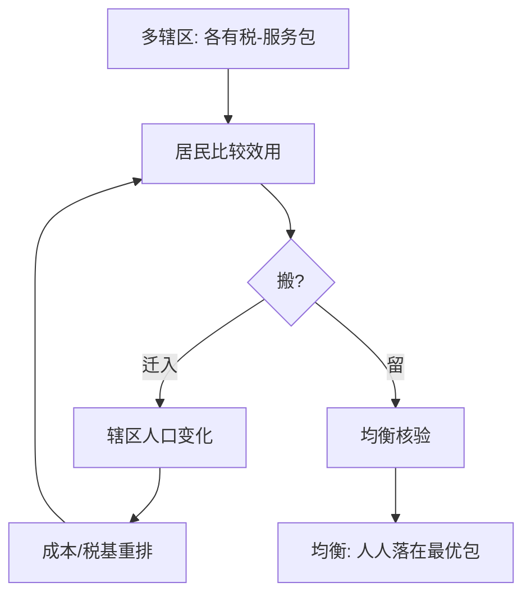
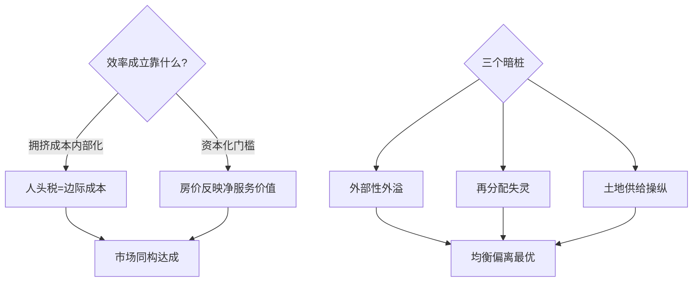

# Tiebout 用脚投票

公共品不用投票也能「定价」：居民挑社区落脚，偏好被脚投票显式披露，地方竞争把萨缪尔森难题松了一扣。

<footer>—— 据 Tiebout「A Pure Theory of Local Expenditures」(1956)；Oates 财政联邦主义 (1972)</footer>

萨缪尔森 (1954) 断言公共品偏好在投票中无法被真实披露——人人隐藏口味搭便车。Tiebout 的回应：把「买不买」换成「搬不搬」。缺口是**辖区竞争模型**：多辖区、差异化税包，居民迁移使偏好显形。本课只做流动性红利一侧，不做辖区间恶性减税竞争的另一面。

## 问题

全国性公共品无法用脚投票，地方性公共品（学校、治安、绿化）可以。若辖区数量足够、迁移无成本、居民完全信息，每人选出「税收-服务包」最合身的社区——市场机制在公共品上的复现。要问的是：这个复现在哪些假设下成立，偏离时谁受损？

术语翻译：用脚投票（voting with feet）= 以迁移代替投票披露偏好；税收-服务包（tax-service package）= 辖区同时给出的税率与公共品组合，类比商品的价格-质量组合。

数字实例：两个辖区，学区质量高低之别，房产税差 1.5%。高偏好家庭愿意为优质学区付房价溢价——资本化研究显示边境学区房价差可达 15–25%，远高于税差本身：税付一次性，服务吃很多年。

## 方法

模型骨架：$N$ 个辖区各供一档公共品 $g_j$ 与人头税 $t_j$；居民 $i$ 效用 $u(x_i, g_j)-t_j$，选使效用最大的辖区；辖区在给定人口下以最低成本供 $g$。均衡时每个居民落在最优包上，且各辖区成本最小——**偏好被分拣（sorting）而不是被披露**。Oates 加上对应性原则：收益归属哪级辖区，就由哪级征税。

直觉类比：把辖区想成自助餐厅的档口——不用举手表决全楼吃什么，各取所需即可；前提是你换档口不要排队成本，且每档口的成本只跟自家食客人数有关。

## 机制

Tiebout 均衡的效率来源是**拥挤性公共品的准私有化**：当 $g_j$ 的边际成本随人口线性上升，人头税恰好把它「内部化」，居民迁移至边际收益等于边际税收处，条件与私人品市场出清同构。 Hamilton (1975) 补上房产税版本：以最低住房消费作为分区门槛，把辖区变成「俱乐部」，资本化让门槛自我执行。但效率有三个暗桩——辖区间外部性（治污外溢）、再分配失灵（穷人被挤出好学区）、以及土地开发商操纵供给。

常见误区：把 Tiebout 当成「地方竞争必然有效」——模型假设迁移无成本、就业外生；现实里双职工家庭迁移成本高达数年收入，而辖区为抢税基压低税率会切断「税收=边际成本」的等式，效率论证反转为逐底论证。

## 边界

实证检验走资本化路线：Oates (1969) 的房产税-学区价值回归开启五十年文献，现代断点设计利用辖区边界确认溢价。适用边界：服务同质、人口可分、辖区较多的都会区最像模型；农村与单一城市内部不适用。政策接口：财政转移支付要补偿「搭便车的邻居」，学区择校的公平性争论本质是 Tiebout 效率与 Rawls 分配的对撞。与[拥堵定价](/econ/congestion-pricing)衔接：同一「按使用付费」逻辑从空间维度转向时间维度。

直觉类比：Tiebout 世界像自助餐再进一步——每家餐厅只做一道菜且成本随人数线性，食客流动自动校准价格；一旦某餐厅的菜香飘到隔壁（外部性）或菜单给熟客打折（再分配），市场同构就漏气。

## 小结

- 偏好靠分拣披露：多辖区差异化税包让脚投票替代投票。
- 效率条件：迁移成本低、拥挤成本可内部化、无跨区外部性。
- 资本化是实证抓手，房价溢价远超税差。
- 出处：Tiebout 1956；Oates「Fiscal Federalism」1972；Hamilton 1975。
