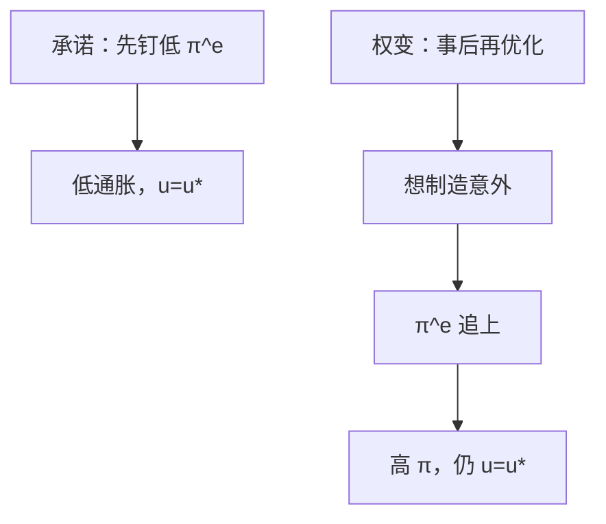

# 时间不一致与承诺

事先最优的低通胀计划，到了定价已完成后，突然来一次意外扩张常常显得更好；公众若预见到这一点，计划一开始就不会被信。

<footer>—— Kydland and Prescott, Rules Rather than Discretion, JPE 1977；对照 Barro and Gordon 的通胀偏差</footer>

[上一课](/econ/taylor-rule)把政策写成 $\phi_\pi>1$ 的反应函数。卢卡斯批判要求规则进入预期。本课的缺口是：将来的政策制定者仍会重新优化。Kydland 与 Prescott（1977）证明，缺乏承诺时，事先最优的规则一般不是事后最优。零下限是下一课的工具约束；本课先把激励约束写完。

## 问题

附加预期的菲利普斯里，意外通胀能暂时压低 $u$。事先，央行希望 $\pi^e$ 低，从而在 $u^*$ 用低通胀。事到临头，$\pi^e$ 已进入工资合同，再制造一点意外似乎能改善目标函数。若公众有理性预期，他们会把这种再优化算进去，$\pi^e$ 上升到使意外的净收益为零——结果是更高的 $\pi$，没有换到更低的 $u$。这就是通胀偏差。

Taylor 规则若只是「过去碰巧这么做」，不是承诺。承诺意味着未来的自己不能再解一次最优控制。Friedman 的 $k\%$、独立央行、通胀目标，都是把再优化关掉的制度近似。

时间不一致不是「朝令夕改的无能」。它是动态规划的子博弈：没有约束的最优控制，在公众先行动时，不是子博弈完美的事先最优。

## 方法

Barro–Gordon：央行目标含通胀平方与失业（或产出）对 $u^*$ 的偏离；短 Phillips 含 $\pi-\pi^e$。承诺解：选 $\pi$，令 $\pi^e=\pi$，得到低通胀。权变解：对给定 $\pi^e$ 选最优 $\pi$，再令 $\pi^e$ 等于这个选择，得到 $\pi>\pi_{\mathrm{commit}}$，$\tilde{u}=0$。信誉均衡可以在重复博弈里用触发策略支撑更好的结果，接近无名氏定理——那是博弈课已有的逻辑，对象换成通胀。

Taylor 原则是承诺的一种可检验写法：把未来的 $i$ 写成对状态的函数，而不是每期重新选「要不要偷一次」。Woodford 的最优目标规则（对价格水平或通胀缺口的承诺）是同一家族。

### 与黄金律的对照

黄金律也是事先与稳态的张力，但那里是资本过度积累。这里是名义锚：事先要低 $\pi$，事后想要意外 $\pi$。工具不同，时间结构同类。

若模型正确、冲击可观察、承诺可执行，状态依存规则可以优于僵硬数字。Kydland–Prescott 反对的是伪装成优化的权变：每期重解、假装意外还能用。灵活通胀目标是状态依存承诺，不是 1970 年代的微调菜单。

## 机制

公众的 $\pi^e$ 是对未来再优化的预测，不是对新闻发布会的字面理解。若制度不能限制再优化，唯一可信的是权变均衡的高通胀。铸币税在权变里往往更高：不仅抽税，还想用意外买就业，结果税抽到了、就业没买到。独立与保守的央行（Rogoff）把目标函数里通胀权重加大，是用制度改变权变均衡，不是否定激励。

卢卡斯批判与本课叠合：即使估对了 Phillips 斜率，若把「最优控制每期重解」当成规则，公众的 $A(g)$ 对准的是权变，不是你写在纸上的低 $\pi^*$。Taylor 规则要进入预期，必须让偏离规则有成本——沟通、立法、人事，而不是拟合优度。

资本税有同一结构：事先宣布低税以诱使投资，事后想对沉没的 $K$ 加税。Kydland–Prescott 原文的例子不限于货币。本课用通胀当主例，因为后课工具是 $i$。

## 边界

本课不把所有高通胀都写成 Barro–Gordon：财政主导、战争、铸币税拉弗区是另一条预算约束。也不在这里展开前瞻指引的措辞技术——那是 ZLB 课把承诺延伸到利率路径。公司承诺与资本结构是后课 MM；宏观承诺是名义锚。

NK 里前瞻 NKPC 使承诺更值钱：今天的规则压低 $\mathbb{E}\pi$，直接改善今天的权衡。这是 Woodford 强调的渠道，不是把 1977 年的故事作废。

后课默认：利率规则要被当成子博弈上的约束，才进预期。下一课：规则给出的 $i$ 碰到零，承诺必须换工具或换路径语言。

## 小结

- 事先最优的低通胀，事后常想用意外通胀换缺口。
- 理性预期下权变均衡是高 $\pi$、无就业收益。
- 规则、独立、目标制是承诺技术，不是口味。
- 泰勒规则必须可信，否则 $\phi_\pi$ 只是拟合。
- 财政主导可以另起一套高通胀，不必经过 Phillips 诱惑。
- 出处：Kydland and Prescott, JPE 1977；Barro–Gordon 通胀偏差。
