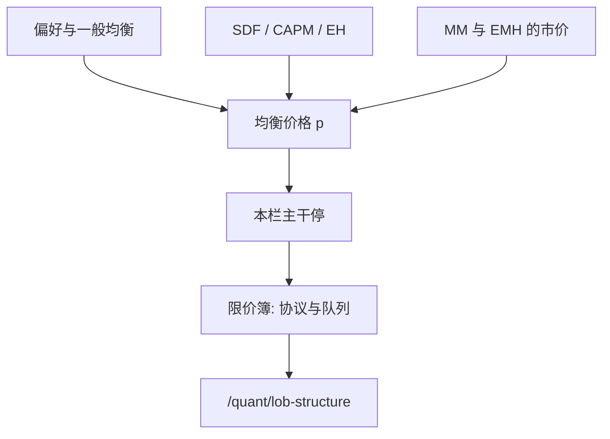

# 到限价簿：理论在此停

均衡给出价格应当满足的等式；限价簿是价格被生产出来的协议。理论在等式处停，协议从队列处起。

<footer>—— 本栏收束；簿的几何见 Harris, Trading and Exchanges</footer>

定位：[期限结构预期假说](/econ/eh-term-structure)。从偏好走到 SDF、CAPM 与 EH，本栏已经有一套关于**哪一个数字可以叫价格**的理论。本课是主干最后一课：缺口不是再写一个均衡模型，而是承认这些数字还没有交易程序。程序在量化栏的[限价簿结构](/quant/lob-structure)。后课不在本栏。

## 问题

瓦尔拉斯拍卖人、Arrow–Debreu 证券、CAPM 的市场组合、EH 的收益率，都假定存在一个使供需相等的 $p$，交易在 $p$ 上瞬时完成。没有人问：$p$ 如何出现在屏幕上、谁有权在某个价位排队、不成交的意愿如何被记录。若继续在本栏写「市场微观结构」，会把金融理论吞进撮合引擎，也会把量化栏的第一课变成重复。

缺口因此是交接。本栏的对象是配置、合同与均衡关系：偏好、生产、一般均衡、货币与银行、资本结构、$p=E[mx]$。量化栏的对象是协议：限价单、市价单、时间优先、价差。两者在「有一个可交易价格」处相切，不相吞。本课把切点写清楚，然后停笔。

Walrasian $p$ 是清值。LOB 上的中间价是最佳买卖价的中点，不是清值，甚至不是任何人必须成交的价。把中点叫成均衡价格，是后文 Glosten–Milgrom 与 Roll 要拆的习惯，不是本栏的定理。

## 方法

把本栏用过的「价格」收成三类，都**不是**簿。第一，一般均衡价格：商品与或有要求权的 $p$，使超额需求为零。第二，资产定价核：$p=E[mx]$，CAPM 与 EH 是它的特化。第三，公司金融里的市价：MM 套利、发行柠檬、股利公告所引用的那个 $p$，EMH 说它反映 $\Phi$。三类都是均衡或信息条件，没有状态机。

限价簿是状态机。未成交的买卖意愿按价格分层、按时间（或比例规则）排队；交叉时撮合，未交叉时停在簿上。Harris 称之为连续双向拍卖。它回答的问题是协议问题：立刻成交的价是什么、下一档还有多少、新单插在哪。这些问题在 [LOB 结构](/quant/lob-structure) 的第一课从零铺垫；本栏读者到那里时，只携带「理论上应当有一个 $p$」，不携带簿的几何。

交接句必须硬：理论停；簿是协议。不要把 CAPM 的 $R_m$ 当成盘口中间价的时间平均，也不要把 EH 的 $y^{(n)}$ 当成国债的某一档挂单价。那些映射需要微观结构与久期约定，是量化栏的工作。

## 机制

为什么均衡语言不够用？因为出清是对配置的描述，不是对消息与队列的描述。真实市场在时间上展开：买单到达、排队、被撤、被扫。价格形成是这个过程的产物，O'Hara 强调过这一点。过程会制造价差、深度空洞、短暂的交叉，这些对象在 $p=E[mx]$ 里没有符号。若强行在本栏引入做市商，会与已经写完的银行中介、与尚未写的 LOB 抢定义。

因此机制课在此是负面的：不再增加一条均衡定理。正向的机制从量化栏开始——价格优先如何把「更优的价」变成可验证的排序。本栏读者若跳过交接直接读因子实证，会把测量误差当成定价核的失败；先读簿，才知道收益是什么事件的记录。

### 理论停；簿是协议

这句话要按字面执行。本栏不再写做市商存货、知情交易或买卖价差分解——那些会与银行中介抢「中介」一词，也会把量化栏第一课掏空。Harris 的连续双向拍卖、价格优先加时间优先、tick 网格，全部从 [/quant/lob-structure](/quant/lob-structure) 起笔，并声明后课已经默认读过本栏主干。CAPM 的 $R_m$ 不是盘口中点的平均；EH 的 $y^{(n)}$ 不是某一档挂单价。映射需要约定与微观结构，是换栏之后的工作。

O'Hara：价格形成是交易过程的产物。过程的状态机是簿；均衡等式是对过程结果的限制，不是过程本身。

## 边界

本课不是微观结构综述。Glosten–Milgrom、Kyle、Roll 价差分解全部在量化栏，按课程序列出现。本栏也不回头改写 CAPM：均衡陈述仍在[前一课序](/econ/capm-theory)，实证仍在[/quant/capm](/quant/capm)。附录论文课（Arrow–Debreu、Akerlof、Keynes、Woodford、Diamond–Dybvig 原文等）是对照，不插入主干，不接在本课之后当成第十五课。

四栏互不吞并在此落地：金融接到限价簿为止；量化从限价簿起笔。打开 [/quant/lob-structure](/quant/lob-structure) 时，默认已经读完本栏主干到这一句。

附录十篇（Arrow–Debreu、Debreu 书、Akerlof、Spence、Rothschild–Stiglitz、Keynes、Friedman、Kydland–Prescott、Woodford、Diamond–Dybvig 原文）是对照，阅读顺序在附录课程内，不充当主干第十五课。读完本课若继续，应打开量化栏，而不是打开第一篇附录当作「下一课」。

理论停。簿是协议。Walrasian $p$ 不是盘口中点。

Glosten–Milgrom、Kyle、Roll 分解按量化栏课序出现，本课不预支。

打开 [/quant/lob-structure](/quant/lob-structure) 时，只携带「应当有一个均衡价格」，不携带队列几何。

## 小结

- 本栏给出均衡与合同意义上的价格；不给出交易协议。
- 限价簿是连续双向拍卖的状态机，不是 Walrasian $p$ 的另一种写法。
- 主干在此结束。下一课是量化栏第一课：[限价簿结构](/quant/lob-structure)。
- 附录对照另起，不插入本课之后。
