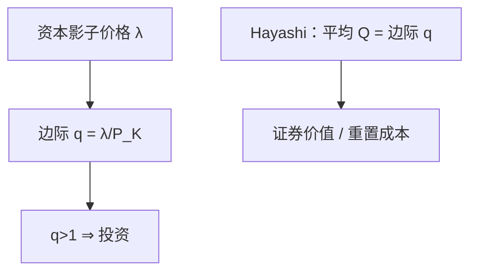

# 托宾 q

多装一单位资本值多少，相对重置它要花多少：这个比大于一就投资，小于一就停——投资跟着边际 $q$，不是跟着当期利润的会计。

<footer>—— Tobin, A General Equilibrium Approach to Monetary Theory, JMCB 1969；Hayashi 对平均 q 与边际 q 的对齐</footer>

[上一课](/econ/efficiency-wage)在劳动侧留下均衡失业：工资可以钉在出清之上。资本侧若完全灵活，投资会跳到使 $K$ 立刻到达合意水平，周期里的 $I$ 不会缓慢。本课的缺口是给出投资的影子价格：Tobin 的 $q$。调整成本下一课才说这个 $q$ 如何映射到**有限的** $I$；本课先钉边际 q 是什么。

## 问题

索洛把 $I=sY$ 当储蓄率。厂商问题里，资本的影子价值 $\lambda$ 相对其重置价格 $P_K$，定义为边际

$$
q=\frac{\lambda}{P_K}.
$$

$q>1$ 时多装资本的现值超过成本，应该投；$q<1$ 则相反。缺口不是再写效率工资，而是：投资决策的充分统计是这个比，而不是当期会计利润或现金流本身。Hayashi（1982）：在线性齐次生产与线性齐次调整成本下，边际 $q$ 等于可观测的平均 $Q=$ 证券价值 / 资本重置成本。没有这条对齐，股市市值不能直接当投资回归的右侧。

平均 $Q$ 用的是企业证券的市场价值。那是宏观投资理论的可观测代理，不是量化栏的限价簿或 CAPM 实证。本课不估计 $\beta$。

## 方法

无摩擦、无调整成本时，$q$ 被钉在 1，$K$ 瞬时跳到合意——投资率可以无限。这正是下一课要关掉的刀刃。本课保留定义：$\lambda$ 来自资本的欧拉（未来边际产出与资本利得的贴现）。货币政策、需求、效率工资造成的就业，都通过未来利润进入 $\lambda$，从而进入 $q$。托宾原初还把 $q$ 接到货币与资产组合；宏观主干后来把它收成投资理论。

公司金融的 MM 说资本结构不改企业价值；这里的 $q$ 是资产侧相对重置成本。税盾与代理会让平均 $Q$ 偏离边际 $q$，那是后课与公司金融课的缺口，本课先取齐性基准。

### 不是「股价涨就该投」的口号

平均 $Q$ 含泡沫、风险溢价与无形资产测量误差。$q$ 理论说的是**边际**影子价值；用市值当代理要声明 Hayashi 条件是否近似成立。把 $q$ 回归的拟合优度当成理论真伪，是把测量当结构。

### $q$ 不是股价预测作业

边际 $q$ 是资本欧拉的影子价格。把指数点位当 $q$，已经把风险溢价、泡沫与现金资产混进重置成本比。

本课只要求投资理论用 $q$ 当充分统计；预测股价不是宏观主干。

## 机制

预期未来的边际产出上升（技术、需求、更低的折扣率），$\lambda$ 升，$q$ 升，投资意愿升。重置成本 $P_K$ 升则 $q$ 降——同样的影子价值，装机更贵。效率工资提高劳动成本，可以压低资本的未来租，从而压 $q$；通道是利润，不是把纪律工资写成投资函数的自变量。

索洛的 $s$ 把投资钉在当期产出比例上，$q$ 把它钉在资本的跨期影子价格上。需求暂时上升若很快过去，$\lambda$ 几乎不动，$I$ 不应大动——这与凯恩斯的当期 $Y$ 驱动 $I$ 不同。动物精神只有改了预期利润路径才进 $q$；把股价噪声直接写成 $I$，是把平均 $Q$ 的测量误差当成结构。

开放经济下，外国资本成本进入折扣率；CIP 实证仍在[量化栏](/quant/irp)，本课不把 $q$ 写成远期基差。增长模型里的 $I$ 一旦离开外生 $s$，就要用 $q$ 或欧拉来引导——Ramsey 的消费欧拉与这里的资本欧拉是一对。

边际 $q$ 不可直接看见，平均 $Q$ 可看见。理论用前者，实证常用后者。二者分叉时，先查齐性、税与无形资产，再谈「理论失败」。

## 边界

本课不估计投资对 $Q$ 的弹性，不把托宾 $q$ 写成交易策略。调整成本、不可逆与固定成本会改 $I(q)$ 的形状——下一课。金融加速器会让外部融资溢价再乘一层，那是更后的周期课。

无形资产、垄断租进入证券价值时，平均 $Q$ 可以长期大于 1 而不对应安装更多实物 $K$。测量误差使 $Q$ 回归看起来「失败」，不一定否定边际 $q$。MM 与代理冲突改的是企业价值如何在证券间分割，不是取消资本的影子价格。

后课默认：投资的一阶条件用边际 $q$；平均 $Q$ 只在 Hayashi 条件下等于它。下一课：凸调整成本如何让 $I$ 有限、让 $q$ 可以离开 1。

## 小结

- 劳动侧摩擦已写完；资本侧用 $q$ 当投资的充分统计。
- 边际 $q=\lambda/P_K$；$q>1$ 投，$q<1$ 停。
- Hayashi：齐性下平均 $Q$ 等于边际 $q$。
- 无调整成本时 $q$ 被钉在 1，投资跳——下一课的刀刃。
- 出处：Tobin, *JMCB* 1969；Hayashi, *Econometrica* 1982。
