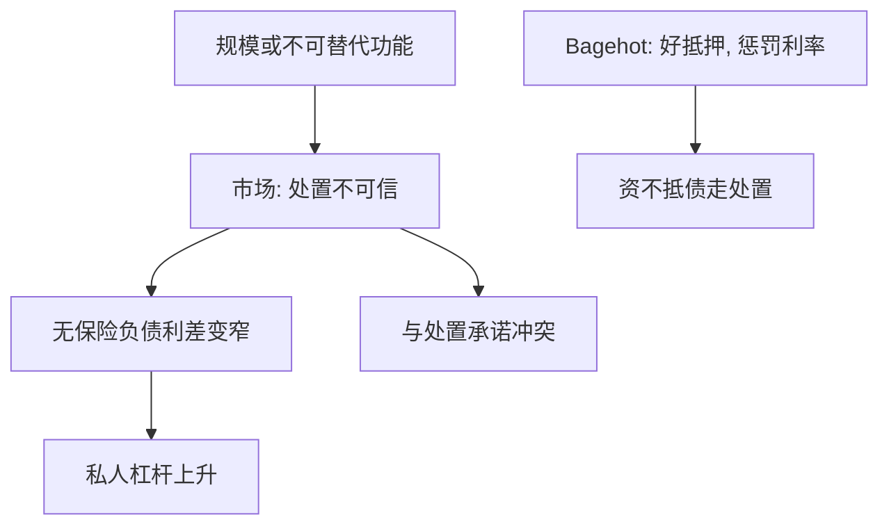

# 太大而不能倒

若市场相信某家机构倒闭的社会成本不可接受，对该机构负债的担保就不必写在任何保单上。

<footer>—— 据 Stern and Feldman, Too Big to Fail: The Hazards of Bank Bailouts, Brookings Institution Press, 2004 整理</footer>

定位：[上一课](/econ/lender-of-last-resort)。Bagehot 已经把窗口限制在好抵押与惩罚利率上，并把偿付能力问题交给处置。本课缺口是系统性机构的**隐担保**：规模、关联、不可替代的功能使市场相信股东与无保险债权人也会被保住。不重列三句规则，不把隐担保写成存款保险。

## 问题

最后贷款人删的是流动性坏均衡，筛选靠抵押。若机构大到处置会中断支付、冻结银行间网络、或触发上一课尚未写尽的传染，事后最优往往是连资不抵债也救。事前，债权人把这一事后最优写进价格：资金成本下降，杠杆与风险上升。Stern 与 Feldman 把这种信念称为太大而不能倒（TBTF）。

缺口不是「危机里要不要救」，而是：隐担保如何改变平时的资本结构，以及它与 Bagehot 的哪一句冲突。冲突点明确——好抵押要求资不抵债走处置；TBTF 说处置不可信。

TBTF 不是资产负债表的一个科目。它是均衡信念：无保险负债的信用利差里已经扣除了预期救助。利差变窄是证据的候选，不是定义本身。

## 方法

把担保分成三层，已经出场的两层不再展开。零售[存款保险](/econ/deposit-insurance)是显式、有上限的保单。Bagehot 窗口是显式、有抵押的流动性。TBTF 是对**未保险、无抵押、甚至股权**的预期转移支付。它不出现在费率表里，出现在债权人愿意接受的更薄利差、以及经理更愿意保留的尾部风险。

对照 Bagehot。自由放贷针对好抵押上的流动性；惩罚利率阻止把窗口当日常资本；好抵押把资不抵债剔出窗口。TBTF 反过来：数量上可能无上限，价格上可能接近市场而非惩罚，抵押上可能接受已经减值的资产——因为「不救」的社会成本被写成不可接受。时间不一致在[承诺](/econ/time-inconsistency)课已经有一般形式；这里的具体对象是处置的不可信。

政策含义先停在机制：要恢复 Bagehot，必须使处置可置信——损失能落在无保险债权和股权上，功能能继续。具体的遗嘱、自救债工具是监管后文，本课不列条款。

## 机制

机制是社会成本与私人成本的缺口被债权人提前资本化。倒闭的外部性——支付中断、[传染](/econ/bank-contagion)、火售——进入事后救助的目标函数，不进入该机构股东的目标函数。债权人若分享事后救助，事前就按准政府信用放贷。于是 TBTF 机构的私人 $D^\ast$ 更高，与后课权衡里「银行私人杠杆偏高」是同一外部性，只是这里的通道是**资金价格**，不是税盾。

与保险的差别：保险覆盖集是公开的，看跌的标的是被保险存款；TBTF 的覆盖集是博弈结果，标的可以包括批发债甚至股权。Keeley 的特许权价值在这里被另一块租金替换：太小的机构没有这块隐租金，竞争条件不对称。

### 救助窗口不是最后贷款人

把股权价值保全写成「流动性支持」，直接破坏 Bagehot 第三句。本课要能把两句话分开：对有偿付能力机构按折扣放贷，是 LOLR；对资不抵债机构的注资或债务担保，是财政或有。混用使惩罚利率失去筛选，使「太大」成为最便宜的融资策略。

跨境机构使「谁的最后贷款人」与「谁的纳税人」错位。本币窗口救不了外币批发债，隐担保若以外币计，还要回到储备与互换，不能用一句 TBTF 跨币种使用。

## 边界

不要把所有危机救助都贴上 TBTF：针对市场功能的证券购买、针对支付系统的流动性，可以不保全某家股东。也不要把「系统重要性」清单当成已经解决信念——清单本身可能强化隐担保，除非配上可置信的损失吸收。

本课不写巴塞尔公式。下一课才把亏损顺序写成可审计比率；资本是对 TBTF 激励的数量阀，不是对 Bagehot 三句的改写。

后课默认：TBTF 是处置不可信时的隐担保，降低无保险负债成本，与 Bagehot 的好抵押冲突。流动性窗口不是保全股权。资本监管下一课才出场。

规模通过外部性进入事后目标，通过利差进入事前杠杆。两者必须分开写，才能对着干。

隐担保的覆盖集是均衡，不是保单。不要把它写成存款保险的一个档位。

## 小结

- Bagehot 要求资不抵债走处置；TBTF 是处置不可信时的隐担保。
- 信念被写进无保险负债的价格，私人杠杆系统性偏高。
- 保全股权的「流动性支持」不是最后贷款人。
- 出处：Stern and Feldman, *Too Big to Fail*, 2004；对照 Bagehot, *Lombard Street*。
