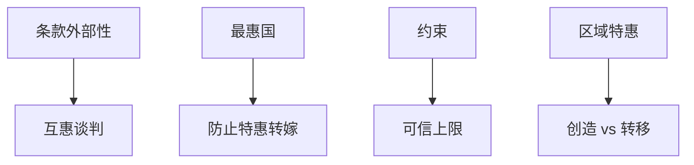

# 贸易协定与 WTO

互惠把各国的条款外部性内部化，最惠国防止被绕开的优惠侵蚀；GATT/WTO 是捆住最优关税之手的合约，不是自由贸易的颂词。

<footer>—— Bagwell and Staiger, An Economic Theory of GATT, AER 1999；对照 Maggi 多边主义</footer>

[上一课](/econ/tariffs-optimal)给出单边 $t^*$ 与报复困境。本课缺口是：为何以及如何用协定约束关税。全球价值链下一课换生产结构；本课钉 GATT 逻辑：互惠、最惠国（MFN）、约束（bindings）。

## 问题

大国关税改善本国条款、恶化对方条款，是条款外部性。Bagwell–Staiger：若政府目标是政治加权福利（含游说），有效协定仍应消掉条款外部性，把关税收到政治上的有效点，而不必是社会最优零关税。互惠：你降我的出口壁垒，我降你的，条款大致不变，各自收获效率。MFN：对所有成员同一税率，减少「对 A 优惠、把成本转给 B」的双边操纵。缺口不是联合国年史，而是：协定的经济功能是什么。

争端解决与授权报复是执行装置，不是法庭浪漫。退出威胁、安全例外、反倾销，都是合约不完全。本课机制优先，条款清单不背。

## 方法

条款外部性 → 谈判要互惠。政治经济：Grossman–Helpman 保护出售给出单边政治关税，协定在其上再削条款部分。区域协定（FTA/关税同盟）对多边的绊脚石 / 垫脚石：特惠转移（贸易转移 Viner）可以损世界。WTO 的约束关税（ceiling）允许实际税率低于约束，提供灵活性与可信上限。

与引力：FTA 系数是平均相关，不是 Bagwell–Staiger 识别。要因果需设计（加入时点、产品覆盖），仍受多边阻力约束。

## 机制

机制是合约。单边最优是占优策略，协定改支付矩阵。互惠使「我降税」不再等于「我条款恶化」。MFN 使让步多边化，减少对局外人抽租。政治加权意味着协定后仍可有正关税（游说），但不应再有以邻为壑的那一层。

与不可能三角、资本账户无关：这是货物壁垒合约。服务、投资、知识产权是后代议题，逻辑类似外部性与互惠，对象不同。

Viner：关税同盟创造贸易（从高成本国内转向成员）也转移贸易（从更低成本的世界转向成员）。净福利不定。区域主义不是自动的多边加速器。

## 边界

本课不预测某次部长会议结果。不把 WTO 危机写成已经替代理论。下一课价值链：中间品关税被放大，有效保护与名义税率分叉，协定的产品规则（原产地）变得更关键。China shock 是冲击分配，不是协定理论的否证。不要用「自由贸易协定」字面当成已达零关税有效。

后课默认：GATT 逻辑是内部化条款外部性；互惠 + MFN + 约束是手段。政治关税可以留下。区域特惠要问创造还是转移。单边 $t^*$ 仍是无协定时的威胁点。

## 小结

- 条款外部性使单边关税过高；互惠内部化。
- MFN 防止特惠把成本转给第三方。
- 政治目标下协定有效 ≠ 零关税。
- Viner：区域同盟可转移贸易，世界福利不定。
- 出处：Bagwell and Staiger, *AER* 1999；Grossman and Helpman；Viner。
