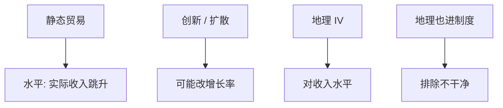

# 贸易与增长

静态比较利益是一次水平效应；增长问的是贸易是否改变创新与资本积累的斜率。工具若只推动收入水平，不能把回归里的开放系数读成增长率。

<footer>—— Frankel and Romer, Does Trade Cause Growth?, AER 1999；Grossman and Helpman, Innovation and Growth in the Global Economy</footer>

[上一课](/econ/offshoring-tasks)把贸易收到任务。贸易理论课序在此收束长期。下一单元国际金融续从 Lucas 悖论起：资本为何不按教科书流向穷国。本课钉贸易与增长的水平 / 增长效应，以及识别。

## 问题

静态李嘉图 / Krugman / Melitz 给出开放后的**水平**（实际收入一次跳升）。内生增长：贸易扩大市场（创新租金）、扩散技术、或通过竞争消灭模仿——斜率可以变。Frankel–Romer：用地理构造的贸易预测值当 IV，估贸易份额对收入水平的效应，发现正且大于 OLS。缺口是：那是水平（或长期水平），不是每年增长率；地理工具排除「收入高所以贸易多」的反向，不排除地理还通过制度、疾病进收入（后续批评）。Rodriguez–Rodrik：开放指标与政策内生，简单跨国回归不可信。

Grossman–Helpman：开放对创新的符号取决于知识溢出是国际的还是国内的、以及竞争是偷走租金还是扩大市场。理论不定，要机制而不是一条 $\beta$。

## 方法

水平 vs 增长：在 AK / 半内生增长里，开放可以只抬水平（资本向新稳态过渡时表现为暂时高增长）。实证要声明因变量是 $\ln y$ 还是 $\Delta\ln y$。IV：地理（FR）、政策突变、关税时间表；每一个都有排除故事。Melitz 动态（Atkeson–Burstein、Sampson）把选择与创新连起来：贸易改变创新激励，斜率可以动。本课不估新的 $\beta$。

与计量课程：这是 IV 在宏观跨国，弱工具与排除的课都适用。不要用 DML 替代地理故事。

## 机制

机制候选三条。市场扩大：出口提高创新租金（Krugman / 内生增长）。知识扩散：进口品种与 FDI 带技术（Coe–Helpman 溢出）。竞争：减少惰性或偷走租金（Schumpeter 两刃）。资本积累：开放改实际利率与 $K$ 路径，仍可能只是水平。穷国若制度差，开放可以把资源配置到寻租而不是创新——增长效应可以负。

与 China shock：局部劳动市场损失是过渡与摩擦；增长文献问几十年的 $y$。两套时间尺度，不要用 CZ 十年就业否证 Frankel–Romer 的水平效应，也不要用跨国 $\beta$ 否认 ADH。

贸易课序到此：比较成本、禀赋与分配、IRS 与品种、异质企业、引力与 EK、关税与协定、价值链、中国冲击、任务、增长。下一单元资本流动之谜，货物理论当背景不再重推。

## 边界

本课不宣称「开放一定加快增长」。不重写[索洛](/econ/solow-1956-paper)附录。国际金融续的 Lucas 悖论问的是资本为何不流向穷国，与本课「贸易是否提高 $A$」相关但对象是 $K$ 的跨境，不是货物。不要把 FTA 虚拟变量的增长回归当成 Bagwell–Staiger 的福利。

后课默认：静态贸易给水平；增长效应要创新 / 积累机制，理论符号不定。Frankel–Romer 是水平 IV，排除有争议。局部冲击证据与长期跨国证据分层。下一课 Lucas 悖论：资本不按边际产出流向穷国。

## 小结

- 静态比较利益主要是水平效应；增长要斜率机制。
- Frankel–Romer 地理 IV 对准收入水平，排除不完美。
- Grossman–Helpman：市场、溢出、竞争三通道，符号不定。
- 局部劳动市场损失不自动否证长期水平增益。
- 出处：Frankel and Romer, *AER* 1999；Grossman and Helpman；Rodriguez and Rodrik。
