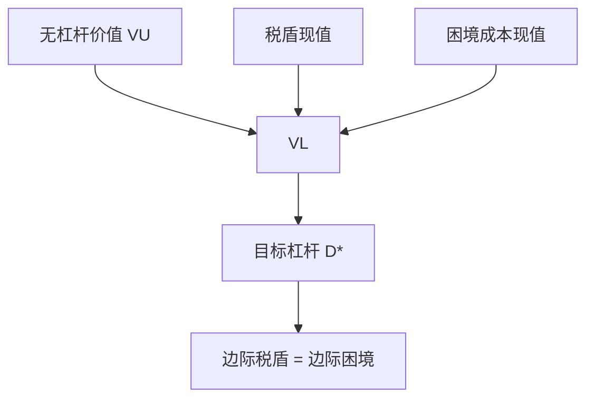

# 权衡理论与破产成本

若税盾使债务变贵而有利，破产成本使债务变贵而有害，最优资本结构出现在两边际相等处。

<footer>—— 据 Modigliani and Miller, AER 1963 更正；Kraus and Litzenberger, Journal of Finance 1973；Myers, The Capital Structure Puzzle, Journal of Finance 1984 整理</footer>

[上一课](/econ/mm-corporate-tax)（MM 与公司税盾）。[莫迪利亚尼–米勒](/econ/modigliani-miller)。1958 年的套利已经证明无摩擦时切片无溢价。本课缺口是把最先被放松的两块摩擦放回去：公司所得税让利息可抵扣，破产与财务困境让杠杆有真实成本。目标负债率从这里出现。不重做家庭自制杠杆的套利。

## 问题

MM 1963 年更正指出：利息在公司税前扣除，股利不。多一单位债务，政府少收一笔税，这笔税盾的现值可以进入企业总价值。若只有这一块，最优是百分之百债务——与观察到的内部股权、与[巴塞尔](/econ/basel-capital)对银行股本的要求都冲突。因此必须有一块随杠杆上升的抵消成本，否则权衡没有内部解。

成本候选是破产的资源损耗与困境中的激励扭曲：法律费用、资产火灾出售、客户与雇员流失、以及股权在接近破产时的资产替代（赌大的）。Myers（1984）把「税盾对困境成本」称为静态权衡，并立刻指出它预测企业应有一个可计算的目标比率，而现实中的比率调整缓慢、且 internally 融资更常见。本课先把权衡钉住；优序是下一课对「目标比率」的否定。

财务困境成本不必等到法律破产。投资不足（债务积压）与资产替代在违约前就已经改变项目选择。Kraus–Litzenberger 用状态依存把税盾与破产惩罚写进同一偏好。

## 方法

把杠杆企业价值写成

$$
V_L = V_U + \mathrm{PV}(\text{税盾}) - \mathrm{PV}(\text{困境成本}).
$$

$V_U$ 是 MM 1958 的无杠杆价值。税盾在债务永久滚动、税率不变时，常被写成 $\tau_c D$；边际税率下降、亏损无法立即抵扣、以及个人层面利息税，都会缩小这块现值。困境成本的现值随违约概率上升，违约概率随杠杆与资产波动上升。最优 $D$ 在边际税盾等于边际困境成本处。

Kraus 与 Litzenberger（1973）在状态偏好里把同一权衡写清楚：某些状态下债务触发破产惩罚，另一些状态下税盾兑现；最优切片取决于状态价格，不是一个与风险无关的魔法比率。银行版本里，困境成本包含挤兑与处置的外部性，所以私人最优杠杆仍可能高于社会最优——资本监管是把权衡的目标从外部再切一刀。

权衡给出可检验的定性预言：税率更高、有形资产更多（困境中可收回）、利润更稳定的企业，目标杠杆更高。预言失败的方式交给 Myers 的谜题，不是本课改写成优序。

## 机制

机制是两块现金流对同一切片的相反反应。多借债：支付给债权人的利息少交公司税，状态好时 $V$ 上升；状态坏时控制权转移的成本、以及事前的风险转移，使 $V$ 下降。内部最优是权衡，不是角点。与 1958 年的差别仅在于：家庭不能自制公司税盾，也不能自制破产的法律成本，复制失败，切片开始有关。

静态权衡把调整成本设为零，企业应随时贴近 $D^\ast$。发行成本、回购窗口、市值波动使账面或市值杠杆绕着目标游走。这仍是权衡加摩擦，还不是信息不对称的优序。下一课 Myers–Majluf 会说：即使存在 $D^\ast$，被低估的企业也不愿发股去贴近它。

### 银行的权衡被监管切开

对非金融企业，$D^\ast$ 是私人最优。对银行，倒闭的外部性使私人 $D^\ast$ 高于社会最优，[巴塞尔](/econ/basel-capital)相当于把可行集再切一刀。税盾对银行同样存在，存款保险还额外降低私人看到的困境成本——权衡会进一步偏向杠杆。资本监管不是否认税盾，而是不让私人权衡决定社会杠杆。读银行资本时，先写 MM，再写权衡，再写监管切一刀，顺序不能倒。

债务积压（Myers 1977）：杠杆过高时，新股权为债权人「打工」，正 NPV 项目被放弃。这是困境成本的事前版本，不必等到法庭清算。

## 边界

不要把 $\tau_c D$ 当成不可错的税盾公式：亏损结转、利息抵扣上限、个人所得税会使有效税盾远小于法定税率乘债务。也不要把评级下调本身当成困境成本——评级是信息，成本是真实资源与激励。权衡不解释为什么盈利企业往往杠杆更低（它们按权衡应更能扛债）；这正是优序要抢的残差。

本课不写股利，不写自由现金流的代理问题。Jensen 的债务作为纪律，与困境成本方向相反，放到股利课才不会把权衡撑破。

动态权衡允许 $D^\ast$ 随盈利与投资机会移动，企业有调整带。带的宽度来自发行成本，不是来自柠檬。柠檬是下一课：发股本身传递类型，成本可以大到使目标比率不再是一阶描述。

后课默认：权衡给出私人 $D^\ast$，来自税盾对困境成本。盈利企业杠杆偏低、发股的负公告，不是本课能吞的残差，交给优序。银行的社会最优杠杆可以低于私人 $D^\ast$，监管切一刀并不取消税盾会计。

$\tau_c D$ 不是不可错的税盾：亏损结转、抵扣上限、个人所得税都会缩小现值。

债务积压在违约前就已经改变项目选择。评级下调本身是信息，不是资源成本。

## 小结

- 税盾使债务有利，困境成本使债务有害；内部目标杠杆是权衡。
- 复制失败是因为家庭造不出公司税与破产法。
- 静态权衡预测可计算的 $D^\ast$；现实中的偏离是下一课的缺口。
- 出处：MM 1963；Kraus and Litzenberger 1973；Myers 1984。
