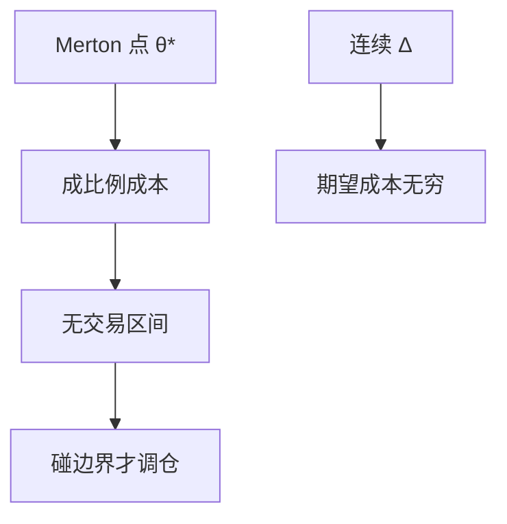

# 交易成本下的组合 Constantinides

成比例成本使连续再平衡的 Merton 权重变成无交易区间：只有偏离够大才调仓，小偏离被惰性吞掉。

<footer>—— Constantinides, Capital Market Equilibrium with Transaction Costs, Journal of Political Economy, 1986</footer>

[上一课](/econ/incomplete-market-pricing-bounds)因缺列而不能精确复制。本课菜单可以完全，但**再平衡要付成比例成本**。缺口是政策形状：从点状 $\theta^\ast$ 变成区间。不把成本写成限价簿价差的估计，尽管经济含义相近——协议仍不在本栏。

## 问题

Merton 常机会下 $\theta$ 每瞬都等于目标。成比例成本（买卖按价格的固定比例付费）使每一次调整有限损失。最优是：在财富–持仓状态空间里设一个无交易锥（或带），落在带内不动，碰到边界才交易到边界内侧（或到有限目标）。Constantinides（1986）在一般均衡里还问：这种惰性如何反馈进价格。缺口是承认 BS 式连续 $\Delta$ 在正成本下期望损失无穷（无限次小交易），工作策略必须是间歇的。

与 BP 保证金：那边是占用资本；这边是每次调仓的冰山成本。都可以减少交易频率。与 Glosten–Milgrom：价差是不利选择的均衡报价；这里成本可以是外生摩擦（税、物理）。接口课已经允许把价差折进持有成本——Constantinides 是那条通道的组合理论。

Constantinides, *JPE* 94(4), 1986。Davis–Norman 给出成比例成本下的奇异控制解（无交易、买、卖三区域）。本课要形状，不要控制论细节。

## 方法

状态含当前权重。HJB 在无交易区退化为偏微（只有扩散把权重带偏），在交易区退化成「立刻付成本并跳到边界」。比较静态：成本升，带宽；风险厌恶升，目标更稳但带宽的福利成本更高。均衡：若人人惰性，价格对小冲击反应钝——与过度波动的「价格太抖」对照，摩擦这一层倾向于更钝；时变 $m$ 仍可以抖。不要用惰性否证 Shiller，也不要用 Shiller 否证惰性。

不要把无交易区间画成盘口两档之间的空间。那是簿；这里是个人状态空间里的政策。投资者可以在区间内「对市场价格有需求为零的导数」，看起来像流动性差，来源是成本不是信息。

## 机制

机制是固定比例的冰山对冲掉伊藤的无穷小再平衡。二次变差要求理论上不停调，线性成本对每次调收费，最优用带宽换风险暴露误差。福利损失往往小于朴素「成本乘换手」的直觉——因为最优已经大幅降低换手。加总后，市场中介看到的流量更尖、更间歇，像流动性螺旋的离散版，但不必有保证金。

不完全加成本：界更宽，因为超复制若靠高频对冲，成本把上界抬高。本课点明叠加，不计算。

固定成本（每笔固定费）给出另一类政策：更少、更大的交易。本课以成比例为主，对应买卖价差的比例部分。

## 边界

本课不校准某市场的年换手。下一课把装置收回离散多期：消费–组合的两基金、欧拉、与连续时间极限的对照，作为本单元收束。Constantinides 的惰性在离散里变成「校准点附近的 $sS$ 规则」。

后课默认：成比例交易成本 ⇒ 无交易区间，连续 Merton 点不再可行。BS 连续对冲是零成本理想。惰性不是限价簿，尽管价差可以是成本的来源。

## 小结

- 正的成比例成本使最优变成无交易带，碰壁再调。
- 连续再平衡期望成本无穷；工作策略间歇。
- 加总可钝化价格对小冲击的反应，与信息惰性不同源。
- 出处：Constantinides, *JPE* 1986；对照 Davis–Norman 奇异控制。
