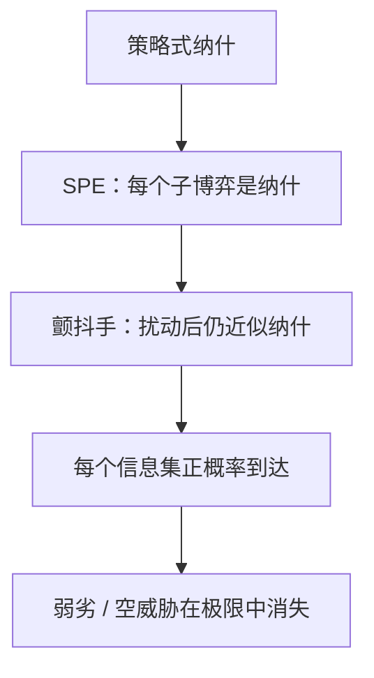

# 颤抖手完美

完美性要求均衡是完全混合扰动博弈之纳什的极限：每只手都以任意小的概率发抖，于是每个信息集都会被碰到。

<footer>—— Selten, Reexamination of the Perfectness Concept for Equilibrium Points in Extensive Games, International Journal of Game Theory, 1975</footer>

[上一课](/econ/subgame-perfect)用子博弈完美删掉「到达之后自己也不愿执行」的威胁。缺口是：许多信息集根本开不出子博弈——不完美信息、非单点信息集，SPE 管不到。Selten 1975 的颤抖手更强：让每人在每个信息集上以至少 $\varepsilon$ 的概率误触每一行动，再令 $\varepsilon\to 0$，极限均衡必须在这些「几乎不到」的点上仍近似最优。本课钉完美均衡，不把蜈蚣的认知悖论提前，也不重写逆向归纳算法。

## 问题

策略式里，纳什可以靠弱劣策略撑住：若对手绝不走进某列，自己在该列上的亏本招不会被罚。扩展式里，这就是空威胁。SPE 只在子博弈（单点、切得干净）上要求纳什；信息集若跨枝，没有子博弈可切。

颤抖手完美：存在一列完全混合策略 $\sigma^k$ 与一列 $\varepsilon_k\to 0$，使 $\sigma^k$ 是「每行动概率至少 $\varepsilon_k$」的扰动博弈的纳什，且 $\sigma^k\to\sigma^*$。极限 $\sigma^*$ 是原博弈的完美均衡。因为扰动下每个信息集正概率到达，最优反应必须在那些点上也成立——不可信的亏本招在极限里活不下来。

### 完美比 SPE 窄，不是另一套支付

有限扩展式上，完美均衡一定是 SPE；反过来不必。进入遏制里，「进入 / 斗争」可以是纳什（进入者不进），不是 SPE，更不是完美。完美信息、支付无平局时，逆向归纳路径常常既是 SPE 也是完美；平局或弱劣一开，两者分开。

策略式完美均衡不含弱劣策略。扩展式要先取行为策略再扰动，不能只在摊平后的策略式上删弱劣——摊平会把「在未达信息集上的规定」与「路径上的规定」绑成同一个纯策略，扰动的含义不同。

## 方法

对象：有限博弈，完美回忆。先在策略式上写：完美 $=$ 完全混合纳什的极限。再搬到树上：对每个信息集的行为策略加最小概率扰动（Selten 的 agent-normal form：把每一信息集当成一个代理人）。不在本课解序贯均衡的信念系统；Kreps–Wilson 用「信念 + 序贯理性」重写同一直觉，主干后课才用。

检验：若某策略在某个正概率被碰到的信息集上不是最优反应，则对足够小的 $\varepsilon$ 它也不是扰动博弈的纳什，故不能进入极限。这比「只在子博弈根上检查」更密。两人同时选「合作 / 互毁」而互毁弱劣时，纳什可以靠「对方会互毁」撑住；完全混合扰动里互毁严格吃亏，极限只留下合作。进入博弈是同一把刀的扩展式版。

## 机制

发抖把「未达」变成「稀有事件」。惩罚者若在该事件里吃亏，扰动下他会改招，进入者预见到这一点，空威胁从均衡里掉出去。可信性不再靠建模者指定子博弈，而靠技术条件：完全混合逼近。

与[混合策略](/econ/mixed-strategy)的差别：混合是原博弈里的随机化，用来让对手无差异；颤抖是建模者加的失误，用来挑选哪些纳什在极限里站得住。均衡策略本身可以是纯的，只要它是某列失误均衡的极限。Myerson 的适当均衡（proper）还要求更差的失误相对更稀有，本课停在 Selten 的 $\varepsilon$-完美。

策略式上先扰动再取极限，与树上对每个信息集分别发抖，筛选可以不同：摊平后的一个纯策略捆住了许多信息集上的规定，弱劣删除会误伤或漏删。Selten 因此强调 agent form——每个信息集一个代理人，失误彼此独立。课堂上以扩展式为准。

### 扰动必须落在行为上

若只扰动终点支付、不扰动行动，弱劣仍可能留下。Selten 的对象是策略的最小概率，不是支付的连续统扰动（那是本质均衡一类）。课堂上用进入博弈与「双方都准备合作、但合同写了互毁」核对：互毁若弱劣，完美不要它。

完美信息有限树上，SPE 与完美常常重合；需要颤抖手出刀的，多半是不完美信息或弱劣撑着的纳什。后课逆向归纳的限度问的是另一件事：共同知识理性推不推得出未达节点上的理性。

## 边界

无限行动、连续型要另写扰动；本课有限。完美仍可能很怪：信号博弈里，对偏离的解释可以靠「特定方向的失误」，直觉标准还要再砍。适当均衡、序贯均衡、完美贝叶斯是后继精炼，不是本课的算法。

也不要把颤抖手写成宏观政策「承诺要留失误余地」。本课只是均衡精炼：缩小纳什集，不改支付。

连续行动要把「每个纯策略正概率」改成对全支撑的扰动，技术更重，直觉不变：未达集合必须被碰到。本课有限已经够用：SPE 删空威胁，颤抖手在信息集切不干净时接着删。

后课默认：需要每个信息集都被碰到时，解概念从 SPE 升级为颤抖手完美；SPE 是必要条件。认知上「未达节点还有没有理性」，是下一课逆向归纳的限度。

## 小结

- SPE 只管子博弈；颤抖手让每个信息集以任意小概率被碰到。
- 完美均衡是完全混合扰动纳什的极限，剔除靠弱劣撑住的空威胁。
- 完美 $\Rightarrow$ SPE；有限完美信息上两者常常重合。
- 发抖是选择均衡的技术，不是玩家真的随机化。
- 出处：Selten, *IJGT*, 1975。
