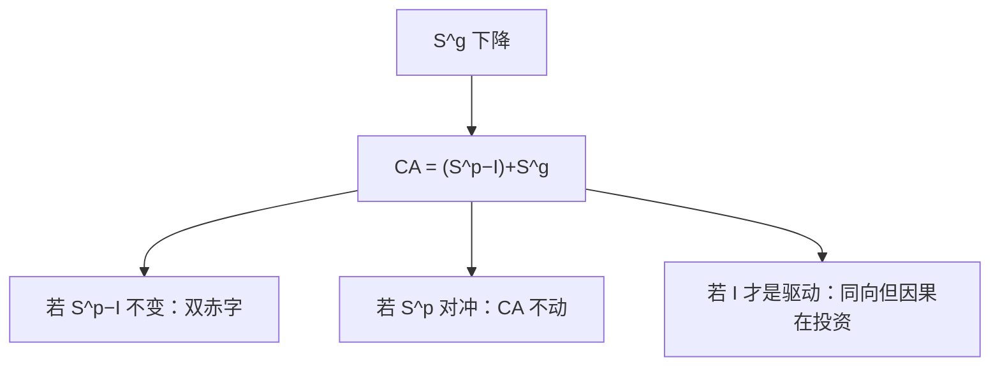

# 双赤字

公共储蓄下降出现在经常账户恒等里，不表示财政赤字必然导致贸易赤字；私人储蓄与投资可以抵消，也可以放大。

<footer>—— 据 Obstfeld and Rogoff, Foundations of International Macroeconomics 对跨期经常账户的处理</footer>

[上一课](/econ/open-ca)已经把 $CA\equiv S-I$ 钉成国外账户恒等，并预告孪生赤字是部门展开。本课的缺口是：把恒等拆成公共与私人，说明**会计联系不是必然因果**。购买力平价从下一课起给相对价格；本课仍停在数量账户。

## 问题

国民储蓄 $S=S^p+S^g$，公共储蓄 $S^g=T-G$（口径从简）。于是

$$
CA=(S^p-I)+S^g.
$$

财政赤字（$S^g$ 下降）若私人净储蓄 $S^p-I$ 不变，则 $CA$ 一对一恶化——这就是教科书里的双赤字。缺口是：私人净储蓄为什么要不变？李嘉图下减税被私人储蓄完全抵消，$CA$ 不动；投资高峰可以同时出现财政赤字与 $CA$ 赤字而驱动项是 $I$；财政紧缩若压低 $Y$、压低进口，短期 $CA$ 甚至改善。Obstfeld 与 Rogoff 的跨期方法把 $CA$ 当成对冲击的最优反应，而不是道德评分。

上一课已经把 $CA\equiv S-I$ 钉成账。本课只做部门展开，并拒绝把恒等读成因果。PPP 从下一课才给 $q$；没有相对价格，本课也不把双赤字写成「汇率政策失败」。

恒等永远成立。双赤字假说是一条行为：私人 $S^p-I$ 对 $S^g$ 的偏导接近零。检验的是这条行为，不是 $CA=S-I$ 本身。

## 方法

跨期：减税加发债，若被看成未来税的平移且市场完全，欧拉不变，$C$ 不动，$S^p$ 上升对冲 $S^g$ 下降，$CA$ 不变——开放版李嘉图。打破：有限寿命、流动性约束、扭曲税、投资对利率或 $q$ 的反应。财政扩张抬 $r$、挤出 $I$，或抬 $Y$、经进口漏出，都会让 $CA$ 动，但导数不是 $-1$。汇率制度改变调整渠道（蒙代尔），不改变恒等。

乘数课的开放漏出在此落地：一部分吸收变成进口，$CA$ 变差，封闭乘数缩小。批判仍在：开放度、汇率规则、税法都进简化式，不能用某十年美国的双赤字回归去模拟另一套规则。

### 不要把双边贸易差额当福利

$CA$ 是对全世界的净额。对某一国的双边赤字可以与总体 $CA$ 异号。发展中经济的 $CA$ 逆差可以是 $I$ 高，不是 $S^g$ 不道德。本课禁止把双赤字写成「财政不负责任的充分统计」。

## 机制

每一笔公共减储蓄，若私人不补、投资不降，就必须向国外借——对外净资产下降，未来要用净出口偿还。相对价格（下一课的 $q$）决定偿还时支出如何转换，本课只记下数量约束。货币中性的长期：名义汇率可以变，$CA$ 的实物路径仍由跨期偏好、投资机会与净国外资产决定；财政改变的是公共相对私人的吸收，不一定改变总吸收。

自动稳定器使 $S^g$ 在衰退中自动下降，此时 $CA$ 是否恶化取决于私人 $S^p$ 与 $I$ 的周期形态——衰退里 $I$ 常降得更多，经常账户反而改善。把危机年的「财政赤字+CA盈余」当成否证双赤字，是把周期相关当成假说失败；假说从未说每个季度都一对一。

Obstfeld–Rogoff 的跨期经常账户把冲击分成暂时与永久：暂时的财政扩张更应由对外借贷平滑，永久的应由吸收调整。这是行为，不是恒等。蒙代尔会加上：$E$ 固定还是浮动，改变 $r$ 与 $q$ 从而改变 $I$ 与 $NX$ 的分担，导数仍不是 $-1$。

BPM 的金融账户记录融资。恒等不告诉你资本流入是「推动」还是「拉动」。突然停止课会把融资切断写成制度碰撞，本课只把账留在部门展开。

## 边界

不要把统计误差当理论。量化栏的外汇微观结构、CIP 偏差，不是 SNA 科目。公司如何在境外融资，留给资本结构课。也不在这里写 PPP 或 UIP。双边贸易差额不是福利；总体 $CA$ 才进恒等。发展中经济的投资高峰可以同时写出财政赤字与经常账户赤字，驱动项是 $I$，口号式的双赤字会把因果说反。

后课默认：$CA$ 与财政赤字的会计联系成立，因果要另写行为。下一课用一价定律与购买力平价给相对价格与汇率一个长期锚。

## 小结

- $CA=(S^p-I)+S^g$ 是恒等的部门展开。
- 双赤字假说要求私人净储蓄不抵消；李嘉图与投资驱动都可以打破它。
- 会计联系不是必然因果。
- 周期上稳定器与 $I$ 的共动常让符号对不上口号。
- 双边贸易差额不是福利；总体 $CA$ 才进恒等。
- 出处：Obstfeld and Rogoff, *Foundations of International Macroeconomics*。
