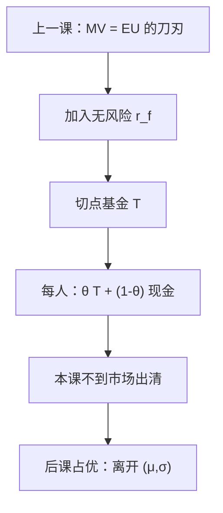

# 两基金分离

有一张无风险债券时，均值方差菜单上的每个人都只在「现金」与**同一**切点风险基金之间配比——分的是风险承担，不是各挑各的股票。

<footer>—— 据 Tobin, Liquidity Preference as Behavior Towards Risk, Review of Economic Studies, 1958；Markowitz, Journal of Finance, 1952 整理</footer>

[上一课](/econ/mean-variance-eu)标明 $V(\mu,\sigma)$ 等于 $\mathbb{E}u$ 仅在二次效用或椭圆/正态族上。本课不重写那两条许可证，也不把二次的 IARA 再批一遍。缺口是：在许可证**内部**，菜单若再加一张无风险资产，最优解塌成两个基金的组合。Tobin 分离是这条几何，不是组合实证，也不是市场组合已经被持有。后课 CAPM 才问切点是否等于市场；本课停在个人问题上。

## 问题

均值方差合法之后，可行集是 $(\mu,\sigma)$ 平面上的一条边界。没有无风险资产时，有效集是双曲线前沿，不同厌恶程度的人选前沿上不同的点，持仓结构可以完全不同。缺口是加上收益确定的债券 $r_f$：从 $(0,r_f)$ 向风险资产前沿做切线，切点 $T$ 是**唯一**的风险基金。任意均值方差决策者的最优都是 $\theta T+(1-\theta)$ 的无风险，只 $\theta$ 随厌恶而变。

这就是两基金：无风险 + $T$。Tobin 用它解释「流动性偏好」：利率变，沿这条线移动的是风险承担，不必每人重算协方差。本课不估计切点权重，不把 $T$ 叫市场组合。

### 分离不是 CAPM，也不是限价簿

切点 $T$ 由风险资产的 $(\mu,\Sigma)$ 与 $r_f$ 决定，与偏好无关——这是分离。CAPM 还要相同信念、市场出清，才把 $T$ 等于市值加权组合。本课没有出清。量化栏的组合与报价更不是这里的对象：这里没有订单，只有给定分布族上的 $V(\mu,\sigma)$。

没有无风险资产时，Markowitz 前沿上任意两点张成整条有效集：那是「两风险基金」形式。Tobin 的工作例子是有 $r_f$ 的那一条，更干净。

## 方法

在合法的 MV 菜单上画图。风险资产的最小方差前沿给定；过 $r_f$ 的切线是新的有效集（资本配置线）。一阶条件：风险基金内部的相对权重使夏普比最大，与 $r_A$ 无关；$r_A$ 只决定切线上的位置。CARA+正态时，绝对风险需求与财富无关，沿切线移动的是 $\theta$，与形状课一致。CRRA 一般不在欧氏 $(\mu,\sigma)$ 里，不要把幂效用塞进 Tobin 图。

背景风险若不可交易，切点菜单本身被咬断：可交易财富的边际分布不必仍椭圆，上一课的许可证失效，分离不成立。本课主干假定没有这类 $\tilde y$，或它已被写进给定的 $(\mu,\Sigma)$。

本课不引入 $\beta$、样本协方差或回测。那些是定价课与量化栏。这里只问：许可证内部，有效需求的维度为何降到一。共同信念一旦放松，每人一条切线，公共 $T$ 消失——那是后课 CAPM 对照，不是本课的默认。

## 机制

为什么只剩一个风险基金：椭圆族里，分散只通过协方差矩阵发生，前沿上每一点是某一影子价格下的切点。引入 $r_f$ 之后，所有人面对同一条从 $r_f$ 出发的直线，最陡的那条被所有人共用。厌恶程度改的是在直线上走多远，不改风险篮子内部的比例。二次效用给出同一几何，但 IARA 让 $\theta$ 随财富下降，与 DARA 主干不合——几何仍分离，比较静态难看。

与两期确定消费的对比：那里分离是 Fisher 的生产/消费；这里分离是风险/无风险。都是「先选共同的技术或基金，再按偏好切一刀」。不要把 $r_f$ 写成闲暇工资。

Tobin 1958 针对 Keynes 的流动性偏好：利率通过风险承担起作用，不是通过非理性窖藏。引用不要写成拒绝 vNM，也不要写成交易微观结构。

## 边界

异质信念：每人一条切线，基金不再公共。卖空约束、不可分股票，切点不可复制。非椭圆、偏度、跳跃，回到一般 $\mathbb{E}u$，分离没有定义——下一课随机占优正是离开两个数字。不完全市场加上背景风险，可交易基金无法复制最优，分离只在张成子空间上像那么回事。

也不要把「人人持有同一基金」写成经验事实。本课是刀刃上的个人最优，不是持仓数据。后课若见到 CAPM，先问信念是否已被设成相同；本课没有问。

切点权重的公式属于许可证内部的算法：$T\propto \Sigma^{-1}(\mu-r_f\mathbf{1})$（再归一）。写出它不等于去做样本 $\Sigma$ 的实证。$\theta$ 由 $r_A$ 或二次的厌恶参数决定；CARA+正态下 $\theta$ 与财富无关，CRRA 若不在该刀刃上就不要套这条公式。下一课随机占优离开 $(\mu,\sigma)$，分离没有定义。

后课默认：均值方差加无风险资产，则两基金分离；切点不是市场组合，除非另加入出清。一般 EU 不分离。

## 小结

- MV 许可证内部、有 $r_f$ 时，最优是无风险加唯一切点基金。
- $\theta$ 随厌恶（与财富形状）变；篮子内部权重与偏好无关。
- 这不是 CAPM，不是组合实证，也不是报价机制。
- 无 $r_f$ 时是两风险基金张成前沿；信念一散，公共基金消失。
- 出处：Tobin, *Review of Economic Studies*, 1958；Markowitz, *Journal of Finance*, 1952。
