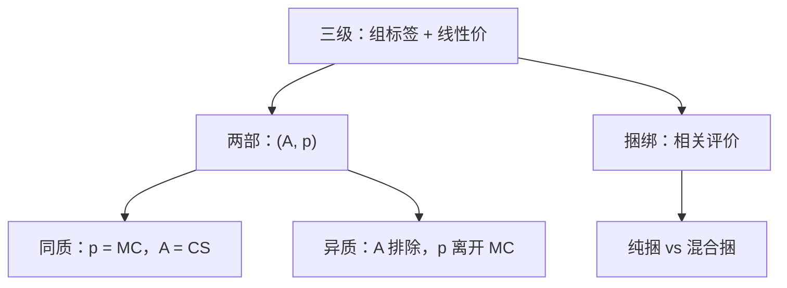

# 两部收费与捆绑

入场费抽取剩余，使用费贴近边际成本；把几种商品捆成一包，利用的是评价的负相关，不是再按组别贴一个勒纳。

<footer>—— 据 Oi, A Disneyland Dilemma, QJE, 1971；Adams and Yellen, Commodity Bundling and the Burden of Monopoly, QJE, 1976 整理</footer>

定位：[上一课](/econ/price-discrimination)。三级歧视按可观察组别给出 $L_i=1/|\varepsilon_i|$。本课不重讲分箱与套利。缺口是菜单：卖方往往看不见组别标签，却能收一笔固定费再加使用费，或把几种产品捆成包。这是 Pigou 的二级方向，不是把三级勒纳再写一遍。[拉姆齐](/econ/natural-monopoly-ramsey)的线性次优在此被非线性价目部分替代。

## 问题

两部收费 $(A,p)$：先付 $A$ 才获得以单价 $p$ 购买 $q$ 的权利。消费者剩余 $\mathrm{CS}(p)$ 若低于 $A$ 则退出。同质消费者且能挡转售时，最优是 $p=\mathrm{MC}$、$A=\mathrm{CS}(\mathrm{MC})$：产量有效，剩余全归卖方——效率上像一级歧视，信息不要求看见每个人的边际评价，只要求他们相同。缺口是：**异质时 $A$ 会被低需求者卡住，使用费被迫离开 MC。**

捆绑：两种商品的保留价格 $(v_1,v_2)$，纯捆绑只卖包，混合捆绑包与单品都卖。Adams–Yellen 的机制是负相关评价：单独定价会丢掉「对 A 很热、对 B 很冷」的人，打包把总和拉过成本。这不是三级的组间弹性，不要把捆绑写成「把两种商品当两个组别」。

### 两部收费不是拉姆齐线性税

拉姆齐用一组线性 $P_i$ 分摊固定成本。两部收费把固定成本（或垄断租金）放进 $A$，让 $p$ 承担配置。同质时第一优可恢复；异质时 $A$ 有排除效应，与拉姆齐在「谁被赶出市场」上权衡不同。本课不把二者写成同一个乘子。

Oi 的迪士尼乐园：公园入场费加园内边际成本定价。若游客同质，这是教科书最优；游客异质时，入场费要迁就边际游客，园内价格可能高于 MC 以抽取高需求者。

## 方法

同质：直接验证 $p=\mathrm{MC}$、$A=\mathrm{CS}$。异质：类型 $\theta$ 的需求 $q(p,\theta)$，参与约束 $A\le\mathrm{CS}(p,\theta)$ 对边际类型紧。提高 $p$ 放松对高类型抽取的限制，但扭曲用量；最优 $p\gt \mathrm{MC}$ 是次优。连续类型、激励相容的非线性价目接到[筛选](/econ/screening-rent)，本课只钉两部这一维。

捆绑：比较三种利润——分开卖、只卖包、混合。评价独立或正相关时，捆绑增益小；负相关时包的需求更集中。成本超可加会吃掉捆绑的理由。不要用三级的 $\mathrm{MR}_i=\mathrm{MC}$ 套到包上而不声明需求如何加总。

保留价格若在成本之下的象限，打包可能强迫消费无价值的那一件，利润比较必须把这块浪费算进去。

本课仍是一家卖方。对面出现第二家之后，两部与捆绑变成策略变量，不在这里写反应函数。也不把「打包」写成限价簿的冰山单。

## 机制

抽取剩余的机制是参与约束：固定费把无差异曲线「整块」搬进卖方口袋，使用费决定沿需求走多远。同质时没有人被排除，MC 定价不伤害抽取；异质时固定费的高度由最不愿意进门的人决定，高类型留下信息租金——二级歧视的核心，三级看不见这个租金，因为它按标签定价、不让人自选。

捆绑的机制是保留价格求和。负相关使 $v_1+v_2$ 的方差小于分开卖时的两支需求，更接近单一垄断价格下的完全抽取。正相关则打包几乎不增加抽取，还可能因为必须接受不喜欢的那一件而排除用户。

混合捆绑保留「只买一件」的出口，减少排除，但给高评价者留下自选租金，利润比较要算。单位需求教具上，Adams–Yellen 用矩形把四种人（热–热、热–冷、冷–热、冷–冷）画清楚；连续需求时同一相关结构仍在，只是积分替代计数。互补品打折是另一条理由，不要与评价负相关混成一个「打包总是好」。

Adams–Yellen 1976 的图是单位需求、0–1 消费的矩形。连续需求、互补品打折，机制仍是评价相关，不要退化成「捆绑等于三级里的第三组」。

## 边界

转售把 $A$ 冲掉：一人付费、多人用，两部崩溃。规制若禁止 $A$（只许线性价），退回拉姆齐。耐用品、跨期承诺会改 $A$ 的可信性。高峰负荷把「同一商品不同时点」当成容量约束，下一课接，不是把一天拆成三级组别。连续类型的最优非线性价目把两部嵌进一整个 $T(q)$，本课只留二维菜单。

捆绑若含互补的接口或售后，评价相关被技术锁死，Adams–Yellen 的矩形不再够用。

后课默认：同质两部可恢复 $p=\mathrm{MC}$；异质两部与捆绑是二级工具，不是三级勒纳的重贴标签。

## 小结

- 两部收费用 $A$ 抽剩余、用 $p$ 管用量；同质时有效，异质时次优。
- 捆绑利用评价相关，尤其是负相关；不是组别勒纳。
- 与拉姆齐线性税对照：非线性把固定成本从边际价格里拆出去。
- 下一课把固定成本换成时点上的容量影子价格。
- 出处：Oi, *QJE*, 1971；Adams and Yellen, *QJE*, 1976。
