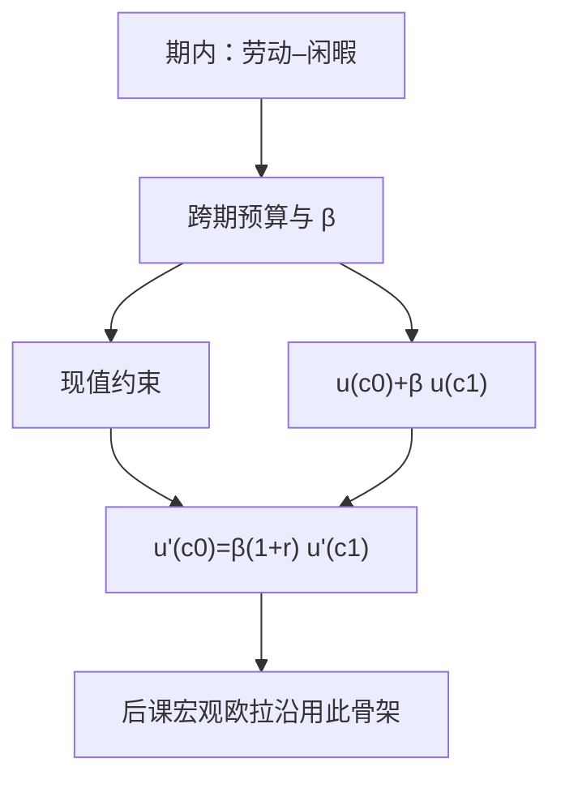

# 两期消费

    
利息把两期消费绑在同一条现值预算上；主观贴现则决定人愿意在这条线上停在哪一点。

    <footer>—— 据 Fisher, The Theory of Interest, 1930；Mas-Colell, Whinston and Green 关于日期商品的整理</footer>

[上一课](/econ/labor-leisure)把时间当成**期内**的闲暇商品，工资是闲暇的机会成本。本课不重讲劳动供给，也不把闲暇再写进无差异曲线。缺口是：日历跨了两期之后，菜单不再是当期预算切出来的 $(c,\ell)$，而是带利率的跨期预算，还要有主观贴现才能把两期效用加总。宏观[欧拉方程](/econ/consumption-euler)默认这条微观骨架已经在；本课只写确定环境，不写随机。

## 问题

劳动–闲暇的预算是同期的：$pc+w\ell\le w\bar t+m$。一旦消费可以标日期，$c_0$ 与 $c_1$ 是两种商品，价格比由债券市场给出。若仍只用当期收入约束每一期，后课无法谈储蓄，宏观也无法从家庭一阶条件推出消费路径。缺口是写出现值预算

$$
c_0+\frac{c_1}{1+r}=w_0+\frac{w_1}{1+r},
$$

以及可加的跨期效用 $u(c_0)+\beta u(c_1)$。$\beta\in(0,1)$ 是主观贴现，不是市场利率，二者不必相等。Fisher 的图在这条预算线上找切点；切点条件就是确定情形的欧拉。

本课不引入 $\mathbb{E}_t$。收入风险、随机折现因子是不确定课序与宏观课的对象。这里两期都是已知数字。

### 贴现因子不是利率的倒数

$1/(1+r)$ 是市场把明天的一单位计价物折成今天的价格。$\beta$ 是偏好：同样一单位效用，人愿意等多久。二者在最优处被 $u'(c_0)=\beta(1+r)u'(c_1)$ 焊在一起，但定义域不同：改 $r$ 是改预算斜率，改 $\beta$ 是改无差异曲线的弯曲。把 $\beta=1/(1+r)$ 写成公理，会把禀赋平滑的动机取消掉。

日期商品是 Debreu 商品空间的一维：同一苹果，今天与明天不是同一坐标。本课只有两期、一种实物，是这条定义的最小工作例子。

## 方法

对象：禀赋 $(w_0,w_1)$、完全的一期债券、确定的 $r$。人选择 $(c_0,c_1)$ 或等价地选择储蓄 $s=w_0-c_0$。内部解且 $u$ 严格凹、可微时，一阶条件即上式。$\beta(1+r)\gt 1$ 则消费上升；小于 $1$ 则下降。这是相对价格效应，不是「收入决定消费」的同期函数。

Fisher 分离：若还有生产（把 $w_0$ 变成 $w_1$ 的技术），先在生产面上选现值最大的计划，再在预算上选消费。生产决策不依赖 $\beta$，只依赖 $r$。本课标明这把刀，不把厂商课提前写完。

财富效应走现值：两期禀赋按 $r$ 折现后，才进入需求。利率上升既转动预算，又改禀赋的现值，符号一般不定。本课不写斯勒茨基在日期商品上的矩阵，只指出分解与[期内需求](/econ/slutsky-equation)同构。

本课没有不确定性。也不把 $r$ 写成限价簿上的成交利率——这里 $r$ 是参数。

## 机制

为什么必须同时有预算与 $\beta$：只有预算，人仍不知道两期消费如何权衡；只有 $\beta$ 没有债券，人被锁在禀赋点，贴现无法通过市场表达。切点把「少吃一单位、按 $1+r$ 攒到明天再吃」的边际值钉死。宏观确定性 Ramsey 欧拉就是把这一期条件沿无限期写下去；随机版本再给 $u'(c_{t+1})$ 加期望。本课把随机那一层明确留空。

与劳动–闲暇的接口：一期模型里「时间」是闲暇，$w$ 是它的价格。两期模型里「时间」是日期，$r$ 是日期之间的相对价格。不要把工资欧拉与消费欧拉焊成一个公式；劳动供给可以后补进 $u(c,\ell)$，本课消费侧先独立站住。

$\beta$ 在本课是常数。双曲贴现、时间不一致是后课与宏观对照；主干跨期选择先用指数贴现，否则欧拉没有时间一致的递推。

## 边界

无限寿命、许多日期、许多商品，只需把预算写成贴现和；几何仍是超平面上的切点。流动性约束把债券下界关掉，切点可能变成角点，$c_0=w_0$，欧拉改成不等式——宏观课会用，本课不展开。

也不处理随机收入。把 $w_1$ 换成分布之后，本课的切点要改成[期望效用](/econ/expected-utility)下的欧拉，那是下一课序的语言，不是把 $\beta$ 改成「风险厌恶」。本课的 $u$ 仍是确定消费上的伯努利前身，基数性尚未被独立性给出。

生产分离依赖完全的债券市场。不完全市场或不可交易的人力财富，会让投资与 $\beta$ 重新缠在一起。也不要把两期图画成限价簿的隔夜资金：这里没有报价机制。

后课默认：确定环境下的跨期需求来自现值预算加 $\beta$；宏观欧拉的微观原形即本课一阶条件。

## 小结

- 期内闲暇与跨期消费不是同一商品；后者需要现值预算与主观贴现。
- Fisher 切点 $u'(c_0)=\beta(1+r)u'(c_1)$ 是确定欧拉，不含期望。
- $\beta$ 是偏好，$r$ 是价格，最优处对齐，定义上不先相等。
- 本课不写随机；收入风险留给期望效用课序。
- 出处：Fisher, *The Theory of Interest*, 1930；Mas-Colell, Whinston and Green 日期商品与跨期选择。
