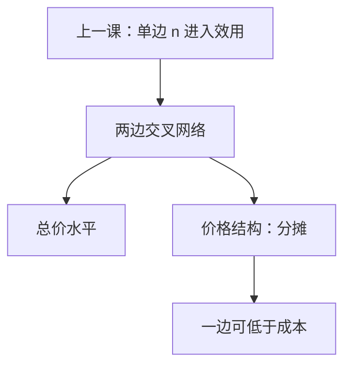

# 双边市场

平台向两边收费；要紧的不单是总价水平，还有价格结构——哪一边被补贴，决定交易量能否起来。

<footer>—— 据 Rochet and Tirole, Platform Competition in Two-Sided Markets, Journal of the European Economic Association, 2003 整理</footer>

[上一课](/econ/network-externalities)（网络外部性）。单边采用：支付意愿随同一侧的 $n^e$ 升。本课不重写实现预期的不动点，也不把兼容再选一遍。缺口是两边：买方与卖方（或读者与广告商）交叉网络，一边的规模进入另一边的支付意愿。Rochet–Tirole 把「价格结构」从「总价」里拆出来：同一总价，分摊不同，成交量可以完全不同。

## 问题

平台选择 $p^B,p^S$（或注册费加抽成）。交叉弹性：降 $p^B$ 抬高买方参与，卖方更愿意上平台，又反过来抬高买方愿意付的价。最优往往是一边低于边际成本、另一边回收——看起来像[掠夺](/econ/predatory-pricing)或交叉补贴，其实是把结构当工具。缺口不是再写一次 Katz–Shapiro 的单网 $n$，而是：**总价水平与结构何时可分，勒纳公式怎样改成两边。**

Rochet–Tirole 的工作定义：市场是双边的，若平台可以分别向两边收费，并且成交量不仅依赖 $p^B+p^S$，还依赖分摊。若两边能内部讨价还价把总费任意重分，结构无关，市场退回单边。科斯谈判在平台内部若无摩擦，双边消失——与[科斯](/econ/coase-theorem)同一把摩擦刀。

### 补贴一边不是垂直质量

把「免费的一边」读成高 $s$，会把价格结构误写成产品差异。纵差异是同一侧消费者对质量的排序；双边是两侧互为投入。广告支持的媒体：读者价可以是负的（内容补贴），广告价为正。这不是读者认为「质量更高」，而是广告商买的是读者的注意力。

用量收费与会员费可以拆开。Armstrong 强调会员外部性；Rochet–Tirole 强调每次交易的价格结构。主干用后者的定义：结构是否影响量。

## 方法

垄断平台：最大化 $(p^B+p^S-c)D(p^B,p^S)$。一阶条件是两边各自一条勒纳，弹性用的是「自己价格」对成交量的弹性，并计入交叉项。更有弹性、或对另一边贡献更大的一侧，最优 $p$ 更低，可以为负。

竞争平台：多归属（一边可同时上两家）与单归属改变「竞争性瓶颈」。多归属的一侧更难被独家锁定，价格压力落在另一侧。本课只钉结构逻辑，不把所有权与排他合同写完。测度上，一边免费、一边收费，不能用单边勒纳直接读势力。

不要把两边的 $p$ 写成买卖价差。这里是平台对两组用户的参与价，没有连续撮合。

鸡与蛋在方法上就是选哪一个实现预期：补贴弹性大的一侧，是把经济从零推到正交易量的价格结构，不是单边降价。

## 机制

结构起作用的机制是：两边不能无成本地重新谈判平台价。买方付的那一份不能由卖方在场外全额报销（或反过来），于是谁付决定谁参与。交叉网络把参与变成对方的需求曲线移动，平台内部化这个外部，用低价「收买」弹性大的一边。

与单边网络的分工：单边是同群规模；双边是跨群规模。兼容在单边是标准之战；在双边是「是否让另一边多归属、是否开放接口」。监管若禁止「低于成本」的一边，可能把平台钉死在零均衡。

Rochet–Tirole 2003 给竞争平台；2006 的综述把定义收成「结构要紧」。引用时不要把任意「两边都有人」的市场都叫双边——缺结构相关性就只是两群客户。

## 边界

一边免费本身不能当势力证据，要看竞争是否压住总价。

支付卡、操作系统、交易市场是教具，不是本课的产业志。卡组织里商户扣率与持卡人年费是结构的原型：Rochet–Tirole 正是从这里抽出定义。规制若用单边勒纳去抓「低于成本」的一边，会把最优结构误判成掠夺。转换成本与独家会强化瓶颈，下一课从用户侧的沉淀接着写。

后课默认：双边市场的成交量依赖价格结构，不只依赖总价；一边低于成本可以是最优分摊，不是自动的掠夺。

本课不把免费的一边写成垂直质量。

## 小结

- 交叉网络让一边的参与进入另一边的需求。
- 总价与结构可分；结构无关当且仅当两边能无摩擦重分费用。
- 更有弹性或外部性更强的一侧更可能被补贴。
- 下一课：用户换平台的沉淀如何改竞争。
- 出处：Rochet and Tirole, *JEEA*, 2003。
