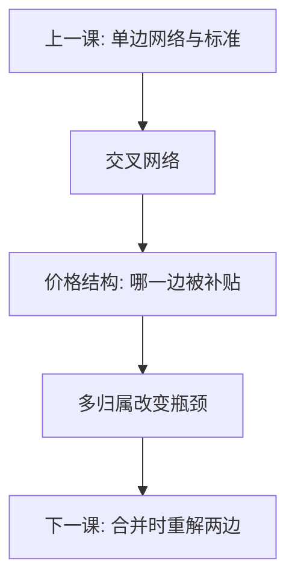

# 平台双边定价续

交叉网络下，最优往往是一边低于成本、另一边回收。总价水平与分摊结构可分；看错结构，会把补贴一边误判成掠夺。

<footer>—— Rochet and Tirole, Platform Competition in Two-Sided Markets, JEEA 2003；Armstrong, Competition in Two-Sided Markets, RAND 2006；对照 Weyl 的分配效应</footer>

[上一课](/econ/network-standards-io)把单边采用与兼容写完。微观主干[双边市场](/econ/two-sided-platform)已经给出 Rochet–Tirole 的定义：成交量依赖价格结构，而不只依赖 $p^B+p^S$。本课是产业组织里的**续**：把结构接到多归属、竞争性瓶颈，以及后课合并模拟必须改写的勒纳。不重推交叉弹性的符号，只补策略与测度。

## 问题

平台选 $p^B,p^S$（或会员费加抽成）。降一边的价，抬高该边参与，经交叉网络移动另一边需求，再反馈回来。最优常在一边 $p\lt \mathrm{MC}$（甚至为负），另一边 $p\gt \mathrm{MC}$。缺口是：单边勒纳 $L=1/|\varepsilon|$ 不能逐边套用——每边的有效弹性含交叉项，补贴可能是内部化交叉外部性，不是牺牲。多归属（一边同时上两家平台）改变哪一边成为瓶颈：单归属的一边更易被独家锁定，价格压力落到另一边。

与[纵向约束](/econ/vertical-restraints)的交叉补贴不同：那里是同一产品的上下游；这里是两组用户互为对方的投入。广告支持媒体：读者价可负，广告价为正——买的是注意力，不是「读者质量档更高」。

### 一边免费不是掠夺

掠夺要有牺牲与事后补偿两段，并且改变市场结构才划算。双边最优在静态就可以一边低于成本，因为另一边的需求被交叉项抬起，联合利润不必先亏后赚。用单边 AVC 检验去打免费端，会把平台钉死在零均衡。真正的排他（独家、不兼容）仍可能有害，但检验对象是结构与多归属，不是免费本身。

Armstrong 强调会员外部性（规模进效用）；Rochet–Tirole 强调每次交易的价格结构。续课两者都用：会员费管参与，抽成管用量，两套工具对两边弹性的指向不同。

## 方法

垄断平台：$\max(p^B+p^S-c)D(p^B,p^S)$，一阶条件是两边各一条含交叉的勒纳。更有弹性、或对另一边贡献更大的一侧，最优 $p$ 更低。竞争：多归属一侧难以被抽成独占，瓶颈落在单归属一侧。合并两家平台：交叉网络与同边竞争同时变，反事实必须重解两边价格，不能只把单边 $HHI$ 相加。测度：一边免费时，会计利润全在另一边，单边加价会夸大势力。

科斯：若两边能无成本地重分平台收费，结构无关，市场退回单边。摩擦使结构有内容——与科斯定理同一把刀。独家迫使一边单归属，把瓶颈人工造出来：价格结构立刻更陡。这是网络课拒绝兼容的双边版本，检验仍应走反事实利润，而不是看免费。

## 机制

机制是交叉外部性被平台内部化。买方多一个，卖方愿意付的价上升，平台用低价「收买」弹性大的一边，把系统推离零交易量。这与标准之战里补贴早期用户是同一族策略互补，只是互补发生在跨群。竞争性瓶颈：多归属的一边把平台当互补投入，平台对单归属一边加价——看似「欺负」的一边，其实是另一边可以逃走。

与差异化 Bertrand 对照：那里交叉弹性在品种之间；这里交叉弹性在用户组之间。合并模拟若只用单边份额，会把补贴端读成零势力、收费端读成高势力，符号可以全错。广告价与读者价的联合最优，还依赖广告是否降低读者效用：负效用越大，越要补贴读者、越要从广告回收——结构里多了一条厌恶参数，不是「流量所以能贵」。

Weyl 把分配效应从利用效应里拆开：降一边价既扩大总量，也改变谁成交。本课先钉结构与瓶颈，分配权重留给公共财政，不在 IO 定价里展开。

## 边界

本课不把支付卡交换费的监管条文写成清单，不提供「如何把一边做到免费来驱逐对手」的步骤。主干双边市场课已给定义；本课默认读者读过，只补多归属与合并时的勒纳改写。下一课把所有权变化接到可计算反事实，含单边与双边。不要进限价簿。

后课默认：看见一边免费，先写交叉网络与结构，再谈掠夺。平台合并要重解两边价格。

## 小结

- 交叉网络下总价与分摊可分，一边低于成本可以是静态最优。
- 单边勒纳不能逐边套用；免费端不是自动零势力。
- 多归属决定哪一边是竞争性瓶颈。
- 平台合并必须重解两边，不能加总单边 $HHI$。
- 出处：Rochet and Tirole, *JEEA* 2003；Armstrong, *RAND* 2006；Weyl。
