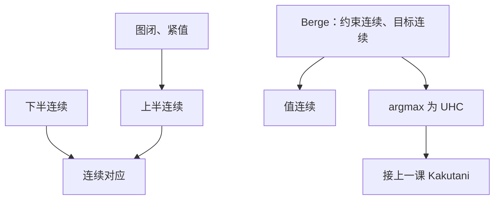

# 上半连续对应

对应可以突然变小，不能突然变大：极限点的像必须兜住像的极限。

<footer>—— 据 Berge, Topological Spaces, 1963；Mas-Colell, Whinston and Green 数学附录；Stokey, Lucas and Prescott 第 3 章整理</footer>

上一课[Kakutani 不动点](/econ/kakutani-fixed-point)把上半连续当成假设。需求对应、最佳反应、预算对应是否满足它，还没有词汇。缺口是给对应一套与开集语言配套的连续性，并引出 Berge 极大值定理：最优值连续、最优对应 UHC。后课贝尔曼算子保连续，靠的就是这块，而不是再写一遍 Kakutani。

## 问题

$\Phi:X\rightrightarrows Y$，$Y$ 紧。$\Phi$ **上半连续**（UHC）：对每个 $x$，任意含 $\Phi(x)$ 的开集 $V$，附近的 $x'$ 有 $\Phi(x')\subset V$。直观：像不会突然冒出远处的新点。等价（紧值）：图 $G=\{(x,y):y\in\Phi(x)\}$ 闭——$x_n\to x$、$y_n\in\Phi(x_n)$、$y_n\to y$ $\Rightarrow$ $y\in\Phi(x)$。

**下半连续**（LHC）：像不会突然瘦掉。开集只要碰到 $\Phi(x)$，附近的 $\Phi(x')$ 也碰到它。连续对应 = UHC + LHC。预算对应在 $p\gg 0$ 时连续；最优对应通常只有 UHC，没有 LHC——价格微动，整段需求可以突然收成一个端点。Kakutani 只要 UHC，不要 LHC。这是「需求可以跳瘦、不能跳肥」的精确说法。

### UHC 不是逐点连续函数

单值对应 $\{f(x)\}$ UHC 当且仅当 $f$ 连续。多值时不要谈 $\|\Phi(x)-\Phi(x')\|$。Hausdorff 距离给出更强的连续，UHC 只是其中一半。把 UHC 读成「$\Phi(x)$ 随 $x$ 连续变化」会误以为需求函数总存在。完全替代在价格比等于 MRS 时需求是线段，旁边立刻变成顶点：Hausdorff 意义下跳跃，但仍 UHC，因为线段突然变小是允许的。

下半连续保证「附近仍选得到原来那种点」，存在性不靠它；要最优值对参数连续且最优对应 UHC，Berge 需要约束对应连续（两半都要）加目标连续。

## 方法

Berge 极大值定理：$f$ 连续，$\Gamma$ 紧值连续，则 $V(x)=\max_{y\in\Gamma(x)}f(x,y)$ 连续，$\Phi(x)=\arg\max f$ 非空紧且 UHC。再加 $f$ 拟凹、$\Gamma$ 凸，则 $\Phi$ 凸值——Kakutani 的输入齐了。消费者：$\Gamma$ 是预算，连续偏好给出连续效用表示之后 $f=u$，于是马歇尔需求 UHC。本课不重写[效用函数何时存在](/econ/utility-representation)，只标明极大值定理吃的是连续实函数。

闭图检验往往比开集定义好用：取价格序列与需求序列，极限点仍可行、仍最优（偏好连续 $\Rightarrow$ 极限不被严格更好的点压过）。局部非饱和再把极限预算花光。这些检查在后课需求连续性里重复出现，工具是本课的闭图。

## 机制

UHC 阻止「极限选择来自远处突然冒出的点」：否则闭图被破坏，Kakutani 的近似不动点序列可以对不上极限对应。经济学里这对应：价格序列上的最优束，极限必须是极限价格上的最优束。若偏好不连续，极限束可以掉出上优集，需求失去闭图，存在性证明中的极限出清失败。

LHC 失败的典型画面：最优集从线段变成点。值函数仍然连续——两端与中点同效用——但选择不连续。比较静态在这些点没有 $Dx$，只能说对应 UHC。上一单元隐函数在这里停用，是同一现象的两边。

可行对应若只有 UHC 没有 LHC，极大值定理的值函数可能向下跳。预算在 $p\to$ 边界、某些商品价格趋零时要单独紧化，避免 $\Gamma$ 爆炸。

## 边界

本课不把集值分析写成 Kuratowski 讲义，不引入测度弱* 对应（那是宏观分布经济）。也不证明 Kakutani——假设已经在上一课。下一课用 UHC/Berge 保证贝尔曼算子把连续函数送到连续函数，从而压缩有地方作用。

后课默认：最优对应 UHC；预算在 $p\gg 0$ 的紧化下连续；说「需求连续」若未经严格凸，只意味 UHC 而非单值连续。

## 小结

- UHC：像不突然变大；紧值时即闭图。
- LHC：像不突然变小；最优对应常常没有它。
- Berge：值连续、argmax UHC；再加凸得凸值。
- Kakutani 消费 UHC 与凸值；比较静态的导数消费单值光滑。
- 下一课：[贝尔曼方程](/econ/bellman-equation)。
- 出处：Berge, *Topological Spaces*；MWG 数学附录；Stokey–Lucas–Prescott 第 3 章。
