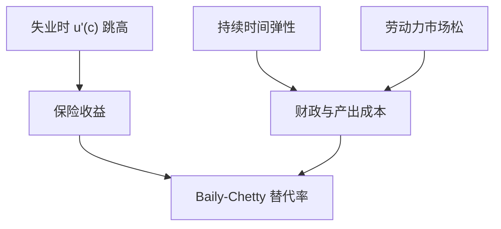

# 失业保险与道德风险

失业是可观测的大冲击，保险价值高；但替代率把搜寻的影子价格压低，最优 UI 是保险与激励的权衡。

<footer>—— Baily, Some Aspects of Optimal Unemployment Insurance, JPubE 1978；Chetty, A General Formula for the Optimal Level of Unemployment Insurance, JPubE 2006</footer>

[上一课](/econ/income-risk-insurance)的部分保险把失业混在一般 $z$ 里。本课缺口是把**失业**单独钉成合约对象：Baily–Chetty 公式。不重估全部传递系数，不把搜寻理论从零推导。

## 问题

失业冲击大、可验证（相对健康的努力），政府 UI 补市场缺失。道德风险：更长的受益期、更高的替代率延长失业持续时间（Meyer 等经验）。Baily：最优替代率使保险的消费平滑收益等于持续时间弹性带来的财政与效率成本。Chetty 把公式写成可用消费掉落与持续弹性校准的充分统计。缺口是给自动稳定器一个微观福利语言，而不是再讲一次 HANK 转移。

Baily, *JPubE* 1978。Chetty, *JPubE* 2006。Shavell and Weiss 的递减给付。Landais, Michaillat and Saez 把宏观劳动力市场松紧接进最优 UI。

## 方法

充分统计：失业时消费掉落 $\Delta c/c$、相对风险厌恶、失业持续时间对 UI 的弹性。宏观：衰退中空岗少，弹性的效率成本下降，最优 UI 可更慷慨——与 HANK 稳定器同向，机制是匹配而不是 MPC。搜寻模型（McCall、DMP）提供弹性的结构来源；本课用弹性，不重写匹配函数。

HANK 里 UI 还改变高 MPC 群体的收入，乘数是副产品；本课主产品是福利权衡。两者可同时报，不要只报乘数。

## 机制

机制是隐藏的搜寻努力（或保留工资）对给付敏感。完全监测则无道德风险，只需保险。现实监测有限。资产：有缓冲的人持续时间弹性可能不同（Chetty 的流动性与道德风险分解）：一部分「更长失业」其实是流动性放松后的最优等待，不一定是社会浪费。这把缓冲存量课接到 UI，而不是新偏好。

经验：Card, Chetty and Weber；Schmieder and von Wachter 综述。本课不引用虚构编号。

## 边界

本课不定具体国家的法定周数。不把残障保险、提前退休写完。企业经验费率、经历评级是同一权衡的企业侧。主权财政能否发 UI 取决于后课债务，这里假设政府能发债或征税。

后课默认：UI 用 Baily–Chetty 权衡；宏观松紧可改弹性成本。下一课：家庭不只被收入砸，还被杠杆砸——债务与周期。

## 小结

- 最优 UI：消费平滑收益 vs 持续时间弹性成本。
- 充分统计可校准；松市场可提高最优慷慨度。
- 流动性效应与纯道德风险要分开。
- 出处：Baily, *JPubE* 1978；Chetty, *JPubE* 2006。
