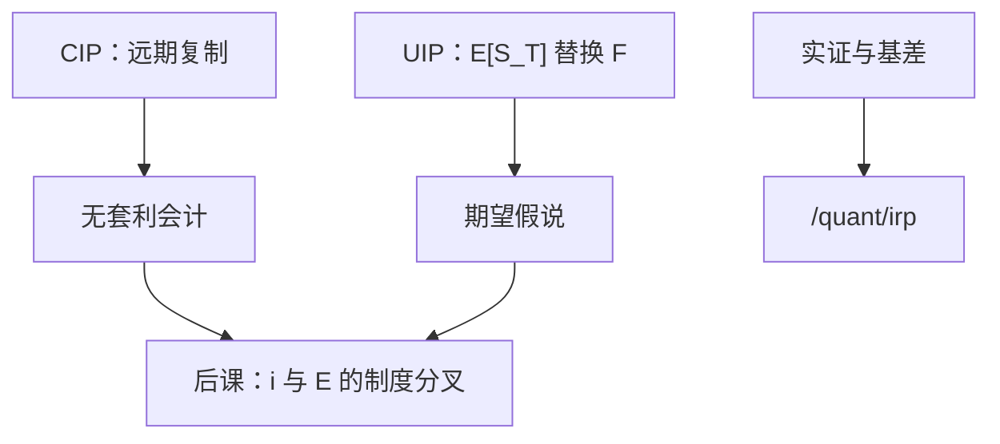

# UIP 与 CIP

抛补平价是即期、远期与两个货币市场之间的复制；无抛补把远期换成对未来即期的期望。把两句话写成一句，后面的谜题都从这里开始。

<footer>—— Keynes, A Tract on Monetary Reform, 1923</footer>

[上一课](/econ/balassa-samuelson)处理的是货物相对价格与实际汇率的水平。本课的缺口是资产平价：利率差如何接到汇率。CIP 是有远期对冲的无套利；UIP 是无对冲的期望假说。实证、远期溢价之谜、交叉货币基差一律交给[量化栏的利率平价](/quant/irp)，本课不编基差数字，也不重写限价簿。

## 问题

PPP 把 $E$ 接到物价；宏观政策还要把 $i$ 接到 $i^*$。凯恩斯在《货币改革论》里已经把远期升贴水与利率差绑在一起。缺口是分开两句。CIP：在可兑换存款与可交割远期上，

$$
F=S\frac{1+i}{1+i^*},
$$

复制成立则无超额无风险收益。UIP：把 $F$ 换成 $\mathbb{E}[S_T]$，利率差等于预期贬值。CIP 是工具集足够时的会计；UIP 是风险溢价为零（或风险中性）的假说。把银行屏幕上的远期当成「市场预测」，是把 CIP 误读成 UIP。

上一课停在货物相对价格。本课换资产平价，但不做量化栏的回归与基差。Fama 斜率、危机后交叉货币基差一律见 `/quant/irp`。蒙代尔下一课用 UIP 的退化 $i=i^*$，需要本课先把两句话拆开。

宏观教学常写 $i=i^*+\mathbb{E}\Delta e$。那是 UIP。钉住且可信时 $\mathbb{E}\Delta e=0$，于是 $i=i^*$，接到蒙代尔。CIP 不要求对未来即期下注，只要求远期报价与利差对齐。

## 方法

宏观主干只保留定义与制度含义。完全资本流动加 UIP，本国利率政策必须承认 $\mathbb{E}\Delta e$；完全流动加 CIP，抛补回报被钉死，不能靠「无风险套息」当政策工具。风险溢价、中介约束、不可兑换，使市场报价偏离这两条——那是量化栏的对象：Fama 回归、危机后基差，本课不检验、不报数。

相对 PPP 慢、UIP 快，是短期 $q$ 波动的来源：资产市场立刻改 $E$，物价粘住。巴拉萨–萨缪尔森解释 $q$ 的趋势水平，不解释周度 UIP 残差。

### 三角不要混层

[不可能三角](/econ/impossible-trinity)约束的是政策目标集合：独立货币、钉住、资本开放。CIP 约束的是报价一致性。Rey 的全球金融周期称浮动也买不到完全独立——那是宏观边界修正，仍不要用某个基差数字来「证明」三角作废。本课禁止把限价簿深度写成开放宏观的定理。

## 机制

CIP 的机制是复制：借本币、买即期、存外币、卖远期，应对齐本币存款。UIP 的机制是风险：未对冲的外汇头寸在坏状态下可能亏，利率差可以是溢价而不是预期贬值。凯恩斯已经把远期当利率差的反映，而不是对未来即期的投票。长期货币中性与相对 PPP 仍锚定 $\Delta\ln E$ 的通胀差部分；UIP 失败不取消这条慢锚。

政策含义：钉住加开放资本，UIP 要求 $i$ 贴近 $i^*$，否则要么储备流动，要么钉住不可信（$\mathbb{E}\Delta e\neq 0$）。浮动则让 $\mathbb{E}\Delta e$ 吸收 $i$ 差。这些句子在蒙代尔课展开；本课只把平价对象分清。巴拉萨–萨缪尔森解释 $q$ 的趋势，不解释为何高息货币在样本里常常不按 UIP 贬值——那句实证属于 `/quant/irp` 的 Fama 回归，本课不报斜率。

突然停止发生时，违约风险与管制让复制中断，CIP 的宏观教学式不再把 $i$ 钉死。那是制度碰撞，仍不要用某个基差数字代替三角。

不可兑换、NDF、资本管制下，CIP 的检验对象已经换了。那不是宏观课用存款利率写的那条会计。细节见 `/quant/irp`。

## 边界

不要在此报告 Fama 斜率，不要发明交叉货币基差的基点。不要把套息策略写成宏观主干。公司如何对冲外币债，接到原罪课；微观执行接到量化栏。后课默认：开放宏观用 UIP 当教学资产均衡，CIP 当无套利参照；证据与报价层不在本栏重做。

下一课：资本流动与利率把 IS–LM 拉到开放，静态预期下 $i=i^*$ 是 UIP 的退化。Dornbusch 再把理性预期补回，超调用的仍是 UIP，不是 CIP。

## 小结

- CIP 是抛补复制；UIP 是无抛补期望假说。
- 远期由 CIP 钉住，不是 UIP 的「预测」。
- 宏观用平价接 $i$ 与 $E$；实证与基差见 `/quant/irp`。
- 不重写限价簿，不编基差数字。
- 钉住加开放时教学上 $i$ 贴近 $i^*$，来自 UIP 而非 CIP。
- 出处：Keynes, *A Tract on Monetary Reform*, 1923。
