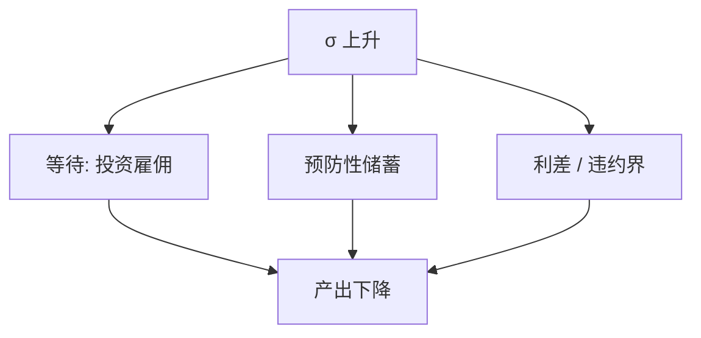

# 不确定性冲击

方差上升本身会推迟不可逆投资、提高预防性储蓄、在金融摩擦下抬升利差——不必先有均值变坏。

<footer>—— Bloom, The Impact of Uncertainty Shocks, Econometrica 2009；Fernández-Villaverde, Guerrón-Quintana, Rubio-Ramírez and Uribe；Arellano, Bai and Kehoe</footer>

[上一课](/econ/news-shocks)动的是条件均值。本课缺口是**二阶矩冲击**。扰动法已说过一阶确定性等价看不见它；现在经济上要用到。不重写新闻的 SVAR 限制。

## 问题

Bloom：不确定性跳升（股市隐含波动、政策不确定性指数）之后，投资与雇佣出现短暂急停，因为不可逆与 $(S,s)$ 的等待价值。开放与 NK：不确定性经风险溢价与需求下降制造衰退。Fernández-Villaverde 等把时变波动写进小型开放或财政规则。缺口是给「信心」一条可与新闻正交的方差通道，而不是把 VIX 当均值新闻的代理而不声明。

Bloom, *Econometrica* 77(3), 2009。Baker, Bloom and Davis 的 EPU。Jurado, Ludvigson and Ng 的宏观不确定性。Basu and Bundick 的 NK 不确定性。

## 方法

冲击：$\sigma_t$ 的 AR。机制菜单：（i）实物期权 / 不可逆（企业异质课的 $(S,s)$），（ii）预防性（缓冲存量），（iii）金融加速器（净值的期权价值、违约界），（iv）名义刚性下的需求下降（谨慎消费 + 粘性价格）。一阶线性 DSGE 必须升到至少三阶或用带 $\sigma_t$ 的非线性，否则通道关掉。识别：符号限制或外部工具，VIX 既含不确定也含风险溢价与杠杆，标签要小心。

与诊断性：主观方差也可以因代表性而误读；本课先取客观 $\sigma$。与疏忽：容量在更嘈杂的世界更不够，惯性上升。

## 机制

机制是凸性与期权。坏状态更坏的可能性提高等待价值（若不可逆），也提高 $u'$ 的期望（若谨慎）。金融：不确定性使外部股权更贵或抵押更紧。HANK：高 MPC 家庭的收入风险升，加总 MPC 升，需求更脆。代表 RANK 的不确定性效应往往偏小，除非把需求与金融摩擦开够。

测量：隐含波动是价格，含风险价格；截面离散是结果也可能是测量。模型应声明用哪一个当 $\sigma_t$ 的观测。

Arellano, Bai and Kehoe 对企业不确定性与金融摩擦。本课不把期权定价公式重推。

## 边界

本课不交易 VIX。不把所有衰退归因于 $\sigma$。灾害风险（Barro、Rietz）是均值的左尾厚度，与时变 $\sigma$ 相关但不是同一冲击。主权利差的不确定性后课违约。

后课默认：方差冲击有实物期权、预防性、金融三条主通道；一阶 SW 默认看不见。下一课：用调查把预期的均值与分歧测出来。

## 小结

- 不确定性冲击动二阶矩，经等待、预防性与利差压活动。
- 需要非线性或显式 $\sigma_t$，一阶确定性等价不够。
- VIX 等观测混有风险价格，识别要声明。
- 出处：Bloom, *Econometrica* 2009。
