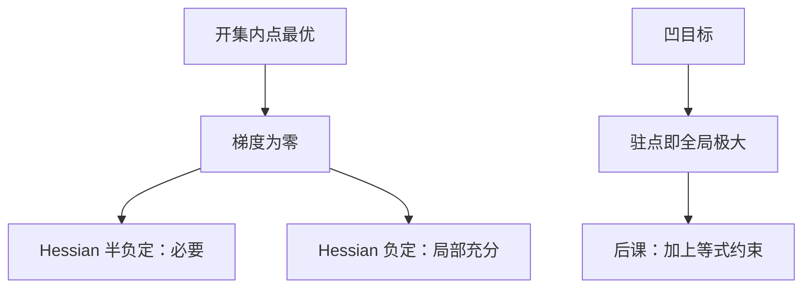

# 无约束一阶与二阶条件

内点最优处梯度必须为零；凹目标让这句话从必要变成充分。

<footer>—— 据 Mas-Colell, Whinston and Green 数学附录；Boyd and Vandenberghe, Convex Optimization, 第 4 章整理</footer>

上一课[分离超平面](/econ/separating-hyperplane)用平面把凸集切开。无约束光滑问题更短：可行域是开集，没有边界可支撑，唯一能站住的一阶陈述是「没有方向还能改善」。缺口是把这句写成梯度与 Hessian。约束、乘子、KKT 是后两课；本课先把无约束钉死，以免后课把 $\nabla\mathcal{L}=0$ 里的 $\nabla u=0$ 与乘子项混在一起。

## 问题

$f$ 在开集 $U\subset\mathbb{R}^n$ 上可微，$x^*\in U$ 为局部极大（或极小）。沿任何方向 $v$ 的方向导数必须为零，否则朝 $v$ 或 $-v$ 可改善。故**一阶必要条件**（FONC）：$\nabla f(x^*)=0$。二阶：Hessian $H=\nabla^2 f(x^*)$ 在极大处半负定，在极小处半正定。严格负定给出严格局部极大的充分条件（加上梯度为零）。

经济学里无约束不是「没有预算」，而是「约束暂时不发言」：内部解、或已把约束代入消元之后。厂商在 $\mathbb{R}^n$ 上选投入、利润已写成无约束函数时，FONC 就是要素的边际产值等于价格那一组方程。角点、不等式留给 KKT。

### 驻点不是最优

梯度为零只说一阶没有方向。鞍点、极小、极大都是驻点。$f(x,y)=x^2-y^2$ 在原点梯度为零，沿 $x$ 极小沿 $y$ 极大。二阶不定时，一阶条件帮倒忙。凹目标（极大化）或凸目标（极小化）把全体驻点变成全局最优：上一课的弦不等式让一阶下估变成全局比较。没有凹/凸，FONC 连局部充分都谈不上，更不要说全局。

$C^1$ 足够写 FONC；$C^2$ 才写 Hessian。比较静态后课常直接假设 $C^2$，为的是对隐函数求导，不是因为最优存在需要二阶。

## 方法

必要与充分要分开记。必要：局部内点最优 $\Rightarrow$ 梯度零、Hessian 半定（若 $C^2$）。充分：梯度零 + Hessian 负定 $\Rightarrow$ 严格局部极大。全局充分：在凸开集上 $f$ 凹且 $\nabla f(x^*)=0$ $\Rightarrow$ $x^*$ 为全局极大。后课多数消费者、规划者问题走最后这条，不靠逐点检查特征值。

边界点不服从无约束 FONC。若 $x^*$ 在 $U$ 的闭包但不在 $U$ 内，方向导数只对可行方向为零。那是约束问题。把非负约束忽略、直接令 $\nabla f=0$，可能解出负消费——这是后课[内点与角点](/econ/interior-corner)要拦的错误，本课先标明适用范围：内点。

## 机制

泰勒展开 $f(x^*+tv)=f(x^*)+t\nabla f^\top v+\frac{t^2}{2}v^\top H v+o(t^2)$。$t$ 任意小时，线性项必须消失，否则选 $t$ 的符号就能升。线性项消失后，二次项决定弯曲：负定则附近都更低。凹函数的一阶下估 $f(y)\le f(x)+\nabla f(x)^\top(y-x)$ 在 $\nabla f(x)=0$ 时直接给出 $f(y)\le f(x)$，不需要 $t$ 小——这是全局化的一步。

多变量时交叉偏导进入 Hessian。Young 定理（$C^2$）让混合偏导对称，后课斯勒茨基对称与此同源，但斯勒茨基还有支出最小化的结构，不要在本课提前写需求。

一阶条件是 $n$ 个方程对 $n$ 个未知数。解的局部唯一靠 Hessian 非奇异，那是[隐函数定理](/econ/implicit-function)的输入，本课只准备矩阵。

## 边界

不在本课写约束、不引入乘子、不把包络当导数捷径。无穷维变分（欧拉方程）是宏观连续时间的附录，主干的 Ramsey 会在离散时间用贝尔曼，不在这里上变分法。也不把 FONC 读成「市场出清」：梯度零是单人优化，出清是后课均衡。下一课只加等式约束。

后课默认：内部无约束最优满足 $\nabla f=0$；凹最大化时这组方程充分且给出全局最优。

## 小结

- 内点局部最优 $\Rightarrow$ 梯度为零；二阶半定是必要，定号是局部充分。
- 驻点可以是鞍点；凹/凸把驻点升级成全局最优。
- 边界点不适用无约束 FONC，交给乘子与 KKT。
- Hessian 非奇异为后课隐函数与比较静态准备矩阵。
- 下一课：[拉格朗日乘子](/econ/lagrange-multiplier)。
- 出处：MWG 数学附录；Boyd and Vandenberghe, *Convex Optimization*。
