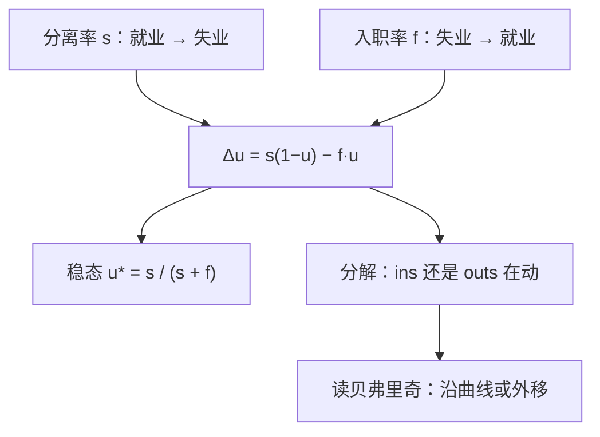

# 失业的存量-流量与贝弗里奇

失业不是一群静止的人，而是一池有人不断落水、有人不断爬岸的水；水位的涨落要先问两个阀门，哪一个在动。

<footer>—— 据 Hall, Job Loss, Job Finding, and Unemployment over the Past Fifty Years, NBER Macro Annual 2005；Shimer, Reassessing the Ins and Outs of Unemployment, RED 2012 整理</footer>

[上一课](/econ/superstar-labor)用 Rosen 1981 的超级明星经济收束「谁赚得多」：赢者通拿的市场里，市场规模与技术放大把微小的能力差写成指数级的收入差，工资分布的右尾由赢家吃掉。本课转入新单元「失业、搜寻与制度」的起点：右尾之外还有整块存量——没被任何工资曲线吸进去的失业人口。宏观主干已有[贝弗里奇曲线](/econ/beveridge-curve)的 U–V 观测与[搜寻匹配](/econ/search-matching-dmp)的均衡模型；分工是：DMP 课讲匹配函数如何把 $(u,v)$ 收成均衡，本课做实证流量核算——把失业率当成水位的会计，从分离率与入职率的月度流量出发，回答「这一轮失业上行，是落水的人多了，还是爬岸的人少了」。后课的搜寻与制度讨论默认已读完本课。

## 问题

U–V 图给了两个存量的对照，没给时间。同一个 $u=7\%$，可以是大量裁员又快速招回的经济，也可以是缓慢流失、缓慢回补的经济，政策含义完全不同。缺口是把静态对照换成流量账：失业的变动分解为流入（分离）与流出（入职），即所谓 ins 与 outs 的分解。

做法：记失业率为 $u$，每月分离率 $s$（就业者转入失业的比例）与入职率 $f$（失业者转入就业的比例），流量恒等式近似为

$$
u_{t+1}-u_t \;=\; s_t\,(1-u_t)\;-\;f_t\,u_t .
$$

令左端为零，稳态是 $u^{*}=\dfrac{s}{s+f}$。这个式子是本课的全部会计：要问失业为什么变，就把 $s$ 与 $f$ 各自的路径摆出来。

用美国月度量级做心算：$s\approx 2\%$、$f\approx 20\%$ 时 $u^{*}\approx 9\%$；$f$ 减半而 $s$ 不变，稳态推到约 $17\%$。换句话说，入职率腰斩对水位的推动，远大于分离率翻倍。

## 方法

分解的口径有三条纪律。第一，两态简化（就业、失业）会漏掉「退出劳动力」这个第三态：泄气工人退出后，$u$ 的分母缩小，水位显得比就业损失好看——[参与课](/econ/labor-participation)的分母警告在流量上仍然有效。第二，毛流量数据噪声大，入职率要从失业退出的转阵概率反推，并剔除「直接退出劳动力」的部分，否则 $f$ 被低估。第三，临时裁员与召回预期会把 $s$ 的高频尖峰读成破坏潮，实际是等待召回。

Hall 对战后五十年的核算与 Shimer 的再评估给出一致的定量结论：美国周期里 $u$ 的波动主要由 $f$ 的下降驱动，$s$ 相对平稳；大衰退中 Elsby–Hobijn–Şahin 发现分离率也显著抬升，是例外而非通则。这套 ins/outs 的分法接回[贝弗里奇曲线](/econ/beveridge-curve)：$f$ 下降是沿曲线向高 $u$、低 $v$ 走；$s$ 上升或匹配效率崩坏才是曲线外移——流量账给 U–V 图装上了时钟。

## 机制

为什么分解错了会错在政策上：若把「分离率上升的衰退」误读成「招聘变慢的衰退」，工具会去补贴招聘广告与匹配，而真实的阀门是岗位破坏与临时解雇，该稳的是存量就业。若把「入职率下降」误读成「工人不肯工作」，又会漏掉岗位创造侧的收缩——$f$ 是接触率与接受率的乘积，市场侧与工人侧都要拆开读。

长期失业的构成是另一层会计：大多数失业期间很短，但某一时点的失业存量集中在少数长期失业者身上——「平均失业期」由短期间拖动，存量却堆积在长尾。只看月度流量健康，会漏掉长尾的技能折旧与再就业难度上升。这也解释了为什么 DMP 课把 $u^{*}$ 写成摩擦均衡：稳态公式的 $s$ 与 $f$ 都是行为参数，制度（解雇成本、失业保险、招聘渠道）改写它们，是本单元后课的对象。

Fujita–Ramey 2009 与 Hall 2005 都用流量方差分解确认：入职率的周期方差贡献远大于分离率。这个「outs 主导」不是定理，是美国月度数据的量级事实，跨国会变。

## 边界

本课只做核算与分解，不做因果：$s$ 与 $f$ 是均衡结果，衰退里二者同时被冲击推动，方差分解不等于结构识别。两态会计也不区分全职与工时调整，雇主先砍工时的经济体里，就业存量的波动会低估劳动力使用的波动。估算入职率所用的转阵概率受样本流失与问卷修订影响，跨期比较要先对口径。政策评估（失业保险如何改 $f$）留给下一课。

后课默认：失业率是流量上的均衡水位，读失业先问 ins 与 outs；贝弗里奇曲线的移动要翻译成 $s$、$f$ 与匹配效率的哪一块在动。

## 小结

- 失业率是水位：$\Delta u = s(1-u) - f u$，稳态 $u^{*}=s/(s+f)$。
- 美国周期波动主要由入职率驱动；大衰退叠加分离率上升。
- 流量账给 U–V 图装上时钟：沿曲线是 $f$ 在动，外移是 $s$ 或匹配在动。
- 长期失业堆积在存量长尾，月度流量健康不等于存量健康。
- 出处：Hall, NBER Macro Annual 2005；Shimer, RED 2012；Blanchard–Diamond 1989；Elsby–Hobijn–Şahin 2010；Fujita–Ramey 2009。
