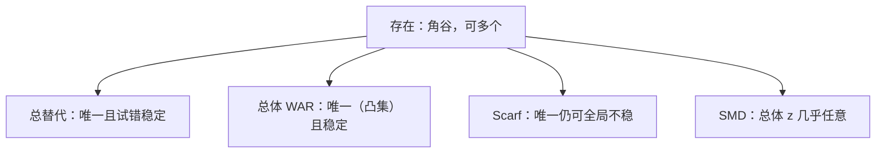

# 唯一性与试错

存在定理不给唯一，也不给拍卖人一条收敛的路；总替代可以两个都给，Scarf 的例子表明唯一均衡仍可全局不稳定。

<footer>—— 据 Arrow and Hahn, General Competitive Analysis, 1971；Scarf, Some Examples of Global Instability of the Competitive Equilibrium, IER, 1960 整理</footer>

[上一课](/econ/negishi-map)（Negishi 方法）。角谷不动点在凸连续下保证均衡非空，并明确：存在不是唯一，不是稳定，不是算法。本课不重写切立方体与 $F(p)$。缺口是：哪些额外结构让 $p^*$ 唯一，试错 $\dot p=z(p)$ 何时收敛——以及为什么「存在」不能偷运「拍卖人会走到那里」。

## 问题

Sonnenschein–Mantel–Debreu 说：超额需求除了齐次性、瓦尔拉斯定律与连续性，几乎可以任意。故唯一性没有免费午餐。充分条件要从总体结构来，不能从「每个人都凸」来。两条教科书路径：

**总替代（gross substitutes）**：$\ell\neq k$ 时 $\partial z_\ell/\partial p_k\gt 0$（相对价格意义上：$p_k$ 升，对 $\ell$ 的超额需求升）。则均衡唯一，试错在单纯形上全局稳定。

**总体弱公理（WAR）**：总量超额需求表现得像单个人的 WARP。则均衡集合凸，试错对唯一均衡稳定。代表性主体是 WAR 的特例，不是一般加总。

缺口不是再证一次存在，而是：**唯一与稳定是另加的总体性质；个体凸给不出。**

### 试错不是存在性的动态版

瓦尔拉斯试错（tâtonnement）：报价按超额需求调整，中间价格不成交。这是教学动态。存在性证明是一次性映射的不动点，没有 $\dot p$。把不动点读成「市场会收敛」是偷换。Scarf 构造了唯一均衡但试错从几乎所有起点发散的例子——唯一也不蕴含稳定。

总替代与互补互斥：互补使 $p_k$ 升、 $z_\ell$ 降，GS 失败。Giffen 在总量上也会破坏。Arrow–Hahn 把 GS 下的唯一与稳定写进教科书传统。

## 方法

正规化在单纯形或计价物截面上写 $\dot p_\ell=z_\ell(p)$（投影掉定律的相关方向）。Lyapunov 函数常用 $\sum(p_\ell-p^*_\ell)^2$ 或 $\max z_\ell$；GS 下超额需求对相对价格的符号模式让 $V$ 下降。WAR 给出 $p^*\cdot z(p)\gt 0$ 对 $p\not\sim p^*$（合适正规化下），同样推动 $p$ 朝 $p^*$ 走。

非唯一时，比较静态可以跳盆地：参数微移，均衡集里哪一点被「选中」试错说了不算——还取决于初值。指数定理（Dierker）说正则经济均衡个数一般为奇数；本课只点「可以多个」，不把度理论展开。

计算一般均衡（Scarf 算法、Newton）是另一套，不是试错的离散化。不要把 $\dot p=z$ 写成限价簿上的连续改价：中间报价在瓦尔拉斯装置里不成交，簿上每笔都可以成交。

## 机制

GS 起作用的机制是：一种商品变贵，需求转向其他商品，把其他市场的超额需求往上推，价格调整不会互相拆台。互补则相反，涨价可以加深别的缺口，循环发散。WAR 起作用的机制是总量像一个人：没有足以翻盘的收入效应加总。SMD 起作用的机制是：许多人的收入效应可以合成任意连续的 $z$，只要守定律与齐次——所以「微观合理」推不出「宏观试错收敛」。

与[核](/econ/core-equivalence)无关：核收缩谈的是复制下的配置集合，不谈价格调整路径。均衡可以唯一且核等价，试错仍然发散。

边界行为也要声明：某种商品价格趋于零时，GS 要求其超额需求趋向正无穷，把价格从边界推回内部。内部禀赋帮存在性，也帮试错不黏在轴上。互补、Giffen、非凸偏好都会在边界附近造出循环。Hahn 过程一类非试错动态允许非均衡成交，收敛条件另写，本课主钉瓦尔拉斯装置：不成交则只改报价。

Scarf 1960 的例子用三种商品、精心构造的偏好，让试错绕着均衡转圈或离开。引用它是为了拆「唯一⇒稳定」，不是为了说现实市场一定发散。

## 边界

随机试错、非瓦尔拉斯短边配给、序列经济，都改动态，本课不写。宏观代表性主体把唯一性当假设用，等于直接加 WAR，不是从加总推出来的。非凸、离散商品让 $z$ 不连续，试错定义本身要改。

后课核等价在配置集合上说话，仍不保证试错。后课默认：标准假设下均衡存在；唯一与 tatonnement 收敛需要 GS 或总体 WAR 一类额外结构，且唯一均衡仍可能不稳定。

## 小结

- 存在不蕴含唯一；SMD 说明总体超额需求几乎不受偏好约束。
- 总替代或总体 WAR 给出唯一（及试错稳定）的充分条件。
- Scarf：唯一均衡也可以让试错全局发散；不动点不是动态。
- 下一课用联盟阻塞把有效集瘦成核，仍不谈调整路径。
- 出处：Arrow and Hahn, *General Competitive Analysis*；Scarf, *IER*, 1960。
