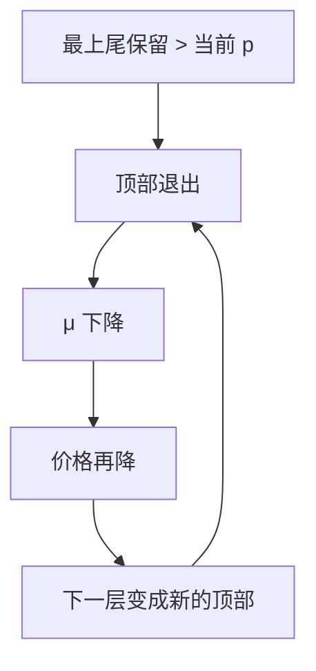

# 逐级退出

给定价格，最好的车先退出；平均质量随即下降，价格再降，下一层再退出。市场可以从顶部一层一层剥掉，而不只是一次性切在某个阈值。

<footer>—— 据 Akerlof, QJE, 1970；Wilson, The Nature of Equilibrium in Markets with Adverse Selection, Bell Journal of Economics, 1980</footer>

[上一课](/econ/akerlof-lemons)给出静态切断：愿意卖的是 $\theta\le\hat\theta(p)$，买方付 $\mu(p)$，不动点可以空。缺口是把切断读成过程：质量从顶部起退出，每一层退出改写下一层的条件期望。Wilson 把「预期到被撇走」写进均衡概念；本课钉逐级退出的动力学，不把竞争保险菜单写成 Rothschild–Stiglitz。

## 问题

连续质量 $\theta$，卖方保留随 $\theta$ 升。静态均衡若存在，是某个切断点。但若买方按当前市场上的平均质量出价，最高的那些卖方立刻发现 $p$ 低于自己的保留，先退出。剩下的分布截去上尾，$\mu$ 下降，$p$ 再降，次高的一层又变成「最高」，再退出。这是从顶部起的逐级退出（unraveling），不是一次算好 $\hat\theta$ 就结束。

完全退出：每一层都发现自己比更新后的 $\mu$ 更贵，直到只剩柠檬或交易量为零——与柠檬课的 $p=0$ 教具同一终点，但路径是一层一层剥。部分站住：某一层的保留恰好被该层条件下的 $\mu$ 托住，退出停止。Wilson 的预期均衡还要求：卖方预见到「若价格再诱出更好的车，那些车其实不会来」，从而挡住某些看似能撑住的价格。

### 顶部先走，不是底部先走

逆向选择的会计是上尾先离开：好的保留高。这与「劣币驱逐良币」的方向一致，但机制是保留效用排序，不是铸造成本。底部的柠檬一直愿意在低价卖；市场萎缩时他们仍在。

Wilson 关心的是：静态「给定他人合同再优化」会把好风险撇走，于是原合同崩溃。逐级退出是同一逻辑在质量连续统上的过程版。本课不把保险公司菜单画出来，那是筛选崩溃课。

静态不动点已经可以空；逐级退出解释空是怎么走出来的。
有不动点时，过程仍可能先超调：价格按当前 $\mu$ 调，暂时切得比均衡更狠。
预期一旦进入，有些路径根本不会被走——卖方不相信「高价能引回好车」。

## 方法

对象：连续质量、公开单一价格、无担保。先写退出算子：给定出售集 $S$，令 $p=\mu(S)$，新出售集是保留 $\le p$ 的类型。反复迭代，看是否收敛到柠檬课的切断。再对比 Wilson：买方（或厂商）预期到撇脂，拒绝那些「只有在好车留下时才不亏、但好车其实会走」的价格。

## 机制

价格仍同时做支付与切断，但切断被迭代。每一轮的信息是「还在场的人的条件分布」，不是新的私人信号。顶部退出是占优的：给定别人还在，最高类型最不划算。别人一旦走，他更不划算，所以退出不可逆。这与信号分离相反：那里高类型花钱留在场上证明自己；这里没有昂贵行动，高类型只能用脚投票离开。

与匹配里「提前签约」的 unraveling 同名不同树：那里是时间上抢跑，本课是质量维度上剥层。不要混。柠檬课已经说互利交易可以消失；本课补的是消失的顺序——从好到次好，不是随机缺货。每一轮出售集都是上尾被截掉的 $F$，买方若按新的 $\mu$ 出价，切断点只降不升，所以过程单向。有担保或最低标准时，上尾被按住，迭代少走几步，问题交给信号或法规，不是换一个静态 $p$。

退出一旦开始就不可逆：最高类型走了，$\mu$ 只降不升，次高类型面对的是更差的市价。
适应动力学按当前 $\mu$ 调价；Wilson 预期则让某些「假高价」根本不被出。两条路都可以走到柠檬课的空均衡。

## 边界

若有最低质量标准或强制公开，上尾被法规按住，逐级退出少一层。若有担保、品牌，高类型可以花钱留场，过程停，问题交给信号。买方也有私型时，双边退出更乱。离散两类型没有「一层一层」，只剩混同或关闭，逐级退出退化成柠檬课的一次性切断。

后课默认：隐藏类型且只有价格时，质量可以从顶部逐级退出；要挡住退出，必须改树（信号、筛选、强制公开），不是再找一个 $p$。

### 预期均衡挡住「假高价」

静态：某个高 $p$ 似乎能引回好车。Wilson：若人人预期好车会被下一张更甜的合同（或更低的有效平均）撇走，这个 $p$ 不会被出。逐级退出因此不只是适应动力学，也可以是预期本身。本课只借这一点，不写保险平面上的零利润线。

Akerlof 原文是一次均衡；把「平均质量随供给集变」反复代入，就得到顶部起退出的路径。终点仍可以是他的柠檬市场。

## 小结

- 好车保留高，先退出；$\mu$ 与 $p$ 随之下移，次好再退。
- 终点可以是市场关闭，与柠檬静态空均衡一致。
- Wilson 把「预见到被撇走」写进哪些价格根本不会出现。
- 挡住退出要信号、菜单或法规，不是另一条公开市价。
- 出处：Akerlof, *QJE* 1970；Wilson, *Bell* 1980。
