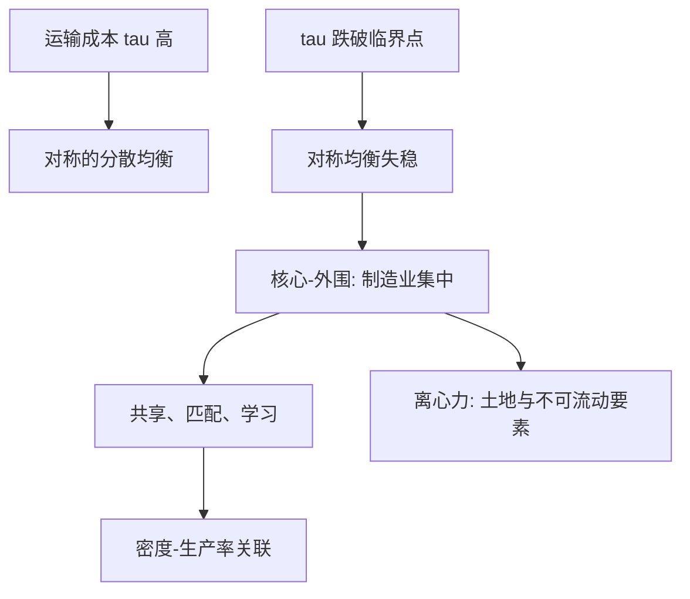
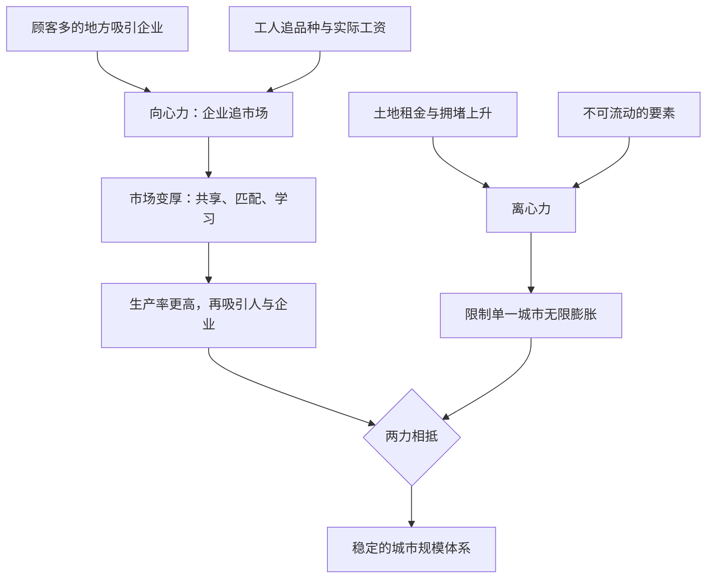

# 集聚经济

城市不是人口的巧合，而是报酬递增在地理上的落点；运输摩擦一旦低于临界值，均衡会从分散跳到集中，而且是灾变式的跳。

<footer>—— 据 Krugman, Increasing Returns and Economic Geography, Journal of Political Economy 1991；Rosenthal and Strange, Evidence on the Nature and Sources of Agglomeration Economies, 2004 整理</footer>

[上一课](/econ/hi-map)把健康与保险收成闭环：风险厌恶要保险、保险改行为、投保决策泄露类型，保单、选择与药价互相定价，是一个市场的三个面。本课是**城市与区域经济学**的第一课，后课默认已经读完。[新贸易理论](/econ/krugman-new-trade)已经把报酬递增与垄断竞争装进不依赖国界的框架；本课把国界换成距离——同一套机制，落点从「国家间分工」换成「经济活动为什么挤在国土的一小片上」。微观主干默认区位给定、企业只选产量；本课把区位本身变成选择变量。

## 问题

若要素自由流动、技术处处相同、报酬不变，密度差应当被迁移抹平；实际上一半以上的人口与产出压在百分之几的国土上。缺口是同时解释两件事：为什么集中，以及为什么没有集中到一点。Marshall 给过三条来源——投入品共享、劳动市场匹配、知识溢出；Krugman 1991 把其中市场规模那条写成一般均衡：运输成本 $\tau$、制造业份额 $\mu$、品种替代弹性 $\sigma$ 共同决定向心力（企业追市场、工人追低生活成本）对离心力（不可流动的农业与土地租金）。参数越过临界点，一个微小扰动会把经济从对称均衡整个翻到核心-外围结构。集中是跳变，不是渐变。

### 聚集的测法

实证两条线。密度-生产率关联最直接：Ciccone 与 Hall 1996 估计美国州级就业密度翻倍，平均劳动生产率约高百分之六。但密度是选出来的：高效率企业与高能力工人自选进大城市，把回归系数推高。识别要靠固定效应吸收个体质量，或用同一个人搬家前后的工资变化做差——把「谁去了哪」从「去了之后变得多好」里剥出来。第二条线是飞镖盘基准：Ellison 与 Glaeser 1997 问，给定自然地理，行业聚集超出随机投镖多少；美国制造业的聚集显著超出基准，说明聚集有产业自身的逻辑，不只是港口与矿藏的运气。

Ciccone–Hall 的 6% 是密度与生产率的关联，不是政策弹性：把人搬进城市不会自动复制这 6%，因为选择效应与聚集效应没有在他们的估计里分开。Rosenthal–Strange 的综述把「聚集值多少」与「聚集来自哪」列为两个独立问题。

## 方法

机制层面的整理是 Duranton 与 Puga 2004：共享（不可分投入的摊薄）、匹配（厚市场改善工人与企业的匹配质量，与[搜寻匹配](/econ/search-matching-dmp)同一语法）、学习（溢出）。溢出最难测：Jaffe、Trajtenberg 与 Henderson 1993 用专利引用显示，同一都区的引用概率显著更高，且随距离快速衰减——知识不是顺着网线免费流动的比特。溢出在产业内还是产业间？Glaeser、Kallal、Scheinkman 与 Shleifer 1992 用 1956–1987 年美国城市产业就业回答：产业内专业化预测更慢的增长，竞争与产业多样性预测更快的增长——在城市尺度，学习更像跨产业的溢出，而非产业内的独享。

## 机制

报酬递增会把聚集放大成星级现象：[超明星劳动](/econ/superstar-labor)里收入向极少数人集中的机制，在城市尺度上表现为少数都市拿走大部分增长。企业异质性也接得上：[异质性企业出口](/econ/melitz-heterogeneous-firms)里只有高生产率企业付得起进入成本；城市里只有高生产率企业付得起中心租金——空间把效率排序直接写进地图。读这份地图要把两个力分开：聚集增益解释为什么挤，离心力解释为什么没有挤成一点；只写前一半，解释不了中小城市为何还存在。

直觉类比：向心力像磁铁——企业想去顾客多的地方，工人想去选择多的地方，互相成就，雪球越滚越大；离心力像弹簧——人一多房租涨、通勤久，把边际的人和企业往外推。一座城市的规模，就停在磁铁和弹簧势均力敌的位置。

数字实例：Ciccone–Hall 的 6% 是「密度翻倍对生产率高约 6%」：就业密度从每平方公里 1000 人升到 2000 人，平均劳动生产率大约多 6%。注意这是对数式的翻倍关系，不是「每多 1000 人多 6%」。

常见误区：「大城市工资高，搬过去就涨 6%」。密度-生产率是关联而非处理效应——搬进大城的本来就是高效率企业和高能力工人。想量「去了之后变好多少」，得用同一个人搬家前后的工资变化做差，把选择剥掉再看。

## 边界

聚集经济不是「密度好」的另一种说法：同一密度也生产拥堵、房价与污染，那是后课的参数。聚集弹性也不能直接当政策杠杆——聚集是均衡的产物，估计里拆不净的选择效应让按弹性补贴密度变成拿关联当杠杆。城市间的聚集与国家间的比较优势是不同尺度的机制，不要把 Melitz 的出口选择当成城市聚集的解释。本课也不回答「该规划成什么样」：规划工具如何作用于这两组力，是收束课之外的地方政策问题。

## 小结

- 核心-外围：运输成本、报酬递增与要素流动的组合越过临界点，集中是跳变不是渐变。
- 聚集三来源——共享、匹配、学习；知识溢出随距离快速衰减。
- 密度-生产率是关联；识别要拆选择效应与处理效应，飞镖盘基准排除地理运气。
- 城市尺度上溢出更像跨产业的 Jacobs 型，而非产业内的 Marshall 型。
- 出处：Krugman, *JPE* 1991；Ellison–Glaeser, *JPE* 1997；Ciccone–Hall, *AER* 1996；Glaeser 等, *JPE* 1992；Duranton–Puga 与 Rosenthal–Strange，*Handbook of Urban and Regional Economics* 卷四，2004。
