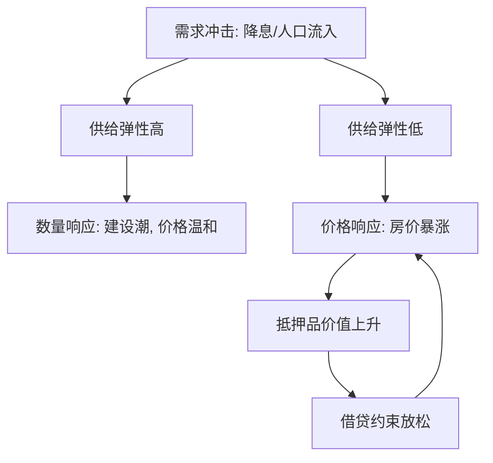
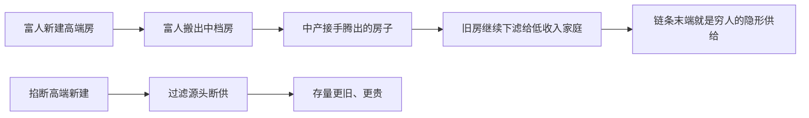

# 住房市场

住房的供给曲线在地理上是平的，在制度上是竖的；需求来的时候，有弹性的城市盖房子，刚性的城市涨房价。

<footer>—— 据 Glaeser and Gyourko, The Economic Implications of Housing Supply, Journal of Economic Perspectives 2018；Saiz, The Geographic Determinants of Housing Supply, Quarterly Journal of Economics 2010 整理</footer>

[上一课](/econ/ur-intra-city)把城市剖面写成租金梯度；本课把时间轴打开：梯度给定之后，需求冲击落进价格还是数量，取决于上一课没写的那个参数——供给弹性。房子是耐用的、异质的、位置固定的消费品加资产，[住房与消费](/econ/housing-asset-consumption)讲过它的双重身份；本课讲这个双重身份如何放大波动。

## 问题

同一轮降息与人口流入，有的城市表现为建设潮与温和涨价，有的城市表现为房价暴涨与可负担性危机。缺口有三：价格由流量定还是存量定；租售比怎么读；信贷怎么把房价变成放大器。只盯「全国平均房价」会把三个缺口全读错——平均数掩盖了城市间的分岔，而分岔才是住房市场的全部信息。

### 存量-流量与用户成本

方法是把市场拆成两层。流量层：价格即时调整，存量按建设周期缓慢变化；长期里价格被边际供给成本托底——Glaeser 与 Gyourko 的口径是，房价持续高于重置成本的部分，是土地与许可的租金，不是建材涨价。供给弹性由两层决定：地理（Saiz 2010 用坡度、水域与地形算出不可开发份额，把地理从管制里剥出来）与管制（分区、许可）。资产层是用户成本恒等式：$R=P\,(i+\tau_p+\delta-\pi_P)$，其中 $\pi_P$ 是预期房价增速；租售比 $P/R$ 因此对实际利率与预期租金增速高度敏感（Poterba 1984 的税收补贴分析即由此入手）。

租售比的算术：实际利率 5%、租金零增长时 $P/R\approx20$；利率降到 4%、预期租金增速 2% 时 $P/R$ 可站上 50。同一处房子，房租没动，价格可以翻倍还多——先算机械效应，再谈情绪与泡沫。

## 方法

抵押品通道把资产层接回信贷：房价上涨抬抵押品价值、放松借贷约束、再推房价，与[抵押品与房价](/econ/collateral-house-prices)同一机制，杠杆决定环是温和的还是爆裂的。分配端靠过滤机制：富人换新房，旧房逐级下滤给低收入者；掐断高端新建，等于切断链条末端的隐形供给，穷人面对的存量更旧更贵。总量端是 Hsieh 与 Moretti 2019：1964–1980 年美国城市间名义工资在收敛，1980 年代起收敛停摆——高生产率城市因住房约束拒绝迁入者，全美产出低于无约束反事实。上一课的聚集增益，被本课的供给约束吃掉。

## 机制

把三课连起来读：第一课说聚集让高密度城市更值钱，本课说约束让这份值钱只落进房价不落进人头。读房价数据时最容易犯的错有两类：一是把租售比当泡沫的充分统计，忘了利率与预期的机械通道；二是把供给弹性当常数，忘了地理是慢变量、管制是政策变量，同一个城市十年前的弹性未必是今天的弹性。

「供给弹性」可以翻译成：房价每涨 1%，开发商愿意多盖百分之几的房子。有弹性的城市像一片开阔的操场，需求来了向四面八方扩；无弹性的城市像被墙围住的院子——墙有两堵，一堵是地理（山、海、湿地），一堵是管制（分区、许可），后者是人砌的，可以拆。

数字实例：一套房的建材加人工重置成本 50 万，市价卖 200 万，中间 150 万的差价不是「房子变贵了」，而是这块地加上盖房许可证的租金。看一座城市有没有供给约束，就盯这个差价是不是长期存在。

常见误区：「不许盖豪宅，穷人就住得起」。过滤机制说反了：豪宅是下滤链条的源头，源头断供，中产腾不出旧房，穷人接到的反而是更旧更贵的存量。类似地，「租售比高 = 泡沫」也快了一步——利率一降租售比机械上升，先算机械效应再谈情绪。

## 边界

资产定价工具用在住房上要加约束：房子不可分割、自住有消费收益、交易成本高，套利远弱于金融资产，现值公式的残差不该全归给风险溢价。按揭利息扣除的归宿落在房价还是家庭，与[税收归宿](/econ/tax-incidence)同一问法，本课不展开。房价-信贷的联合波动留给宏观金融课程；这里只钉一句：判断一座城市的房价，先看它的供给曲线，再看它的人民，最后才看它的故事。

## 小结

- 存量-流量：价格即时、存量缓慢；长期价格贴着边际供给成本。
- 供给弹性等于地理加管制；Saiz 用不可开发份额先剥出地理。
- 租售比对利率与预期租金增速敏感，静态读法会把机械效应当泡沫。
- 过滤是低收入住房的隐形供给线，掐断新建伤在链条末端。
- 聚集增益被住房约束截断：Hsieh–Moretti 的空间错配是全国总量问题。
- 出处：Glaeser–Gyourko, *JEP* 2018；Saiz, *QJE* 2010；Poterba, *QJE* 1984；Hsieh–Moretti, *AEJ: Macro* 2019。
