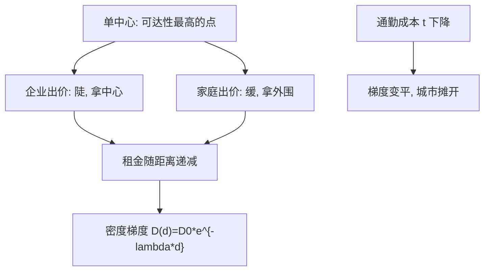

# 城市内部结构

城市里的租金是通勤的赎金：你少走的那段路，由你多付的房租替你买单；梯度陡不陡，看通勤成本对住房支出的比值。

<footer>—— 据 Alonso, Location and Land Use, 1964；Mills, An Aggregative Model of Resource Allocation in a Metropolitan Area, 1967；Muth, Cities and Housing, 1969 整理</footer>

[上一课](/econ/ur-agglomeration)把「为什么聚在一起」写成向心力对离心力的均衡；本课把镜头从城市之间拉近到城市内部：聚起来之后，谁站中心、谁去外围、租金与密度怎么排布。Alonso、Muth 与 Mills 的单中心模型是本课的骨架，后课的住房市场与交通政策都在这副骨架上拧参数。区位竞争的另一支——[Hotelling 线性城市](/econ/hotelling)——问厂商为什么扎堆；本课问家庭与企业如何在既有中心周围出价。

## 问题

几乎所有城市的房价与人口密度都从中心向外递减，但递减速度差别极大；而且中心住谁并不固定——美国大城市的低收入者常在市中心，另一些城市则是富人在中心、通勤者在边缘。缺口：需要一套能把梯度、密度、谁住哪同时排出来的模型，而不是一组城市轶事。

### 出价租与效用拉平

方法是把家庭写成在距离 $d$ 上出价的竞标者：通勤成本 $t\cdot d$ 随距离上升，住房支出随距离下降；均衡处效用被出价拉平，得到 $\partial p/\partial d \lt 0$ 的出价租曲线，谁出价曲线最陡谁拿中心。企业同理：最依赖面对面可达性的活动出价最高，商业中心落在出价曲线的交点。经验规律是 Clark 1951 的密度梯度 $D(d)=D_0\,e^{-\lambda d}$；Muth 1969 给出 $\lambda$ 的近似——通勤支出份额与住房支出份额之比，两者都是收入的一到两成，所以梯度天然是「每英里百分之几」的量级，与实测对得上。

美国大都市的密度梯度 $\lambda$ 在一个世纪里大约降了一半：有轨电车、地铁再到汽车，一路把通勤成本往下压。梯度变平不是住房偏好变了，是 $t$ 变了——用模型读历史的最干净一例（据 Mills 的估算与 Glaeser–Kahn 2001 的整理口径）。

## 方法

单中心模型的用法是反事实，不是描绘：把通勤成本改一档，梯度、密度、城市边界跟着重排，这正是后课交通投资分析的接口。识别上，区位选择是离散选择问题，与[离散选择模型](/econ/discrete-choice)同一语法；把区位属性的价格写成隐含市场，是 Rosen 1974 特征价格的方法，房租梯度里的「可达性价格」是它的特例。辖区维度另算一笔账：Tiebout 1956 说居民按「税收-服务」组合挑选辖区，城市内部的排序因此还要叠一层财政差异，与[地方财政转移](/econ/local-fiscal-transfers)相接。

## 机制

梯度变平的机制值得再走一遍：$t$ 下降让外围的「通勤加住房」总成本相对便宜，需求外移，外围密度上升、中心密度下降，就业也随之郊区化（Glaeser 与 Kahn 2001 的就业分散化研究）。单中心因此是基准而不是描述：就业次中心出现时，出价租的逻辑照用，只是出价者多了一组。谁住中心取决于权衡结构而非贫富本身：靠公交的家庭必须贴着线路住，有车的家庭可以把通勤换成外围的便宜房租；把「穷人住市中心」当成普适规律，会把预算约束误读成文化偏好。

## 边界

单中心模型没写供给：住房供给弹性决定需求冲击是涨房价还是盖房子，那是下一课的参数。它也没写聚集：为什么有一个中心、中心会不会迁移，上一课的向心力只给了答案的一半。税制与学区把辖区维度拉进来后，梯度只在同类辖区内部干净。模型对日常生活的解释半径也有限：信息化让部分工作摆脱通勤，但办公室租金照旧陡峭——面对面交换的价值仍写在出价租里，只是它的载体从工厂换成了写字楼。

## 小结

- Alonso–Muth–Mills：出价租竞争排布城市，谁出价曲线陡谁拿中心。
- 密度梯度 $D(d)=D_0e^{-\lambda d}$，$\lambda$ 近似为通勤支出份额与住房支出份额之比。
- 通勤成本下降让梯度变平、城市摊开；单中心是多中心的基准。
- 谁住中心由通勤方式与预算结构决定，不是普适的贫富规律。
- 出处：Alonso 1964；Mills 1967；Muth 1969；Clark 1951；Rosen 1974；Tiebout 1956；Glaeser–Kahn 2001。
