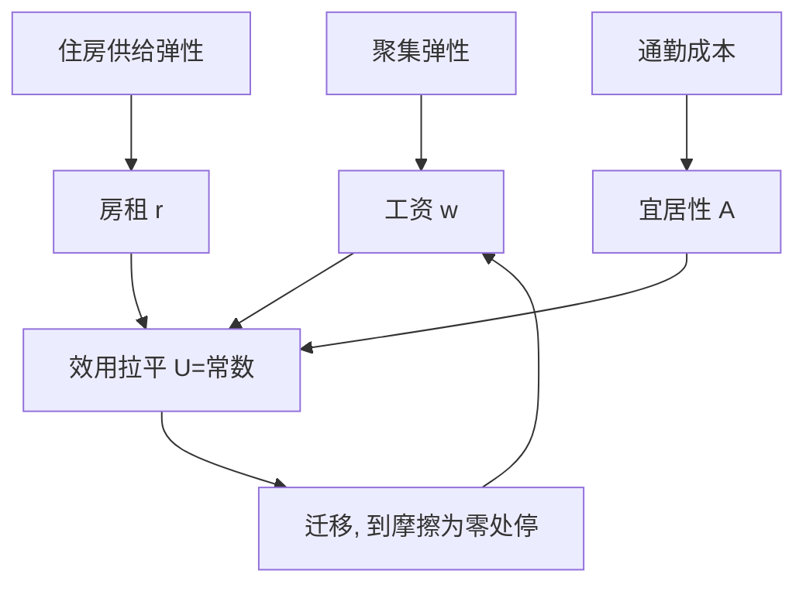

# 城市与区域收束

人往哪去不需要指挥棒：工资、房租与宜居性把效用拉平到迁移的摩擦为止；政策能动的不是方向，是摩擦。

<footer>—— 据 Roback, Wages, Rents, and the Quality of Life, Journal of Political Economy 1982；Gabaix, Zipf's Law for Cities, Quarterly Journal of Economics 1999；Hsieh and Moretti, Housing Constraints and Spatial Misallocation, AEJ: Macroeconomics 2019 整理</footer>

[上一课](/econ/ur-transport-location)把通勤成本写成政策变量，也写清了定价与扩容的分工；本课收束：从城市内部回到城市之间，把四课攒下的参数——聚集弹性、供给弹性、通勤成本——拧进国家尺度的空间均衡。本课程到此收束。

## 问题

城市规模的分布极其稳定：第二大城市人口约为最大城市的一半，按人口排序的前 $n$ 位城市，规模序列近似 $1/n$ 的幂律，这叫 Zipf 律；与此同时，区域人均收入先收敛后停摆。缺口：单城市模型回答不了三个问题——为什么有这么多城市；大小为什么这样排；人为什么不再流动到边际处处拉平。

### 空间均衡的账本

Rosen–Roback 的账本只有一行：工人在城市 $i$ 拿工资 $w_i$、付房租 $r_i$、享宜居性 $A_i$，可迁移把效用拉平 $U(w_i,r_i,A_i)=\bar U$。于是高工资高房租的城市必有过人之处——生产率或宜居性；反过来，用 $w-r$ 组合可以给不可交易的宜居性定价。规模分布把聚集与拥堵的净收益写到地图上：Gabaix 1999 证明，只要各城市按同分布的随机增速增长（Gibrat 律），幂律就是增长的稳态——不需要每座城市都有一个特殊理由。地方冲击的传播以通勤区为分析单位：[中国冲击](/econ/china-shock)按通勤区的行业暴露度识别进口竞争的地方效应，冲击落在地图上的点，而不落在「全国平均」里。

Zipf 的口径：以人口排序，第 $n$ 位城市的规模约为第一位的 $1/n$。Gabaix 1999 说明幂律是随机增长的稳态——规模分布的稳定，不等于每座城市命运的稳定；读反事实要看单个城市的偏离，不看分布形状本身。

## 方法

政策有两个坐标：对地政策补贴特定区位，对人政策降低迁移与人力资本摩擦。Busso、Gregory 与 Kline 2013 对联邦企业区的评估是基准：目标区的就业与工资显著上升，但部分收益来自相邻区让渡——对地政策是慢工具，且要跟「不作为」的对照比较，不能跟「别的政策」比较。Hsieh–Moretti 的总量核算把五课串起来：住房约束（第三课）让聚集增益最高的城市（第一课）拒绝工人迁入；通勤与住房成本（第二、四课）是迁移摩擦的一部分。空间错配因此不是区域问题，是全国总量问题：同样的禀赋，摆错位置，产出就少一截。

## 机制

收束的读法是倒着走一遍课程：为什么有城市——报酬递增对运输摩擦的临界（第一课）；城市内部怎么排——出价租与梯度（第二课）；房子怎么定价——供给弹性与租售比（第三课）；政策动哪根杠杆——$t$ 的定价与扩容（第四课）；最后，这些参数决定人往哪去、不去哪（本课）。链条上任何一环的参数变了，下游全部重排：这就是城市经济学的全部语法。

## 边界

空间均衡的拉平只对能流动的人成立：住房、信贷与家庭约束让均衡位置本身成为摩擦的函数，把「效用处处相等」当成描述而非条件，会低估政策退出的代价。Zipf 是基准不是铁律，顶部城市对幂律的系统性偏离照出反事实：超级城市是否过大，取决于聚集增益与拥堵成本的估计，不取决于分布形状好不好看。本课程未覆盖的还有土地政治、国际移民与气候迁移；五课收在同一句：城市是把聚集增益与拥挤成本装进同一块土地的制度，读城市就是读这两条曲线的均衡。

## 小结

- Rosen–Roback：工资、房租、宜居性三价拉平效用，价差就是宜居性的价格。
- 城市规模近似幂律（Zipf），Gibrat 随机增长足以解释其稳定。
- 对地政策是慢工具且部分收益来自邻区让渡；对人政策降低摩擦。
- 聚集增益被住房约束截断，是总量意义上的空间错配。
- 出处：Roback, *JPE* 1982；Gabaix, *QJE* 1999；Hsieh–Moretti, *AEJ: Macro* 2019；Busso–Gregory–Kline, *AER* 2013。
