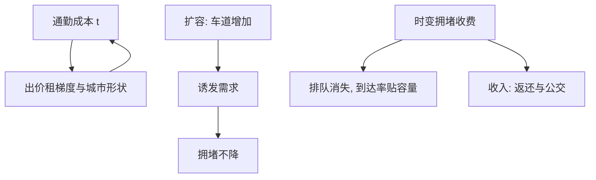

# 交通与区位

高峰期的排队，是用零票价配给稀缺路面；道路不缺车道，缺的是价格。

<footer>—— 据 Pigou, The Economics of Welfare, 1920；Vickrey, Congestion Theory and Transport Investment, American Economic Review 1969；Duranton and Turner, The Fundamental Law of Road Congestion, American Economic Review 2011 整理</footer>

[上一课](/econ/ur-housing)把房子写成耐用资产，把供给弹性立成关键参数；本课处理另一个参数——通勤成本 $t$——并把它变成政策变量：收费、扩容、公交，以及为什么修路常常治不了堵。第二课问 $t$ 如何排布城市，本课问政策能不能改 $t$、改了之后谁受益。

## 问题

拥堵是教科书级的负外部性：每辆车加进车流，自己算时间，不算自己加给所有后车的时间，私人边际成本低于社会边际成本。[外部性与庇古税](/econ/externality-pigou)给过一般语法；缺口在交通的三个特殊性：外部性随流量非线性放大；需求有隐性储备，扩容会把它钓出来；投资与定价在政治上不对称——修路有预算，收费要说服公众。把交通当普通外部性写税，会把这三条特殊性全丢掉。

### 瓶颈与排队

定价：按路段边际外部延误收费，费率随流量变化，这是[峰荷定价](/econ/peak-load-pricing)在道路上的直译。Vickrey 1969 的瓶颈模型把排队写成排程问题：通勤者有理想到达时刻，早到成本 $\beta$、晚到成本 $\gamma$、在途成本 $\alpha$；无定价的均衡是人人排队，队列恰好把每个人的总成本抹平；最优时变费率让到达率贴着瓶颈容量走，队列消失，被烧掉的排队时间变成财政收入。实证的反面是扩容：Duranton 与 Turner 2011 用美国都市区面板发现，车道里程与车辆行驶里程近乎同比例增长，拥堵指标不降——「道路的基本定律」，容量被诱发需求吃满。

伦敦拥堵费开征于 2003 年，标准费率起初为每日 5 英镑；据伦敦交通局监测，初期区内拥堵下降约三成、车速明显回升，但至 2010 年前后拥堵已回到开征前水平。收费管住了收费口的需求，管不住需求总量与路网施工——基本定律在城市里的注脚。

## 方法

机制在第二条曲线上：$t$ 下降，第二课的出价租梯度变平，城市向外摊开；摊开又拉长平均通勤、生成新的拥堵点——交通投资改写的是区位，不只是路况。出行分布与跨城交流强度按[引力模型](/econ/gravity-model)的语法随距离衰减，交通改善等价于把距离矩阵整体调小。收费与扩容的比较还要用[次优理论](/econ/theory-of-second-best)：当公交定价存在扭曲时，道路单独最优定价不再全局最优。新加坡 1975 年的区域通行证、1998 年的电子道路收费，与斯德哥尔摩 2006 年试行后经公投常态化，是定价落地的三个常引样本。

## 机制

读这个题的次序是：先辨外部性的形状，再选工具。延误外部性随流量增长，所以费率应该是时变的；排队是把稀缺容量配给先到者的机制，本身不产生任何价值，收费只是把排队时间换个口袋。诱发需求提醒容量是被区位内生决定的：路网扩张与土地开发互为因果，把拥堵当成单纯工程问题，会把投资变成位移拥堵的竞赛。

## 边界

定价的分配面必须写进方案：高费率对低收入通勤者负担更重，收入返还与公交改善是配套而不是施舍。瓶颈模型测的是排队，不测安全、噪声与停车外部性，费率表再精也只覆盖一种边际。公交的覆盖与频率、停车定价、土地出让的区位后果都在课程之外；本课只钉一句话：交通政策的落点不是路况，是 $t$，而 $t$ 最终写在房租梯度里——下一课把四课攒下的参数拧成国家尺度的空间均衡。

## 小结

- 拥堵是随流量放大的负外部性；庇古定价按边际延误收费。
- 瓶颈模型：无定价的均衡是排队，时变收费消队列并产生收入。
- 扩容被诱发需求吃满：道路的基本定律（Duranton–Turner 2011）。
- 交通改写区位：$t$ 变则梯度变平、城市摊开。
- 出处：Pigou 1920；Vickrey, *AER* 1969；Duranton–Turner, *AER* 2011；伦敦交通局监测报告（据以整理）。
