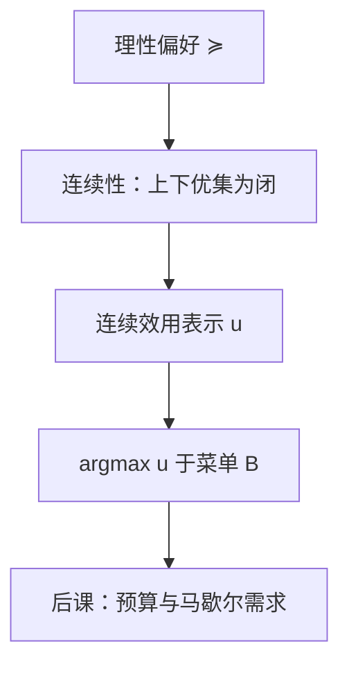

# 效用函数何时存在

一个连续的效用函数表示一个连续的偏好；反过来，连续偏好在适当的消费集上总可以被连续函数表示。

<footer>—— 据 Debreu, Representation of a preference ordering by a numerical function, 1954；Theory of Value, 1959 整理</footer>

上一课[偏好、完备与传递](/econ/preference-choice)把理性偏好钉死：完备加传递，有限菜单上最大元非空。本课不重讲这两条公理，也不从「幸福」另起炉灶。缺口是：排序还只是二元关系，后课的预算最大化、斯勒茨基分解都要在实函数上做微分。何时存在 $u:X\to\mathbb{R}$，使 $u(x)\ge u(y)$ 当且仅当 $x\succsim y$？后课默认已经读完本课，见到 $u$ 就把它读成这个表示，而不是心理强度。

## 问题

有限集上，理性本身就够。把最大元标成 $n$，次大标成 $n-1$，一直标下去，得到的是序数效用：任何严格递增变换 $f\circ u$ 表示同一套 $\succsim$。缺口出在消费理论真正用的 $X\subseteq\mathbb{R}_+^n$。这里菜单可以是闭集、无界集，最大元可能不存在；即便存在，也不保证能用**连续**函数把整条关系写下来。不连续的表示会让后课的需求对应在价格上跳来跳去，包络定理没有对象。

因此本课要加的不是新的「喜欢」，而是拓扑条件：偏好在 $X$ 的序拓扑里连续——上优集 $\{y:y\succsim x\}$ 与下优集 $\{y:x\succsim y\}$ 都闭。Debreu 的表示定理说：在连通的消费集上，连续的理性偏好有连续效用表示。单调、凸还没出场；它们是需求课为了内部解和唯一性才加的。

### 表示是序数的，数字没有基数含义

$u(x)=2$、$u(y)=1$ 只说 $x$ 至少与 $y$ 一样好，不说「好一倍」。后课写 $\max u(x)$ 时，一阶条件里的 $\nabla u$ 会随单调变换改尺度，但切点本身不变。人际比较同样读不出来：两个人的 $u$ 不能相加。那是[福利定理](/econ/welfare-theorems)另引进的公理，不是本课的副产品。

无差异曲线是 $u$ 的水平集。有了连续 $u$，才谈得上「曲线」。上一课只有无差异关系，没有拓扑，画不出图。

## 方法

取 $X\subseteq\mathbb{R}_+^n$ 连通（常用凸锥或非负象限）。理性且连续的 $\succsim$ 对应某个连续 $u$。构造不必唯一：Debreu 的证明用开区间去嵌偏好的分划；教科书里更常见的是沿一条严格单调路径取「刚好无差异」的标量。本课不把证明展开成习题，只锁定三件事：存在、连续、序数。

有了 $u$，菜单 $B$ 上的最大元改写成 $\arg\max_{x\in B}u(x)$。有限 $B$ 上这与上一课的最大元相同；闭有界 $B$ 上 Weierstrass 保证非空。预算集是后课才引进的特殊 $B$，本课不写价格。

局部非餍足还不是本课的公理。没有它，最大元可以落在预算内部，瓦尔拉斯定律后课会失效。本课只保证「排序能写成函数」；钱花完与否，是需求课的缺口。

## 机制

连续性排除「无穷小跳跃」：若 $x^n\to x$ 且每一点都优于 $y$，极限不能突然劣于 $y$。这让无差异集把 $X$ 分成整齐的层，效用沿着层递增。后课对价格求导，靠的就是这层结构可微或至少局部 Lipschitz——可微是额外光滑，不是表示定理的结论。

序数性意味着后课所有「效用差」的说法都要翻译回偏好。马歇尔需求在单调变换下不变，间接效用会变，但间接效用的最大化者不变。这就是为什么需求课可以随便选一个方便的 $u$（拟线性、Cobb–Douglas），只要它表示同一 $\succsim$。

词典序是理性但不连续的标准反例：它没有连续效用表示。后课默认不把词典序当消费者。

## 边界

表示定理不给出唯一 $u$，也不给出基数效用。期望效用课会再加独立性，那时仿射变换才被钉死——那是另一套公理，不是本课的加强。也不要把连续效用读成「人感觉平滑」：它是模型为了用分析工具付的拓扑代价。

实验里的不传递、不完备，上一课已经划成对照。本课在理性内部工作：若连续性也失败，后课的需求函数理论整段暂停。主干仍用 Debreu 表示，因为一般均衡的存在性证明要从连续需求出发。

拟凹、单调是后课为了需求单值、内部解才加的形状，不是表示定理的前提。没有它们，$u$ 仍可以存在，只是 $\arg\max$ 可以是一整段无差异集。也不要把 Debreu 1954 的表示与 1959 年《价值理论》里的均衡存在混成一步：前者只把关系写成函数，后者才把函数送进市场。

后课默认：写 $u(x)$ 就是在写一套连续理性偏好。预算、价格、收入，下一课才进入。

## 小结

- 有限集上理性即有序数效用；$\mathbb{R}_+^n$ 上还要连续性，才有连续表示。
- $u$ 不是偏好的替代物，是表示；严格递增变换表示同一 $\succsim$。
- 菜单上的选择改写成 $\arg\max u$；预算尚未出现。
- 单调、凸、局部非餍足是需求课的缺口，本课不加。
- 词典序是理性但不连续的反例；主干不把它当消费者。
- 出处：Debreu, *Theory of Value*；Mas-Colell, Whinston and Green, *Microeconomic Theory* 第 3 章；Varian, *Microeconomic Analysis*。
