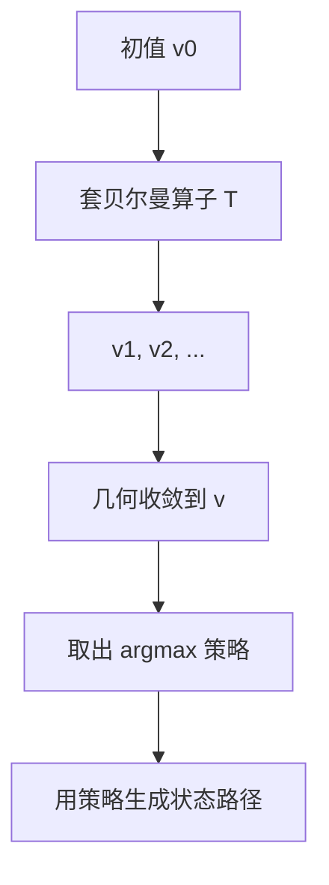

# 值函数迭代

压缩的 Picard 在函数空间上就是：猜一个 $v_0$，反复套贝尔曼算子，几何收敛到唯一值函数。

<footer>—— 据 Stokey, Lucas and Prescott, Recursive Methods in Economic Dynamics, 1989, 第 4、9 章整理</footer>

上一课[贝尔曼方程](/econ/bellman-equation)把动态规划收成 $v=Tv$，并用[压缩映射](/econ/contraction-mapping)保证唯一不动点。缺口是把存在变成可算：值函数迭代（VFI）即 $v_{n+1}=Tv_n$。本课只补算法、误差与它和策略迭代的分工，不把数值网格、插值写成计算附录，也不重推 Blackwell。

## 问题

任取 $v_0\in C(S)$，令 $v_{n+1}=Tv_n$，即
$v_{n+1}(s)=\max_{a\in\Gamma(s)}\{F(s,a)+\beta v_n(g(s,a))\}$。
$\|v_n-v\|\le \beta^n\|v_0-v\|$，或用残差 $\|v_{n+1}-v_n\|/(1-\beta)$ 界住与真值的距离。有限期 $T$ 步的向后归纳恰好是从 $v\equiv 0$（或终端值）做 $T$ 次 $T$ 算子；无穷期是同一程序跑到残差小于容许。

策略 $\Gamma_n(s)=\arg\max\{F+\beta v_n\circ g\}$ 本身 UHC，极限策略的图闭包含于真最优对应。单值时策略也收敛。这是后课定量宏观「先解值函数再模拟路径」的数学许可。本课不进入校准。

### 迭代的是值，不是状态

VFI 更新的是整张函数 $v$，不是沿一条资本路径做梯度下降。把 $k_{t+1}=f(k_t)$ 反复迭代，那是状态的动态，收敛到稳态资本——另一回事，而且可能有鞍点要逆向。值函数迭代在函数空间里走压缩，与状态是否稳定无关。不要把「资本迭代」叫做 VFI。

$\beta$ 接近 $1$ 时几何比很慢。加速：Howard 策略迭代（对固定策略解线性方程再改进策略）、修正策略迭代、代数多重网格。理论主干仍是：$T$ 是压缩，VFI 收敛。

## 方法

离散状态、有限行动：每步对每个 $s$ 扫一遍 $a$，复杂度 $|S|\times|A|$。连续状态要离散化：网格太稀则近似的算子不再是原 $T$ 的压缩扰动可控；误差分析把投影/插值当成对 $T$ 的扰动，真压缩模 $\beta$ 仍给出对不动点的界——前提是近似算子也把函数空间送进自身。随机问题每步多一次对下期分布的积分，条件期望的数值是后课概率单元的计算面，概念上仍是套 $T$。

单调性：若 $v_0\le Tv_0$，则序列上升且有上界 $v$，从下方逼近。猜一个可行策略的值当 $v_0$，常得到单调链。这比任意初值更稳，尤其在无界回报用加权范数时。

## 机制

每套一次 $T$，相当于把「再多看一期精确、更远用旧的 $v_n$ 近似」的视界往前推。压缩说远期货币的误差被 $\beta^n$ 抽干，所以不必真的从无穷远处算起。这与有限 $n$ 期模型再令 $n\to\infty$ 是同一极限，只是实现上用函数迭代而不是每次重解一条变长的序列。

策略迭代往往有限步精确（离散有限问题）或二次收敛，因为它在策略空间交替「估值 / 改进」。VFI 更简单、每步只做最大化，理论接口最短：就是 Picard。主干先会 VFI；计算课再换 Howard。

近似解的欧拉残差小，不自动等于值函数误差小，但压缩把值误差钉在残差上。报告时优先残差与 $\|Tv-v\|$，而不是「看起来稳态合理」。

## 边界

本课不写 GPU 实现、不比较投影法与扰动法（Judd）。连续时间黏性解的数值是另一套。也不把 VFI 用于没有折扣压缩的博弈完美均衡计算——那可能要不动点算法而不是 Picard。概率单元从下一课开始：随机贝尔曼里的期望，需要样本空间与条件期望，不再假设转移是确定的 $g$。

后课默认：折扣 DP 可用 VFI 逼近 $v$；误差由 $\beta^n$ 与 $\|Tv_n-v_n\|$ 控制；取出的策略生成后课宏观路径。

## 小结

- VFI 是贝尔曼算子的 Picard，几何比 $\beta$。
- 迭代对象是值函数，不是状态路径。
- 残差给出与真值的显式界；策略从 argmax 取出。
- 策略迭代更快，不是本课的定义。
- 下一课：[样本空间与 σ-代数](/econ/sigma-algebra)。
- 出处：Stokey, Lucas and Prescott 第 4、9 章。
