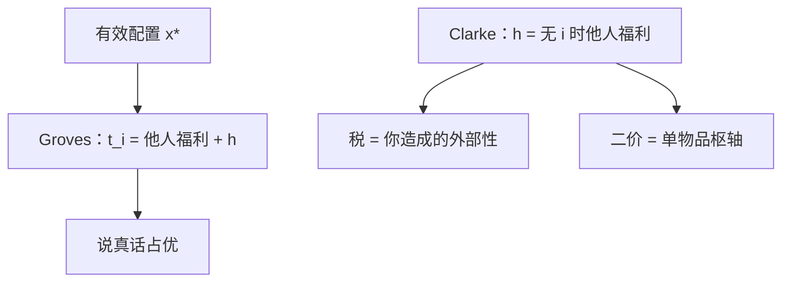

# VCG 与枢轴

Groves 转移让每人内部化自己对他人福利的影响；Clarke 枢轴税把这笔账收成「你造成的外部性」，说真话成为占优策略。

<footer>—— Vickrey, Journal of Finance, 1961；Clarke, Public Choice, 1971；Groves, Incentives in Teams, Econometrica, 1973</footer>

[上一课](/econ/implementability-envelope)证明：拟线性一维下，支付由配置的包络钉死，只剩一个函数（或每人一个 $h_{-i}$）。缺口是指定有效配置 $q^*(\theta)=\arg\max\sum v_i$ 时，如何把那份自由度收成占优策略 IC。本课钉 Groves 族与 Clarke 枢轴，不把卖家收入最大化写成虚拟价值，也不把无转移的社会选择写成 Gibbard–Satterthwaite。

## 问题

有效配置：对每个报告向量选 $x^*(\hat v)\in\arg\max_x\sum_i v_i(x)$。占优策略 IC 要求：即使对手乱报，报真值仍最优。包络在占优策略层必须对每个 $v_{-i}$ 都成立，不只对期望。Groves：给 $i$ 的转移

$$
t_i(\hat v)=\sum_{j\neq i}v_j\bigl(x^*(\hat v)\bigr)+h_i(\hat v_{-i}),
$$

其中 $h_i$ 不随 $\hat v_i$ 变。则 $i$ 的目标变成 $\sum_j v_j(x^*(\hat v))$ 再加与自己报告无关的项，于是他愿让 $x^*$ 按真偏好选——说真话占优。Green–Laffont：在足够宽的定义域上，有效 + 占优策略 IC 本质上就是 Groves 族。

Clarke 枢轴：取 $h_i(\hat v_{-i})=-\sum_{j\neq i}v_j(x^*_{-i})$，即「没有 $i$ 时其余人的有效福利」。于是 $i$ 付的税额等于他加进来使别人福利下降的部分——外部性。二价拍卖是单物品枢轴：赢家付第二高价，恰好是他把次高者挤掉的损失。

### 枢轴不是预算平衡

枢轴税 $\ge 0$，钱交给计划者，一般不平衡（公共品时总税少于成本，拍卖时卖家有收入但买者之间不平衡的镜像）。没有一般的有效、占优策略、预算平衡、自愿参与四件套——后课的不可能在货币环境下的亲戚。Groves 的 $h_i$ 可以改，但宽定义域上改不来平衡。

Vickrey 1961 用反拍卖与二价；Clarke 针对公共品；Groves 写成团队。VCG 是三人合称：有效配置 + Groves 转移，枢轴是其中最常用的 $h$。

占优策略不依赖先验，比贝叶斯 IC 更强。
Myerson 最优拍卖用贝叶斯层，可以牺牲效率换收入；VCG 不优化收入。
拟线性是关键：没有货币，下一课 GS 会把占优策略实施几乎删光。

## 方法

对象：拟线性、私人价值（不必独立）、有效社会选择。先写 Groves，验占优；再特化枢轴；再认出二价是单物品特例。核对包络：Groves 的 $U_i$ 正好是 $i$ 对有效剩余的边际，积分条件自动满足。

## 机制

有效配置使社会剩余对 $i$ 的报告可导（或可积）的部分正好是 $v_i$ 自己。若不把他人剩余补进 $i$ 的钱包，他只会最大化 $v_i-t_i$，扭曲 $x$。Groves 把他人剩余补回去，$i$ 与计划者目标对齐。枢轴再把 $h$ 选成：不参与时你什么也不付、什么也得不到他人的那份；参与则付你造成的差。二价是「你赢走了本该属于第二高的物品」。

收入等价与 VCG 不冲突：在 IPV 对称无保留价下，VCG（二价）的 $Q$ 是有效赢得概率，期望收入被包络钉死。要更高期望收入必须改 $Q$，即放弃处处有效——下一课虚拟价值。

## 边界

互补、多物品组合时，VCG 仍 DSIC、仍有效，但收入可以极低（买家合谋、无竞争），且胜者的枢轴税对估值的敏感度会鼓励假名投标。共同价值下「私人 $v_i$」不再是对物品的真值，VCG 的有效性失去定义。预算必须平衡时，要退到贝叶斯机制或放弃效率。

后课默认：拟线性下，有效配置可用 Groves / 枢轴占优策略实施；代价是预算一般不平，且不最大化卖家收入。

### 二价是枢轴，不是「另一种收入会计」

[收入等价](/econ/revenue-equivalence)说一价与二价期望收入相同；VCG 说二价是有效配置的占优策略实施。两句话一层实施、一层期望。荷兰式、一价不是 Groves：它们不是占优策略诚实，只在 IPV 均衡里实施同一 $Q$。

枢轴税对未影响配置的人是零：你的报告若没改 $x^*$，你不付外部性。这是「只对关键人收税」，不是平均摊派。

## 小结

- Groves 把他人福利写入转移，有效配置可占优策略实施。
- Clarke 枢轴税 = 你加进来给别人造成的损失；二价是其拍卖特例。
- 一般不平衡；不最大化收入。
- 没有货币时，占优策略实施几乎只剩独裁——后课。
- 出处：Vickrey, *J. Finance* 1961；Clarke, *Public Choice* 1971；Groves, *Econometrica* 1973。
