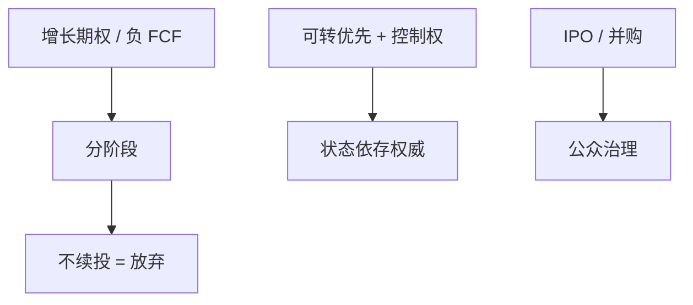

# 风险投资：分阶段与合同

    
风险投资不靠还本纪律，而靠分阶段注资、可转换优先股与控制权随里程碑转移：把放弃期权留在投资人手里，把努力激励留在创业者手里。

    <footer>—— Sahlman, Journal of Financial Economics 1990；Gompers, Journal of Finance 1995；Kaplan and Strömberg, Review of Economic Studies 2003</footer>

[上一课](/econ/lbo-private-equity)的对象是有 FCF 的成熟资产。本课缺口是相反的企业：负现金、软信息、增长期权极大。VC 用 staging 买实物期权，用合同切现金流与控制权。不重写 LBO 杠杆，不把 IPO 抑价课再推一遍——只接到退出。

## 问题

银行债与 LBO 要求可验证的偿还。创业企业没有。Sahlman：VC 是合同与分阶段的中介。Gompers：分阶段缩短检查间隔，像短债检查，但不要求付息——不续投就是关停期权。Kaplan–Strömberg：实际合同把现金流权、表决权、清算优先、董事会席位随可验证信号分开，接近 Aghion–Bolton 的状态依存控制，而不是 MM 切片。缺口是把实物期权估值课的「分阶段」写成金融合同，而不是再画一次决策树。

可转优先：下行像债（清算优先），上行转股。与 Stein 后门权益同族，但对象是私人企业与控制权，不是公开柠檬单独一句。

## 方法

staging：每轮按里程碑，放弃成本是已沉没的轮次，保留的是不付下一轮 $I$。这正是 Dixit–Pindyck 的等待/放弃。联合投资（syndication）分担资本与信息，也制造协调（谁领投）。退出：IPO 或出售；[IPO 抑价](/econ/ipo-underpricing-theory)解释公开那一次，本课只要：退出把私人合同转成公众治理，双层股权常在此时写入。

与优序：没有内部资金，债容量近零，股权（优先股）是主菜单。柠檬仍在，VC 用监测与分阶段降低，而不是靠公开市场定价。

薪酬：创业者股权高，但稀释与归属（vesting）管理努力。多任务：可验证的增长指标会挤出产品安全与会计诚实——同一 Holmström 问题。

## 机制

机制是用合同复制「短债+董事会+期权」在无债企业里的功能。控制权在坏信号时转向 VC（可换 CEO），好信号时创业者保留。现金流权用优先清算保护下行，避免创业者赌大把 VC 当债来转移。这与风险转移课同方向，工具换成优先股而不是限制性条款银行债。

与关系借贷：VC 生产软信息、跨期补贴存活轮次，套牢也存在（内部轮次定价）。联合投资与声誉减轻套牢。

### 不是把 VC 回报当成项目 NPV 的证明

存活偏差与权力法则回报使平均 IRR 难读。资本预算对创业项目仍是概率加权的 FCFF 加放弃期权，不是套用上一家独角兽的倍数。倍数课的收入倍数在此最危险。

Kaplan–Strömberg *RES* 2003 把合同条款映射到金融合同理论，是本课的许可证：现实合同真的在切控制权，不只切现金流。

## 边界

不要把本课写成创业手册。下一课双层股权：创始人在 IPO 后仍要留权威，把 VC 阶段的控制权配置延伸到公众市场。LLSV 则把法律对中小股东的保护写成国别差异。

后课默认：VC 用 staging 持有放弃期权，用优先股与控制权配置激励；对象是无债容量的增长期权企业，与 LBO 对偶。

## 小结

- 分阶段 = 可执行的放弃期权；不续投替代还本。
- 可转优先与状态依存控制权接近不完全合同理论，而不是 MM 纯切片。
- 退出接到 IPO 与双层股权；不要用独角兽倍数替代 NPV。
- 出处：Sahlman, *JFE* 1990；Gompers, *JF* 1995；Kaplan and Strömberg, *RES* 2003。
