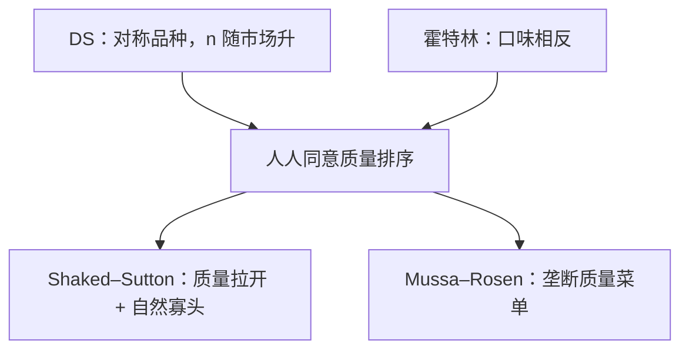

# 垂直差异

若人人同意谁的质量更高，只是对加价的忍受不同，竞争的是质量阶梯，不是街道上的地址，也不是对称 CES 品种。

<footer>—— 据 Shaked and Sutton, Relaxing Price Competition Through Product Differentiation, RES, 1982；Mussa and Rosen, Monopoly and Product Quality, JET, 1978 整理</footer>

定位：[上一课](/econ/monopolistic-dixit-stiglitz)。Dixit–Stiglitz 的品种在质量上对称，差异来自种类爱。本课不重讲 CES 与内生 $n$ 的零利润算术。[霍特林](/econ/hotelling)的横差异是「有人喜欢左、有人喜欢右」。缺口是纵差异：所有人的排序一致，$u=\theta s-p$，只是 $\theta$ 不同。质量高低不是把 $[0,1]$ 再画一遍。

## 问题

消费者类型 $\theta$ 分布在区间上，质量 $s$ 越高越好。买不买、买哪一档，由净效用 $\theta s-p$ 的上包络决定。两家若选 $s_H\gt s_L$ 再定价，市场按 $\theta$ 切开，高 $\theta$ 买高质。缺口不是再写一次勒纳，而是：**质量选择如何软化价格竞争，以及市场变大时均衡家数会不会像 DS 那样无限增加。**

Shaked–Sutton：质量提升若主要靠固定成本（研发），价格竞争在质量拉开之后变钝，但市场扩大时高质厂商能覆盖全市场，低质被挤出——**自然寡头**：即使 $F$ 相对市场规模趋于零，$n$ 仍有上界。这与 DS 的「市场越大 $n$ 越大」相反，不要把两课的进入写成同一条。

### 纵差异不是霍特林的「上北下南」

把质量画在纵轴上很容易误读成另一条线性城市。横差异：无差异消费者两边都有正密度，两家往中间挤或往两端走，取决于运费。纵差异：排序一致，低质要活下去必须够便宜，质量差距本身就是策略。Mussa–Rosen 处理的是一家垄断者对连续 $\theta$ 提供质量菜单，类似二级歧视，不是选址。

自然寡头的关键是：质量的边际成本不要升得太快。若高质量主要吃可变成本，低质仍有空间，家数可以随市场扩张。Shaked–Sutton 强调的是固定成本型质量。

## 方法

两阶段：先选 $s_i$，再选 $p_i$。价格阶段用 $\theta$ 的切开条件求份额，再逆向归纳质量。覆盖还是排除最低 $\theta$，取决于质量成本与 $\theta$ 的下界。垄断菜单（Mussa–Rosen）：对 $\theta$ 的激励相容给出质量扭曲——低类型质量向下扭曲、最高类型有效，与[筛选](/econ/screening-rent)同构，本课只点接口，不把信息租金再推一遍。

进入：给定质量技术，问均衡有限 $n$ 是否对市场规模一致有界。这是与上一课 CES 进入的对照实验，不是把 $F$ 再除一次。

三家以上时，最低质量档更容易被「从上面」覆盖挤出。自然寡头的上界来自质量竞争的这个方向，不是来自固定成本相对市场的简单除法。

不要把「高质高价」写成限价簿上档位更深；这里没有队列。

## 机制

软化价格竞争的机制是：质量差距降低交叉弹性，高 $\theta$ 不愿为了省钱掉到低质，低质不能靠小幅降价抢走全部市场——有点像霍特林的 $t$，但 $t$ 两边对称，质量阶梯不对称。自然寡头的机制是：市场一扩大，高质厂商降价覆盖的激励增强，低质的生存空间被「从上面」吃掉，而不是被对称的新品种稀释。

与 DS 的分工：需要「目录里多种可替代的同类」时用 CES；需要「大家认的好坏、收入或 $\theta$ 分层」时用纵差异。同一行业可以两种都在，本课禁止把质量写成 CES 的另一个 $i$。

覆盖决策也是一刀：若最低 $\theta$ 被排除，低质厂商面对的是截断的需求，质量选择更极端；若必须覆盖，低质变成「买得起的那一档」，与霍特林两端的「最大差异」只在表面上像。收入分布一变，$\theta$ 的密度改切开点，均衡质量阶梯跟着移——这是分配，不是运费 $t$。

Mussa–Rosen 1978 是垄断者的质量歧视；Shaked–Sutton 1982/1983 是寡头质量竞争与自然寡头。不要把垄断菜单的「顶部无扭曲」写成寡头均衡性质。

## 边界

广告、品牌作为横差异与纵差异的混合物，本课不拆。经验品、声誉使 $s$ 不可事前观察，接到信号课。规制最低质量标准会切掉 $s_L$，改变自然寡头的数目。也不要把收入分层直接写成三级歧视的组标签：$\theta$ 通常不可观察，质量菜单是自选，不是按身份证定价。

限价簿的档位深浅不是质量 $s$。

市场结构课序在此收束纵差异。一般均衡下一课程用盒子读配置，不再加一家商店的质量阶梯。后课默认：纵差异是一致排序加 $\theta$ 异质；不要用本课重讲霍特林端点或 CES 种类爱。

## 小结

- 质量排序一致，$\theta$ 决定谁买哪一档；不是横选址，不是对称 CES。
- 质量差距软化价格战；固定成本型质量可给出自然寡头。
- 垄断质量菜单是二级歧视，顶部有效、下部扭曲。
- 下一课程换坐标系：从局部产品市场进入交换的盒子。
- 出处：Shaked and Sutton, *RES*, 1982；Mussa and Rosen, *JET*, 1978。
